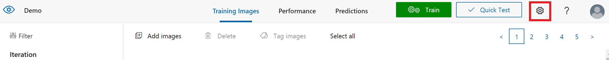
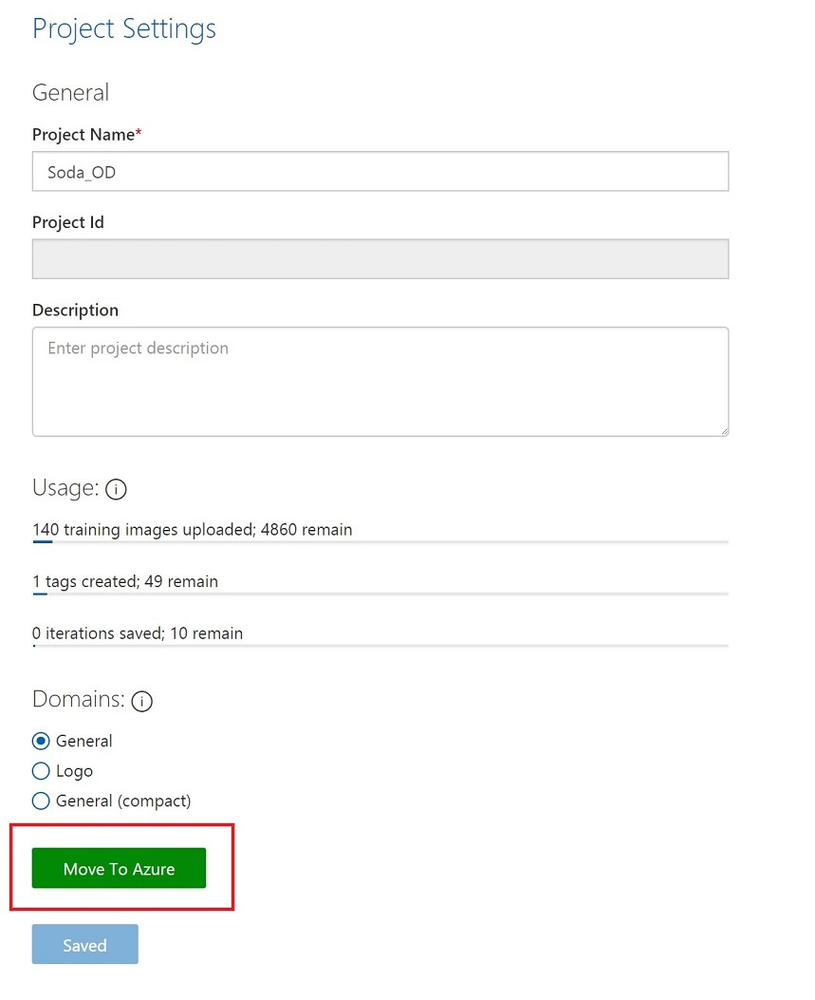
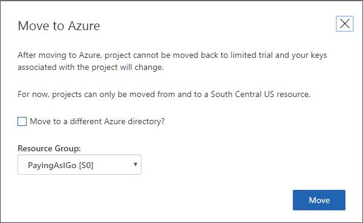
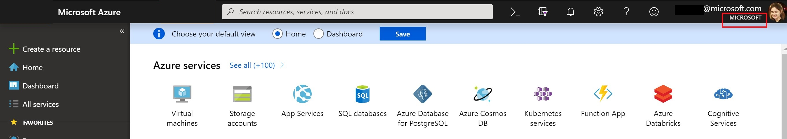
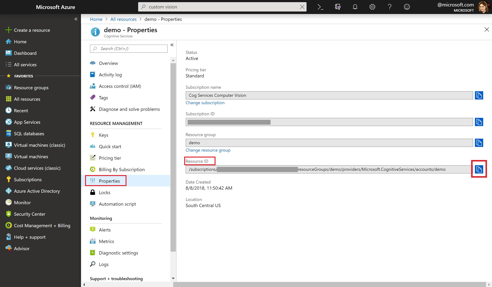
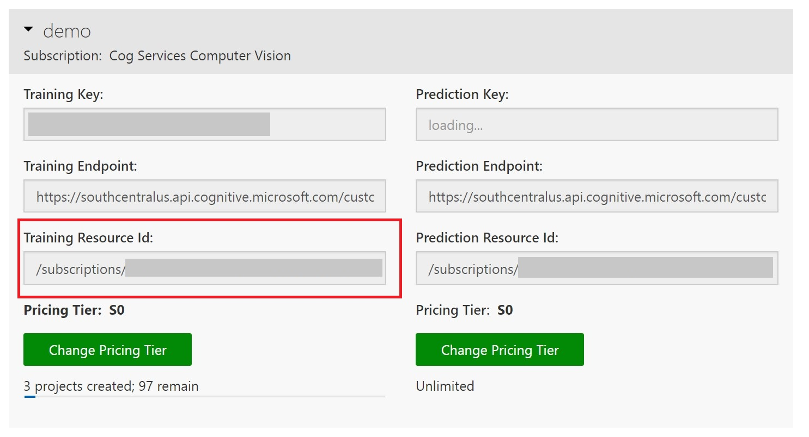

# How to move your Limited Trial project to Azure using the CustomVision.ai site

As Custom Vision Service is now in [Azure Preview](https://azure.microsoft.com/services/preview/), support for Limited Trial projects outside of Azure is ending. This document will teach you how to use the [Custom Vision website](https://customvision.ai) to move your Limited Trial project to be associated with an Azure resource. 

> [!NOTE]
> When you move your Custom Vision projects to an Azure resource, they the inherit underlying [permissions]( https://docs.microsoft.com/azure/role-based-access-control/role-assignments-portal) of that Azure resource. If other users in your organization are Owners of the Azure resource your project is in, they will be able to access your project on the [Custom Vision website](https://customvision.ai). Similarly, deleting your resources will delete your projects.  

For an introduction to the Azure concepts of subscriptions and resources, refer to the [Azure developer guide.](https://docs.microsoft.com/azure/guides/developer/azure-developer-guide#manage-your-subscriptions)

## Prerequisites

You will need a valid Azure subscription associated with the same Microsoft account or Azure Active Directory (AAD) account you use to log into the [Custom Vision website](https://customvision.ai). 

If you do not have an Azure account, [create an account](https://azure.microsoft.com/free/) for free.

## Create Custom Vision resources in the Azure portal
To use Custom Vision Service with Azure, you will need to create Custom Vision Training and Prediction resources in the [Azure portal](https://portal.azure.com/?microsoft_azure_marketplace_ItemHideKey=microsoft_azure_cognitiveservices_customvision#create/Microsoft.CognitiveServicesCustomVision). 

 To move your project using this [Custom Vision website](https://customvision.ai) experience, you must create your resources in the South Central US region, because all Limited Trial projects are hosted in South Central US. 

Multiple projects can be associated to a single resource. More detail about [Pricing and Limits](https://docs.microsoft.com/azure/cognitive-services/custom-vision-service/limits-and-quotas) is available. To continue to use Custom Vision Service for free, you can select the F0 tier in the Azure portal. 

## Move your Limited Trial project to an Azure resource

1.  In your web browser, navigate to the [Custom Vision website](https://customvision.ai) and select __Sign in__. Open the project you wish to migrate to an Azure account. 
2.  Open the Settings page for your project by clicking on the gear icon on the top-right-hand corner of the screen. 

    

3. Click on __Move to Azure__.

    

4. From the dropdown on the __Move to Azure__ button, select the Azure resource you wish to move your project to. Click __Move__. 

5. If you do not see the Azure resource you created earlier for Custom Vision Service, it may be in another directory. To move your project to a resource in another directory, follow the instructions below. 

    

## Move your Limited Trial project to an Azure resource in another directory 

> [!NOTE]
> In both the Azure portal and CustomVision.ai, you can select your directory from the drop-down User menu at the top-right corner of the screen.   

1. Identify which directory your Azure resource is in. You can find the directory listed under your username at the top-right of the Azure portal menu bar. 

    

2. Find the Resource ID of your Custom Vision Training resource. You can find this in the Azure portal by opening your Custom Vision Training resource and selecting “Properties” under the “Resource Management” section. Your Resource ID will be there. 

    

3. Alternatively, you can find the Resource ID of your Custom Vision Resource directly in the Custom Vision website [Settings page]( https://www.customvision.ai/projects#/settings). You will need to switch to the same directory your Azure resource is in.

    

4. Now that you have your resource ID, return to the Custom Vision project you are trying to move from a Limited Trial to an Azure resource. Reminder, you may need to switch back to your original directory to find it. Follow the instructions provided [above](#move-your-limited-trial-project-to-an-azure-resource) to open your project settings page and select __Move to Azure__. 

5. In the Move to Azure window, check the box for “Move to a different Azure directory?”. Select the directory you want to move your project to and enter the Resource ID of the resource you are moving your project to. Click __Move__. 

5. Remember, your project is now in a different directory. To find your project, you will need to switch to the same directory on the Custom Vision web portal that your project is in. In both the Azure portal and the [Custom Vision website](https://customvision.ai), you can select your directory from the drop-down account menu at the top-right corner of the screen. 

