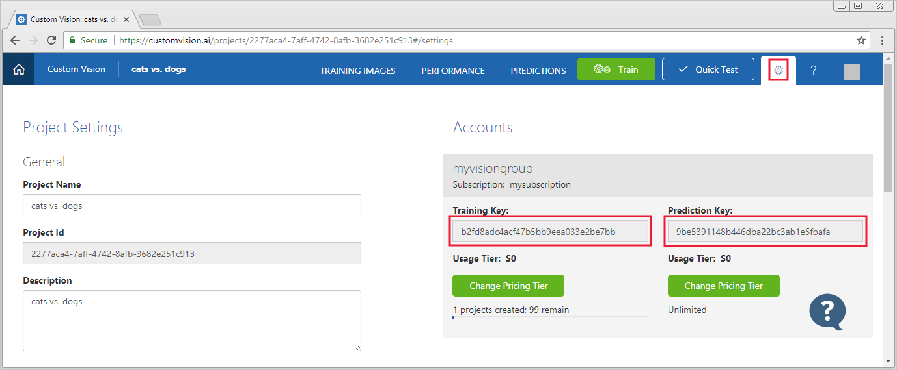

# Tutorial: Create an image classification project using the Custom Vision Service with Python

Learn how to create an image classification project with the Custom Vision Service and a basic Python script. After it's created, you can add tags, upload images, train the project, get the project's default prediction endpoint URL, and use it to programmatically test an image. Use this open-source example as a template for building your own app by using the Custom Vision API.


## Prerequisites

- Python 2.7+ or Python 3.5+.
- The pip tool.

## Get the training and prediction keys

To get the keys used in this example, visit the [Custom Vision web page](https://customvision.ai) and select the __gear icon__ in the upper right. In the __Accounts__ section, copy the values from the __Training Key__ and __Prediction Key__ fields.



## Install the Custom Vision Service SDK

To install the Custom Vision Service SDK, use the following command:

```
pip install azure-cognitiveservices-vision-customvision
```

## Get example images

This example uses the images from the `Samples/Images` directory of the [https://github.com/Microsoft/Cognitive-CustomVision-Windows](https://github.com/Microsoft/Cognitive-CustomVision-Windows/tree/master/Samples/Images) project. Clone or download and extract the project to your development environment.

## Create a Custom Vision Service project

To create a new Custom Vision Service project, create new file named `sample.py`. Use the following code as the file contents:

> [!IMPORTANT]
> Set the `training_key` to the training key value you retrieved earlier.
>
> Set the `prediction_key` to the prediction key value you retrieved earlier.

```python
from azure.cognitiveservices.vision.customvision.training import training_api
from azure.cognitiveservices.vision.customvision.training.models import ImageUrlCreateEntry

# Replace with a valid key
training_key = "<your training key>"
prediction_key = "<your prediction key>"

trainer = training_api.TrainingApi(training_key)

# Create a new project
print ("Creating project...")
project = trainer.create_project("My Project")
```

## Add tags to your project

To add tags to your project, add the following code to the end of the `sample.py` file:

```python
# Make two tags in the new project
hemlock_tag = trainer.create_tag(project.id, "Hemlock")
cherry_tag = trainer.create_tag(project.id, "Japanese Cherry")
```

## Upload images to the project

To add the sample images to the project, insert the following code after the tag creation. This code uploads the image with the corresponding tag:

> [!IMPORTANT]
>
> Change path to the images based on where you downloaded the Cognitive-CustomVision-Windows project earlier.

```python
base_image_url = "https://raw.githubusercontent.com/Microsoft/Cognitive-CustomVision-Windows/master/Samples/"

print ("Adding images...")
for image_num in range(1,10):
    image_url = base_image_url + "Images/Hemlock/hemlock_{}.jpg".format(image_num)
    trainer.create_images_from_urls(project.id, [ ImageUrlCreateEntry(url=image_url, tag_ids=[ hemlock_tag.id ] ) ])

for image_num in range(1,10):
    image_url = base_image_url + "Images/Japanese Cherry/japanese_cherry_{}.jpg".format(image_num)
    trainer.create_images_from_urls(project.id, [ ImageUrlCreateEntry(url=image_url, tag_ids=[ cherry_tag.id ] ) ])


# Alternatively, if the images were on disk in a folder called Images alongside the sample.py, then
# they can be added by using the following:
#
#import os
#hemlock_dir = "Images\\Hemlock"
#for image in os.listdir(os.fsencode("Images\\Hemlock")):
#    with open(hemlock_dir + "\\" + os.fsdecode(image), mode="rb") as img_data: 
#        trainer.create_images_from_data(project.id, img_data, [ hemlock_tag.id ])
#
#cherry_dir = "Images\\Japanese Cherry"
#for image in os.listdir(os.fsencode("Images\\Japanese Cherry")):
#    with open(cherry_dir + "\\" + os.fsdecode(image), mode="rb") as img_data: 
#        trainer.create_images_from_data(project.id, img_data, [ cherry_tag.id ])
```

## Train the project

To train the classifier, add the following code to the end of the `sample.py` file:

```python
import time

print ("Training...")
iteration = trainer.train_project(project.id)
while (iteration.status != "Completed"):
    iteration = trainer.get_iteration(project.id, iteration.id)
    print ("Training status: " + iteration.status)
    time.sleep(1)

# The iteration is now trained. Make it the default project endpoint
trainer.update_iteration(project.id, iteration.id, is_default=True)
print ("Done!")
```

## Get and use the default prediction endpoint

To send an image to the prediction endpoint and retrieve the prediction, add the following code to the end of the `sample.py` file:

```python
from azure.cognitiveservices.vision.customvision.prediction import prediction_endpoint
from azure.cognitiveservices.vision.customvision.prediction.prediction_endpoint import models

# Now there is a trained endpoint that can be used to make a prediction

predictor = prediction_endpoint.PredictionEndpoint(prediction_key)

test_img_url = base_image_url + "Images/Test/test_image.jpg"
results = predictor.predict_image_url(project.id, iteration.id, url=test_img_url)

# Alternatively, if the images were on disk in a folder called Images alongside the sample.py, then
# they can be added by using the following.
#
# Open the sample image and get back the prediction results.
# with open("Images\\test\\test_image.jpg", mode="rb") as test_data:
#     results = predictor.predict_image(project.id, test_data, iteration.id)

# Display the results.
for prediction in results.predictions:
    print ("\t" + prediction.tag_name + ": {0:.2f}%".format(prediction.probability * 100))
```

## Run the example

Run the solution. The prediction results appear on the console.

```
python sample.py
```

The output of the application is similar to the following text:

```
Creating project...
Adding images...
Training...
Training status: Training
Training status: Completed
Done!
        Hemlock: 93.53%
        Japanese Cherry: 0.01%
```