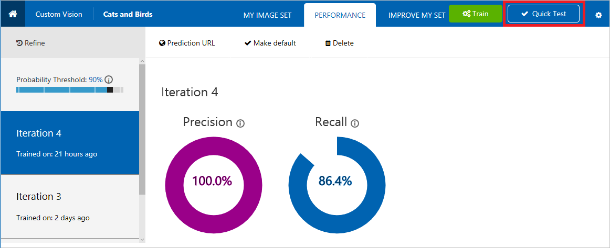
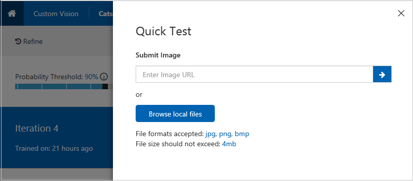
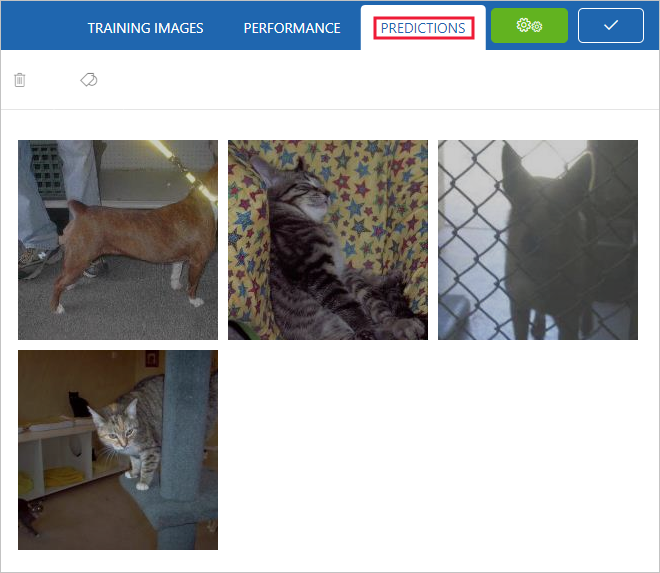
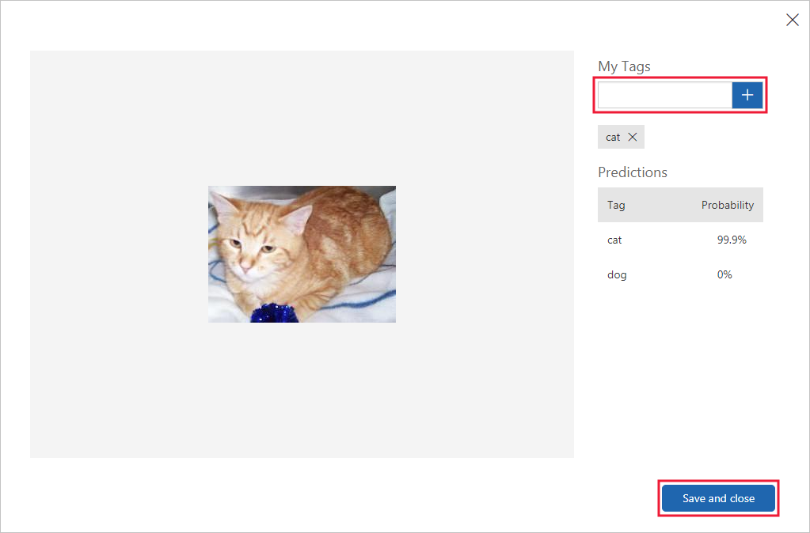

# Test and retrain a model with Custom Vision Service

After you train your model, you can quickly test it using a locally stored image or an online image. The test uses the most recently trained iteration.

## Test your model

1. From the [Custom Vision web page](https://customvision.ai), select your project. Select **Quick Test** on the right of the top menu bar. This action opens a window labeled **Quick Test**.

    

2. In the **Quick Test** window, click in the **Submit Image** field and enter the URL of the image you want to use for your test. If you want to use a locally stored image instead, click the **Browse local files** button and select a local image file.

    

The image you select appears in the middle of the page. Then the results appear below the image in the form of a table with two columns, labeled **Tags** and **Confidence**. After you view the results, you may close the **Quick Test** window.

You can now add this test image to your model and then retrain your model.

## Use the predicted image for training

To use the image submitted previously for training, use the following steps:

1. To view images submitted to the classifier, open the [Custom Vision web page](https://customvision.ai) and select the __Predictions__ tab.

    

    > [!TIP]
    > The default view shows images from the current iteration. You can use the __Iteration__ drop down field to view images submitted during previous iterations.

2. Hover over an image to see the tags that were predicted by the classifier.

    > [!TIP]
    > Images are ranked, so that the images that can bring the most gains to the classifier are at the top. To select a different sorting, use the __Sort__ section.

    To add an image to your training data, select the image, select the tag, and then select __Save and close__. The image is removed from __Predictions__ and added to the training images. You can view it by selecting the __Training Images__ tab.

    

3. Use the __Train__ button to retrain the classifier.

## Next steps

[Improve your classifier](getting-started-improving-your-classifier.md)
