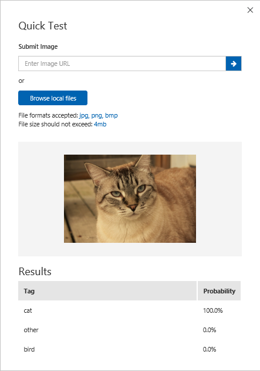

# Test and Retrain Your Model

After you train your model, you can quickly test it using a locally stored image or an online image. The test uses the most recently trained iteration.

## Test your model:

1. Click **Quick Test** on the right of the top menu bar. This action opens a window labeled **Quick Test**.

    

2. In the **Quick Test** window, click in the **Submit Image** field and enter the URL of the image you want to use for your test. If you want to use a locally stored image instead, click the **Browse local files** button and select a local image file.

    

The image you select appears in the middle of the page. Then the results appear below the image in the form of a table with two columns, labeled **Tags** and **Confidence**. After you view the results, you may close the **Quick Test** window.

You can now add this test image to your model and then retrain your model.

## Add a test image and retrain your model:

You can follow the steps below to add to your model an image that you have submitted for a quick test and to then retrain the model. However, adding only one image before you retrain your model doesn't lead to significant performance gains. For best results, add a significant number of images before you retrain the model.

1. Click the **PREDICTIONS** tab on the top menu bar.
2. Click the image you used for the quick test. A new window appears, with the image in the center.
3. In the new window, assign the correct tag to the image from the **My Tags** drop-down list. If you don't see the appropriate tag in the drop-down list, you can type in a new tag and then click the **+** sign to the right of the **My Tags** field.
4. Click the **Save and close** button at the bottom of the window.
4. Click the green **Train** button in the top menu bar.
