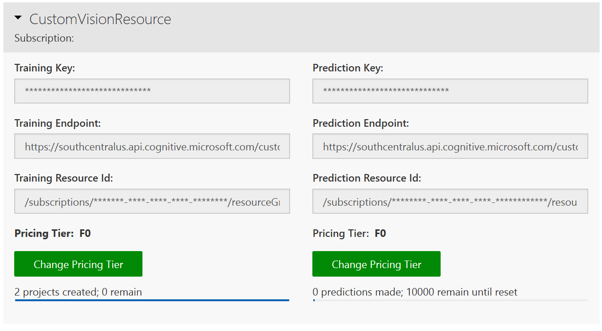

# Migrate to the 3.0 API

Custom Vision has now reached General Availability and has undergone an API update.
This update includes a few new features and, importantly, a few breaking changes:

* The Prediction API is now split into two based on the project type.
* The Vision AI Developer Kit (VAIDK) export option requires creating a project in a specific way.
* Default iterations have been removed in favor of a publish / unpublish a named iteration.

This guide will show you how to update your projects to work with the new API version. See the [Release notes](release-notes.md) for a full list of the changes.

## Use the updated Prediction API

The 2.x APIs used the same prediction call for both image classifiers and object detector projects. Both project types were acceptable to the **PredictImage** and **PredictImageUrl** calls. Starting with 3.0, we have split this API so that you need to match the project type to the call:

* Use **[ClassifyImage](https://southcentralus.dev.cognitive.microsoft.com/docs/services/Custom_Vision_Prediction_3.0/operations/5c82db60bf6a2b11a8247c15)** and **[ClassifyImageUrl](https://southcentralus.dev.cognitive.microsoft.com/docs/services/Custom_Vision_Prediction_3.0/operations/5c82db60bf6a2b11a8247c14)** to get predictions for image classification projects.
* Use **[DetectImage](https://southcentralus.dev.cognitive.microsoft.com/docs/services/Custom_Vision_Prediction_3.0/operations/5c82db60bf6a2b11a8247c19)** and **[DetectImageUrl](https://southcentralus.dev.cognitive.microsoft.com/docs/services/Custom_Vision_Prediction_3.0/operations/5c82db60bf6a2b11a8247c18)** to get predictions for object detection projects.

## Use the new iteration publishing workflow

The 2.x APIs used the default iteration or a specified iteration ID to choose the iteration to use for prediction. Starting in 3.0, we have adopted a publishing flow whereby you first publish an iteration under a specified name from the training API. You then pass the name to the prediction methods to specify which iteration to use.

> [!IMPORTANT]
> The 3.0 APIs do not use the default iteration feature. Until we deprecate the older APIs, you can continue to use the 2.x APIs to toggle an iteration as the default. These APIs will be maintained for a period of time, and you can call the **[UpdateIteration](https://southcentralus.dev.cognitive.microsoft.com/docs/services/Custom_Vision_Training_3.0/operations/5c771cdcbf6a2b18a0c3b818)** method to mark an iteration as default.

### Publish an iteration

Once an iteration is trained, you can make it available for prediction using the **[PublishIteration](https://southcentralus.dev.cognitive.microsoft.com/docs/services/Custom_Vision_Training_3.0/operations/5c82db28bf6a2b11a8247bbc)** method. To publish an iteration, you'll need the prediction resource ID, which is available on the CustomVision website's settings page.

> [!TIP]
> You can also get this information from the [Azure Portal](https://portal.azure.com) by going to the Custom Vision Prediction resource and selecting **Properties**.

Once your iteration is published, apps can use it for prediction by specifying the name in their prediction API call. To make an iteration unavailable for prediction calls, use the **[UnpublishIteration](https://southcentralus.dev.cognitive.microsoft.com/docs/services/Custom_Vision_Training_3.0/operations/5c771cdcbf6a2b18a0c3b81a)** API.

## Additional export options

With the 3.0 APIs we are exposing two additional export targets: ARM architecture and Vision AI Developer Kit.

* To use ARM, you just need to pick a Compact domain and then choose DockerFile and then ARM as the export options.
* For Vision AI Dev Kit, the project must be created with the __General (Compact)__ domain as well as specifying VAIDK in the target export platforms argument.

## Next steps

* [Training API reference documentation (REST)](https://go.microsoft.com/fwlink/?linkid=865446)
* [Prediction API reference documentation (REST)](https://go.microsoft.com/fwlink/?linkid=865445)