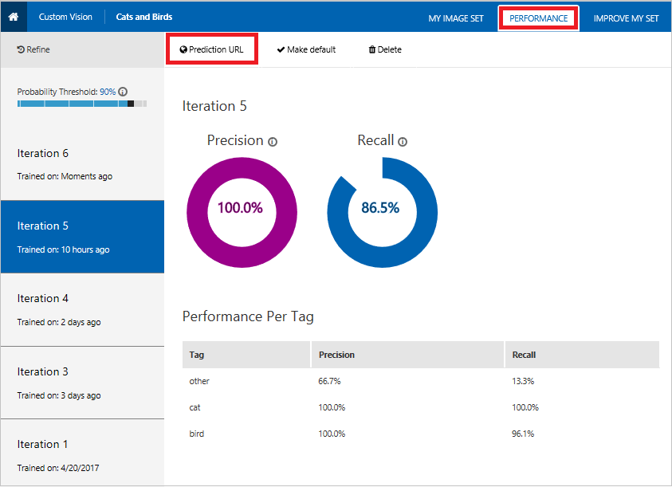
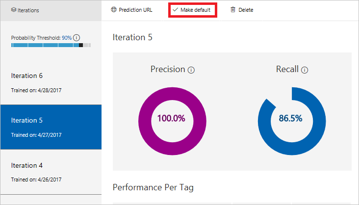

# Use the Prediction Endpoint to Test Images Programmatically

After you train your model, you can obtain a URL that you can use to test images programmatically.

## Obtain the prediction endpoint URL for a specific iteration:

1. Click the "PERFORMANCE" tab, which is shown inside a red rectangle in the following image.
2. In the left pane, click on the iteration you want to use for testing images.
3. In the upper part of the screen, click "Prediction URL", which is also shown in a red rectangle in the following image.

    


### Test an image in C#

```c#
using System;
using System.IO;
using System.Net.Http;
using System.Net.Http.Headers;
using System.Threading.Tasks;

namespace CSPredictionSample
{
    static class Program
    {
        static void Main()
        {
            Console.Write("Enter image file path: ");
            string imageFilePath = Console.ReadLine();

            MakePredictionRequest(imageFilePath).Wait();

            Console.WriteLine("\n\n\nHit ENTER to exit...");
            Console.ReadLine();
        }

        static byte[] GetImageAsByteArray(string imageFilePath)
        {
            FileStream fileStream = new FileStream(imageFilePath, FileMode.Open, FileAccess.Read);
            BinaryReader binaryReader = new BinaryReader(fileStream);
            return binaryReader.ReadBytes((int)fileStream.Length);
        }

        static async Task MakePredictionRequest(string imageFilePath)
        {
            var client = new HttpClient();

            // Request headers - replace this example key with your valid subscription key.
            client.DefaultRequestHeaders.Add("Prediction-Key", "13hc77781f7e4b19b5fcdd72a8df7156");

            // Prediction URL - replace this example URL with your valid prediction URL.
            string url = "http://southcentralus.api.cognitive.microsoft.com/customvision/v1.0/prediction/d16e136c-5b0b-4b84-9341-6a3fff8fa7fe/image?iterationId=f4e573f6-9843-46db-8018-b01d034fd0f2";

            HttpResponseMessage response;

            // Request body. Try this sample with a locally stored image.
            byte[] byteData = GetImageAsByteArray(imageFilePath);

            using (var content = new ByteArrayContent(byteData))
            {
                content.Headers.ContentType = new MediaTypeHeaderValue("application/octet-stream");
                response = await client.PostAsync(url, content);
                Console.WriteLine(await response.Content.ReadAsStringAsync());
            }
        }
    }
}
```

## Obtain the default prediction endpoint URL for your project:

The preceding example uses the prediction endpoint for a specific iteration. You can also mark an iteration as the default iteration for the project. You can then use the default endpoint in your code. This way, when you want your code to use a different iteration, you can use the web browser to mark that iteration as the new default. Your code will automatically use this new default iteration instead of the old iteration.

Follow these steps to mark an iteration as the default:

1. Click the "PERFORMANCE" tab, which is in the upper part of the browser window.
2. In the left pane, click the iteration you want to mark as the default.
3. Click "Make default" as shown in the red rectangle in the following image.



After you mark an iteration as the default, you can write code that always uses the current default. To modify the preceding example to always use the current default, even when that default changes, remove the *IterationId* parameter and its value from the URL. In this example, the following URL is what you obtain.

```
"http://southcentralus.api.cognitive.microsoft.com/customvision/v1.0/prediction/d16e136c-5b0b-4b84-9341-6a3fff8fa7fe/image?"
```
