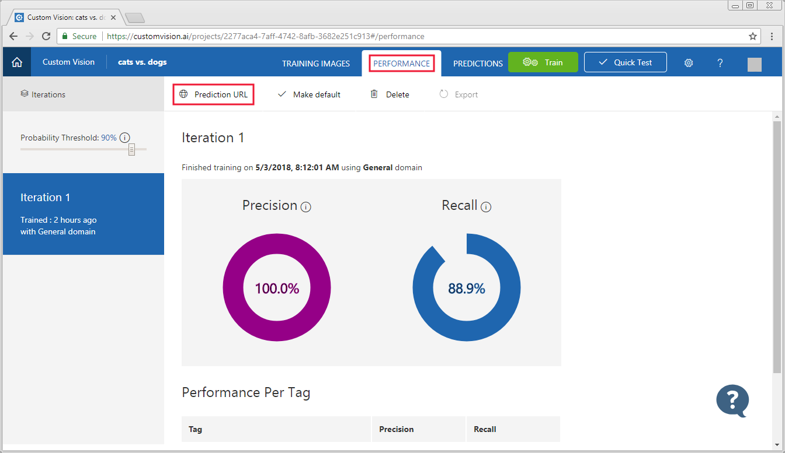

# Use the prediction endpoint to test images programmatically with a Custom Vision Service classifier

After you train your model, you can test images programmatically by submitting them to the Prediction API. 

> [!NOTE]
> This document demonstrates using C# to submit an image to the Prediction API. For more information and examples of using the API, see the [Prediction API reference](https://go.microsoft.com/fwlink/?linkid=865445).

## Get the URL and prediction key

From the [Custom Vision web page](https://customvision.ai), select your project and then select the __Performance__ tab. To display information about using the Prediction API, including the __Prediction-key__, select __Prediction URL__. For projects attached to an Azure Resource, your __Prediction-key__ can also be found in the [Azure Portal](https://portal.azure.com) page for associated Azure Resource under __Keys__. Copy the following information for use in the application:

* __URL__ for using an __image file__.
* __Prediction-key__ value.

> [!TIP]
> If you have multiple iterations, you can control which one is used by setting it as default. Select the iteration from the __Iterations__ section, then select __Make default__ at the top of the page.



## Create the application

1. From Visual Studio, create a new C# console application.

2. Use the following code as the body of the __Program.cs__ file.

    > [!IMPORTANT]
    > Change the following information:
    >
    > * Set the __namespace__ to the name of your project.
    > * Set the __Prediction-Key__ value you received earlier in the line that begins with `client.DefaultRequestHeaders.Add("Prediction-Key",`.
    > * Set the __URL__ value you received earlier in the line that begins with `string url =`.

    ```csharp
    using System;
    using System.IO;
    using System.Net.Http;
    using System.Net.Http.Headers;
    using System.Threading.Tasks;

    namespace CSPredictionSample
    {
        static class Program
        {
            static void Main()
            {
                Console.Write("Enter image file path: ");
                string imageFilePath = Console.ReadLine();

                MakePredictionRequest(imageFilePath).Wait();

                Console.WriteLine("\n\n\nHit ENTER to exit...");
                Console.ReadLine();
            }

            static byte[] GetImageAsByteArray(string imageFilePath)
            {
                FileStream fileStream = new FileStream(imageFilePath, FileMode.Open, FileAccess.Read);
                BinaryReader binaryReader = new BinaryReader(fileStream);
                return binaryReader.ReadBytes((int)fileStream.Length);
            }

            static async Task MakePredictionRequest(string imageFilePath)
            {
                var client = new HttpClient();

                // Request headers - replace this example key with your valid subscription key.
                client.DefaultRequestHeaders.Add("Prediction-Key", "13hc77781f7e4b19b5fcdd72a8df7156");

                // Prediction URL - replace this example URL with your valid prediction URL.
                string url = "http://southcentralus.api.cognitive.microsoft.com/customvision/v1.0/prediction/d16e136c-5b0b-4b84-9341-6a3fff8fa7fe/image?iterationId=f4e573f6-9843-46db-8018-b01d034fd0f2";

                HttpResponseMessage response;

                // Request body. Try this sample with a locally stored image.
                byte[] byteData = GetImageAsByteArray(imageFilePath);

                using (var content = new ByteArrayContent(byteData))
                {
                    content.Headers.ContentType = new MediaTypeHeaderValue("application/octet-stream");
                    response = await client.PostAsync(url, content);
                    Console.WriteLine(await response.Content.ReadAsStringAsync());
                }
            }
        }
    }
    ```

## Use the application

When running the application, you enter the path to an image file. The image is submitted to the API and the results are returned as a JSON document. The following JSON is an example of the response

```json
{
    "Id":"3f76364c-b8ae-4818-a2b2-2794cfbe377a",
    "Project":"2277aca4-7aff-4742-8afb-3682e251c913",
    "Iteration":"84105bfe-73b5-4fcc-addb-756c0de17df2",
    "Created":"2018-05-03T14:15:22.5659829Z",
    "Predictions":[
        {"TagId":"35ac2ad0-e3ef-4e60-b81f-052a1057a1ca","Tag":"dog","Probability":0.102716163},
        {"TagId":"28e1a872-3776-434c-8cf0-b612dd1a953c","Tag":"cat","Probability":0.02037274}
    ]
}
```

## Next steps

[Export the model for mobile use](export-your-model.md)
