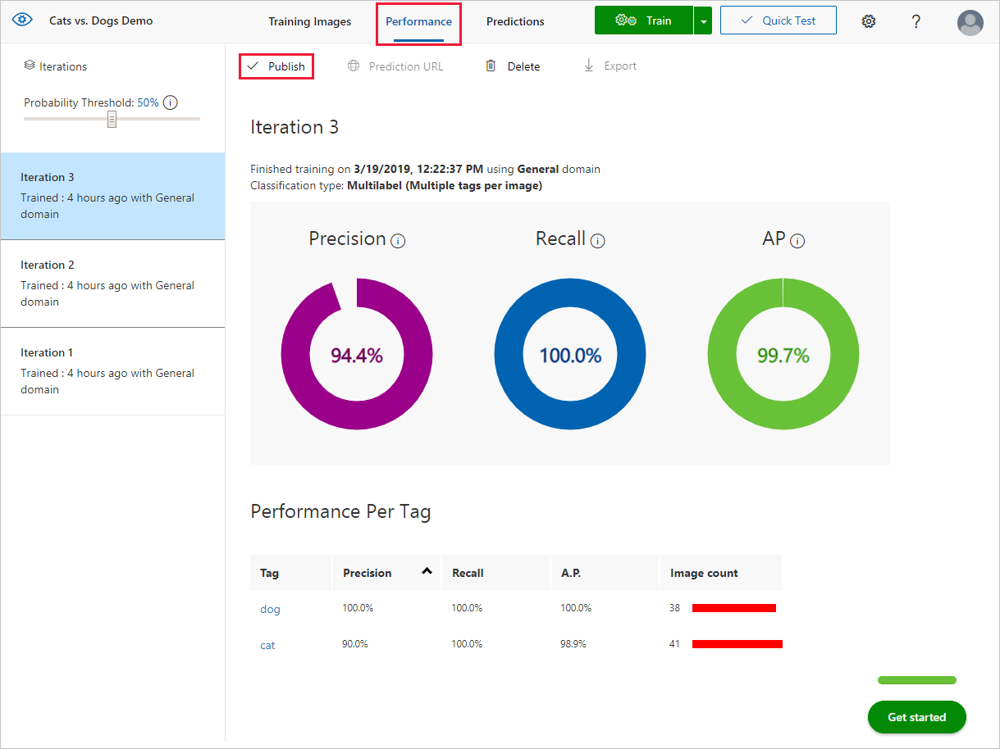
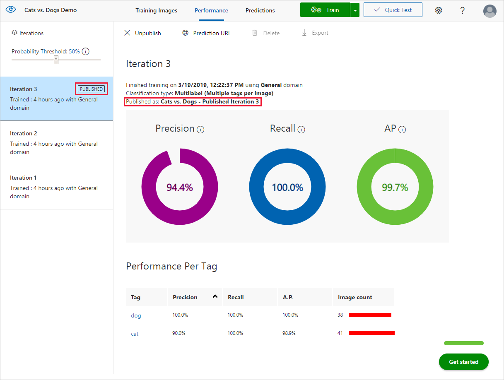
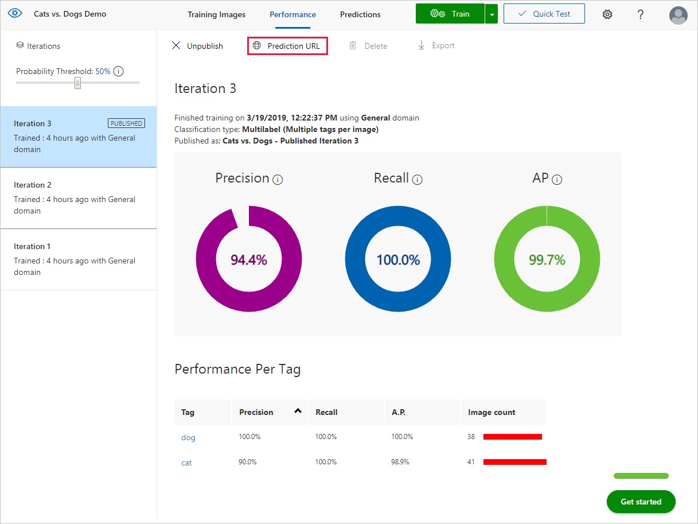
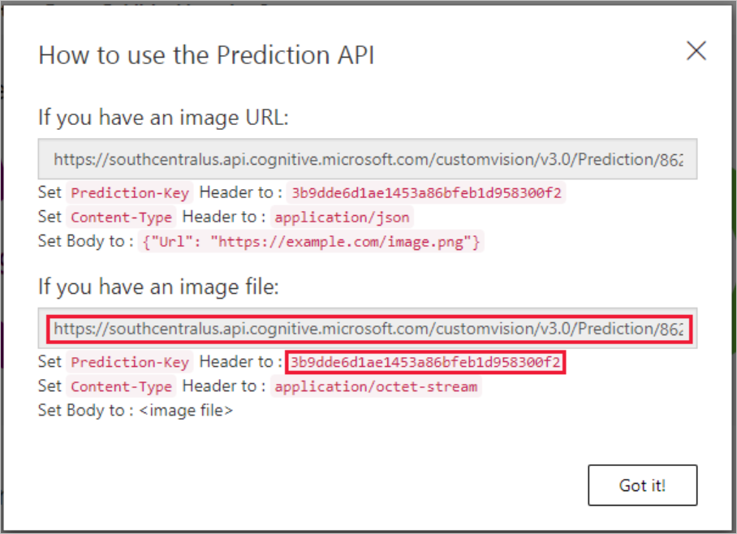

# Use your model with the prediction API

After you've train your model, you can test images programmatically by submitting them to the Prediction API endpoint.

> [!NOTE]
> This document demonstrates using C# to submit an image to the Prediction API. For more information and examples, see the [Prediction API reference](https://southcentralus.dev.cognitive.microsoft.com/docs/services/Custom_Vision_Prediction_3.0/operations/5c82db60bf6a2b11a8247c15).

## Publish your trained iteration

From the [Custom Vision web page](https://customvision.ai), select your project and then select the __Performance__ tab.

To submit images to the Prediction API, you will first need to publish your iteration for prediction, which can be done by selecting __Publish__ and specifying a name for the published iteration. This will make your model accessible to the Prediction API of your Custom Vision Azure resource.



Once your model has been successfully published, you'll see a "Published" label appear next to your iteration in the left-hand sidebar, and its name will appear in the description of the iteration.



## Get the URL and prediction key

Once your model has been published, you can retrieve the required information by selecting __Prediction URL__. This will open up a dialog with information for using the Prediction API, including the __Prediction URL__ and __Prediction-Key__.






In this guide, you will use a local image, so copy the URL under **If you have an image file** to a temporary location. Copy the corresponding __Prediction-Key__ value as well.

## Create the application

1. In Visual Studio, create a new C# console application.

1. Use the following code as the body of the __Program.cs__ file.

    ```csharp
    using System;
    using System.IO;
    using System.Net.Http;
    using System.Net.Http.Headers;
    using System.Threading.Tasks;

    namespace CVSPredictionSample
    {
        public static class Program
        {
            public static void Main()
            {
                Console.Write("Enter image file path: ");
                string imageFilePath = Console.ReadLine();

                MakePredictionRequest(imageFilePath).Wait();

                Console.WriteLine("\n\nHit ENTER to exit...");
                Console.ReadLine();
            }

            public static async Task MakePredictionRequest(string imageFilePath)
            {
                var client = new HttpClient();

                // Request headers - replace this example key with your valid Prediction-Key.
                client.DefaultRequestHeaders.Add("Prediction-Key", "<Your prediction key>");

                // Prediction URL - replace this example URL with your valid Prediction URL.
                string url = "<Your prediction URL>";

                HttpResponseMessage response;

                // Request body. Try this sample with a locally stored image.
                byte[] byteData = GetImageAsByteArray(imageFilePath);

                using (var content = new ByteArrayContent(byteData))
                {
                    content.Headers.ContentType = new MediaTypeHeaderValue("application/octet-stream");
                    response = await client.PostAsync(url, content);
                    Console.WriteLine(await response.Content.ReadAsStringAsync());
                }
            }

            private static byte[] GetImageAsByteArray(string imageFilePath)
            {
                FileStream fileStream = new FileStream(imageFilePath, FileMode.Open, FileAccess.Read);
                BinaryReader binaryReader = new BinaryReader(fileStream);
                return binaryReader.ReadBytes((int)fileStream.Length);
            }
        }
    }
    ```

1. Change the following information:
   * Set the `namespace` field to the name of your project.
   * Replace the placeholder `<Your prediction key>` with the key value you retrieved earlier.
   * Replace the placeholder `<Your prediction URL>` with the URL you retrieved earlier.

## Run the application

When you run the application, you are prompted to enter a path to an image file in the console. The image is then submitted to the Prediction API, and the prediction results are returned as a JSON-formatted string. The following is an example response.

```json
{
    "Id":"7796df8e-acbc-45fc-90b4-1b0c81b73639",
    "Project":"8622c779-471c-4b6e-842c-67a11deffd7b",
    "Iteration":"59ec199d-f3fb-443a-b708-4bca79e1b7f7",
    "Created":"2019-03-20T16:47:31.322Z",
    "Predictions":[
        {"TagId":"d9cb3fa5-1ff3-4e98-8d47-2ef42d7fb373","TagName":"cat", "Probability":1.0},
        {"TagId":"9a8d63fb-b6ed-4462-bcff-77ff72084d99","TagName":"dog", "Probability":0.1087869}
    ]
}
```

## Next steps

In this guide, you learned how to submit images to your custom image classifier/detector and receive a response programmatically with the C# SDK. Next, learn how to complete end-to-end scenarios with C#, or get started using a different language SDK.

* [Quickstart: Custom Vision SDK](quickstarts/image-classification.md)
