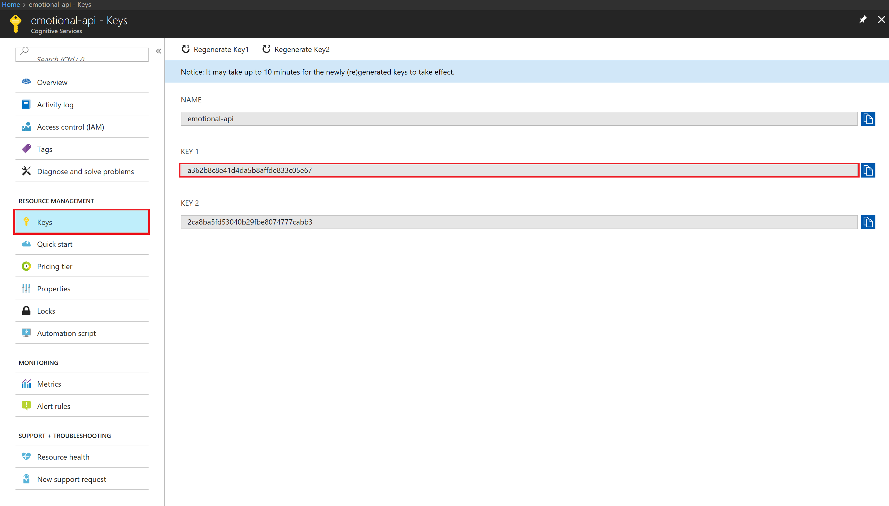
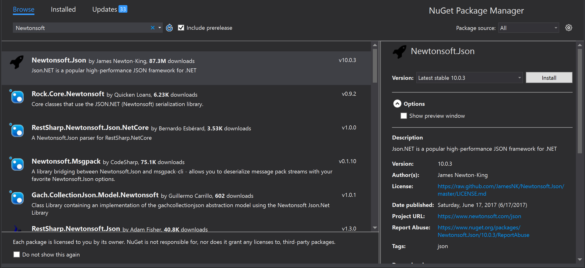

# Quickstart: Build an app to recognize emotions on faces in an image.

> [!IMPORTANT]
> The Emotion API will be deprecated on February 15, 2019. The emotion recognition capability is now generally available as part of the [Face API](https://docs.microsoft.com/azure/cognitive-services/face/).

This article provides information and a code sample to help you quickly get started by using the [Emotion API Recognize method](https://westus.dev.cognitive.microsoft.com/docs/services/5639d931ca73072154c1ce89/operations/563b31ea778daf121cc3a5fa) with C#. You can use it to recognize the emotions expressed by one or more people in an image.

## Prerequisites
* Get the Cognitive Services [Emotion API Windows SDK](https://www.nuget.org/packages/Microsoft.ProjectOxford.Emotion/).
* Get your free [subscription key](https://azure.microsoft.com/try/cognitive-services/).

## Emotion recognition C# example request

Create a new Console solution in Visual Studio, and then replace Program.cs with the following code. Change the `string uri` to use the region where you obtained your subscription keys. Replace the **Ocp-Apim-Subscription-Key** value with your valid subscription key. To find the subscription key, go to the Azure portal. On the navigation pane on the left, under the **Keys** section, browse to your Emotion API resource. Similarly, you can get the proper connect URI in the **Overview** panel for your resource listed under **Endpoint**.



To process the response of your request, use a library like `Newtonsoft.Json`. This way you can handle a JSON string as a series of manageable objects called Tokens. To add this library to your package, right-click your project in Solution Explorer and select **Manage Nuget Packages**. Then search for **Newtonsoft**. The first result should be **Newtonsoft.Json**. Select **Install**. You can now reference this library in your application.



```csharp
using System;
using System.IO;
using System.Net.Http.Headers;
using System.Net.Http;
using Newtonsoft.Json.Linq;

namespace CSHttpClientSample
{
    static class Program
    {
        static void Main()
        {
            Console.Write("Enter the path to a JPEG image file:");
            string imageFilePath = Console.ReadLine();

            MakeRequest(imageFilePath);

            Console.WriteLine("\n\n\nWait for the result below, then hit ENTER to exit...\n\n\n");
            Console.ReadLine(); // wait for ENTER to exit program
        }

        static byte[] GetImageAsByteArray(string imageFilePath)
        {
            FileStream fileStream = new FileStream(imageFilePath, FileMode.Open, FileAccess.Read);
            BinaryReader binaryReader = new BinaryReader(fileStream);
            return binaryReader.ReadBytes((int)fileStream.Length);
        }

        static async void MakeRequest(string imageFilePath)
        {
            var client = new HttpClient();

            // Request headers - replace this example key with your valid key.
            client.DefaultRequestHeaders.Add("Ocp-Apim-Subscription-Key", "<your-subscription-key>"); //

            // NOTE: You must use the same region in your REST call as you used to obtain your subscription keys.
            //   For example, if you obtained your subscription keys from westcentralus, replace "westus" in the
            //   URI below with "westcentralus".
            string uri = "https://westus.api.cognitive.microsoft.com/emotion/v1.0/recognize?";
            HttpResponseMessage response;
            string responseContent;

            // Request body. Try this sample with a locally stored JPEG image.
            byte[] byteData = GetImageAsByteArray(imageFilePath);

            using (var content = new ByteArrayContent(byteData))
            {
                // This example uses content type "application/octet-stream".
                // The other content types you can use are "application/json" and "multipart/form-data".
                content.Headers.ContentType = new MediaTypeHeaderValue("application/octet-stream");
                response = await client.PostAsync(uri, content);
                responseContent = response.Content.ReadAsStringAsync().Result;
            }

            // A peek at the raw JSON response.
            Console.WriteLine(responseContent);

            // Processing the JSON into manageable objects.
            JToken rootToken = JArray.Parse(responseContent).First;

            // First token is always the faceRectangle identified by the API.
            JToken faceRectangleToken = rootToken.First;

            // Second token is all emotion scores.
            JToken scoresToken = rootToken.Last;

            // Show all face rectangle dimensions
            JEnumerable<JToken> faceRectangleSizeList = faceRectangleToken.First.Children();
            foreach (var size in faceRectangleSizeList) {
                Console.WriteLine(size);
            }

            // Show all scores
            JEnumerable<JToken> scoreList = scoresToken.First.Children();
            foreach (var score in scoreList) {
                Console.WriteLine(score);
            }
        }
    }
}
```

## Recognize emotions sample response
A successful call returns an array of face entries and their associated emotion scores. They are ranked by face rectangle size in descending order. An empty response indicates that no faces were detected. An emotion entry contains the following fields:

* faceRectangle: Rectangle location of face in the image
* scores: Emotion scores for each face in the image

```json
application/json
[
  {
    "faceRectangle": {
      "left": 68,
      "top": 97,
      "width": 64,
      "height": 97
    },
    "scores": {
      "anger": 0.00300731952,
      "contempt": 5.14648448E-08,
      "disgust": 9.180124E-06,
      "fear": 0.0001912825,
      "happiness": 0.9875571,
      "neutral": 0.0009861537,
      "sadness": 1.889955E-05,
      "surprise": 0.008229999
    }
  }
]
