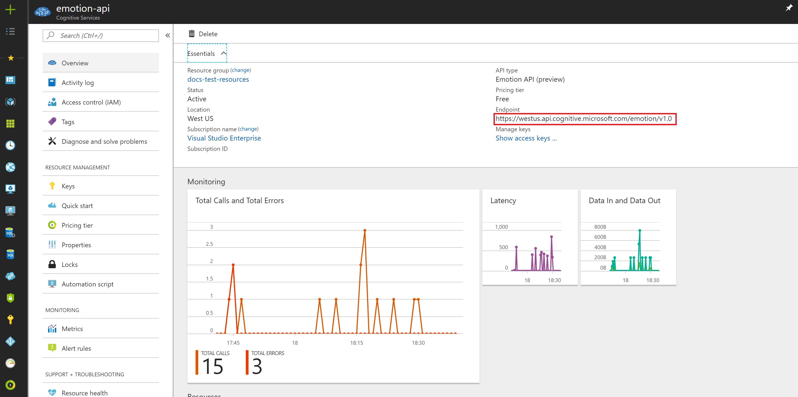
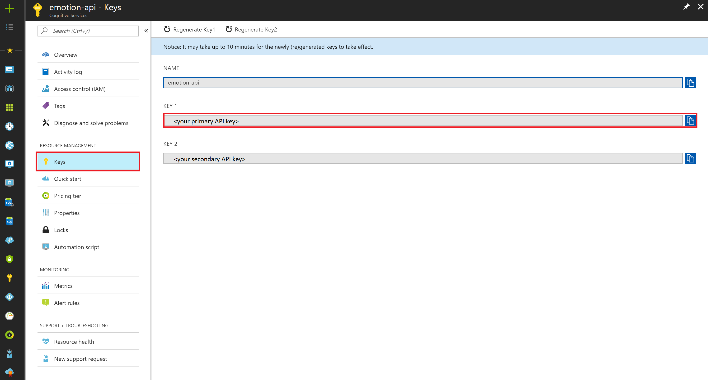

# Quickstart: Build an app to recognize emotions on faces in an image.

> [!IMPORTANT]
> The Emotion API will be deprecated on February 15, 2019. The emotion recognition capability is now generally available as part of the [Face API](https://docs.microsoft.com/azure/cognitive-services/face/). 

This article provides information and code samples to help you quickly get started using the [Emotion API Recognize method](https://westus.dev.cognitive.microsoft.com/docs/services/5639d931ca73072154c1ce89/operations/563b31ea778daf121cc3a5fa) with JavaScript to recognize the emotions expressed by one or more people in an image.

## Prerequisite
* Get your free Subscription Key [here](https://azure.microsoft.com/try/cognitive-services/), or if you have an Azure Subscription create an Emotion API resource and get your Subscription Key and Endpoint there.


## Recognize Emotions JavaScript Example Request

Copy the following and save it to a file such as `test.html`. Change the request `url` to use the location where you obtained your subscription keys, and replace the "Ocp-Apim-Subscription-Key" value with your valid subscription key. These can be found in the Azure portal in the Overview and Keys sections of your Emotion API resource, respectively.





Change the request body to the location of an image you want to use. To run the sample, drag-and-drop the file into your browser.

```html
<!DOCTYPE html>
<html>
<head>
    <title>JSSample</title>
    <script src="http://ajax.googleapis.com/ajax/libs/jquery/1.9.0/jquery.min.js"></script>
</head>

<h2>Face Rectangle</h2>
<ul id="faceRectangle">
<!-- Will populate list with response content -->
</ul>

<h2>Emotions</h2>
<ul id="scores">
<!-- Will populate list with response content -->
</ul>

<body>

<script type="text/javascript">
    $(function() {
        // No query string parameters for this API call.
        var params = { };

        $.ajax({
            // NOTE: You must use the same location in your REST call as you used to obtain your subscription keys.
            //   For example, if you obtained your subscription keys from westcentralus, replace "westus" in the
            //   URL below with "westcentralus".
            url: "https://westus.api.cognitive.microsoft.com/emotion/v1.0/recognize?" + $.param(params),
            beforeSend: function(xhrObj){
                // Request headers, also supports "application/octet-stream"
                xhrObj.setRequestHeader("Content-Type","application/json");

                // NOTE: Replace the "Ocp-Apim-Subscription-Key" value with a valid subscription key.
                xhrObj.setRequestHeader("Ocp-Apim-Subscription-Key","<your subscription key>");
            },
            type: "POST",
            // Request body
            data: '{"url": "<your image url>"}',
        }).done(function(data) {
            // Get face rectangle dimensions
            var faceRectangle = data[0].faceRectangle;
            var faceRectangleList = $('#faceRectangle');

            // Append to DOM
            for (var prop in faceRectangle) {
                faceRectangleList.append("<li> " + prop + ": " + faceRectangle[prop] + "</li>");
            }

            // Get emotion confidence scores
            var scores = data[0].scores;
            var scoresList = $('#scores');

            // Append to DOM
            for(var prop in scores) {
                scoresList.append("<li> " + prop + ": " + scores[prop] + "</li>")
            }
        }).fail(function(err) {
            alert("Error: " + JSON.stringify(err));
        });
    });
</script>
</body>
</html>
```

## Recognize Emotions Sample Response
A successful call returns an array of face entries and their associated emotion scores, ranked by face rectangle size in descending order. An empty response indicates that no faces were detected. An emotion entry contains the following fields:
* faceRectangle - Rectangle location of face in the image.
* scores - Emotion scores for each face in the image.

```json
application/json
[
  {
    "faceRectangle": {
      "left": 68,
      "top": 97,
      "width": 64,
      "height": 97
    },
    "scores": {
      "anger": 0.00300731952,
      "contempt": 5.14648448E-08,
      "disgust": 9.180124E-06,
      "fear": 0.0001912825,
      "happiness": 0.9875571,
      "neutral": 0.0009861537,
      "sadness": 1.889955E-05,
      "surprise": 0.008229999
    }
  }
]
