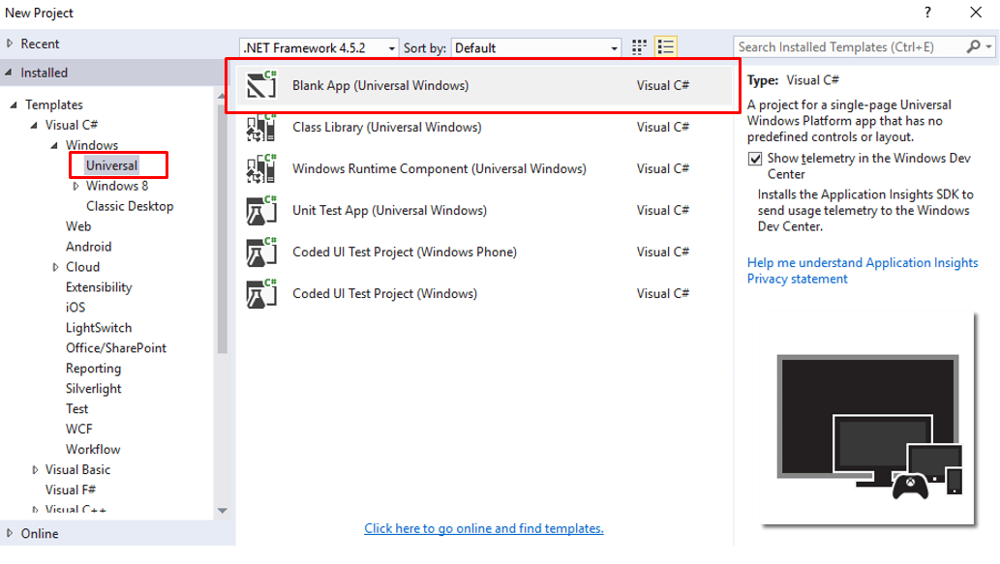
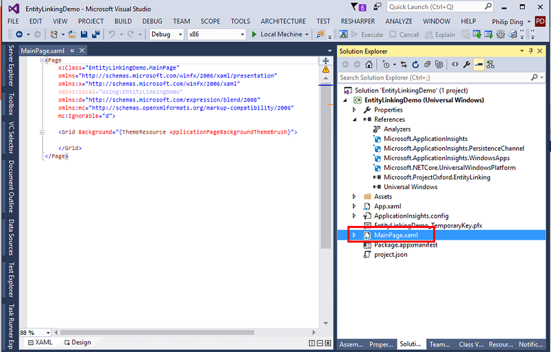
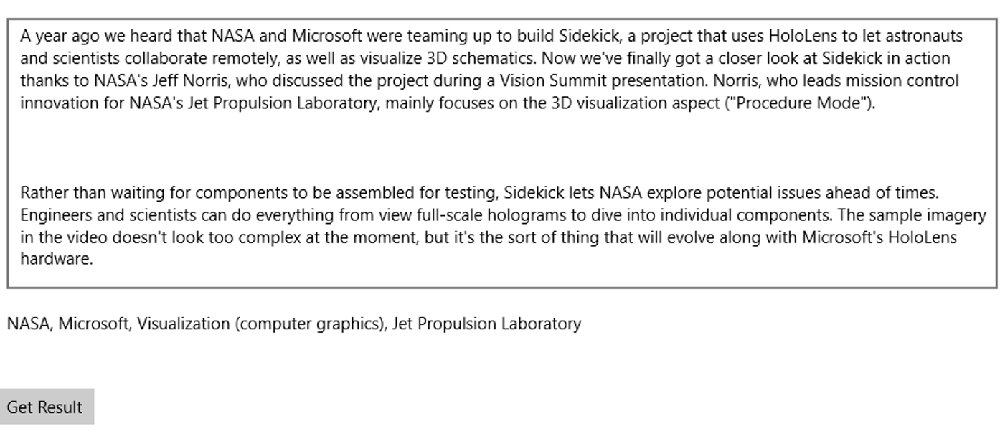

# Tutorial: Build an Entity Linking app with C#

Microsoft's Entity Linking is a natural language processing tool to analyze text and link named-entities to relevant entries in a knowledge base. 

This tutorial explores entity linking by using the Entity Linking Client Library as a NuGet package. 

### <a name="Prerequisites">Prerequisites</a>

- Visual Studio 2015
- A Microsoft Cognitive Services API Key
- Get the client library and example
- Microsoft Entity Linking NuGet Package

You may download the Entity Linking Intelligence Service API Client Library via [SDK](https://www.github.com/microsoft/cognitive-entitylinking-windows). The downloaded zip file needs to be extracted to a folder of your choice, many users choose the Visual Studio 2015 folder.

### <a name="step-1-subscribe-entity-linking-intelligence-service-and-get-your-own-key">Step 1: Subscribe to Entity Linking Intelligence Service and get your key</a>
Before using Entity Linking Intelligence Service, you must sign up for an API key. See [Subscriptions](https://www.microsoft.com/cognitive-services/en-us/sign-up). Both the primary and secondary key can be used in this tutorial.

### <a name="step-2-create-a-new-project-in-visual-studio"> Step 2: Create a new project in Visual Studio</a>

Let’s start by creating a new project in Visual Studio. First, launch Visual Studio 2015 from the Start Menu. Then, create a new project by selecting **Installed → Templates → Visual C# → Windows Universal → Blank App** for your project template:

 

### <a name="step-3-add-the-entity-linking-nuget-package-to-your-project">Step 3: Add the Entity Linking NuGet Package to your project</a>

Entity Linking of Cognitive Services is released as a NuGet.org package and needs to be installed before you can use it.
To add it to your project, go to the **Solution Explorer** tab, right click your project, and select **Manage Nuget Packages**.

First, in the **NuGet Package Manager** window, select NuGet.org as your **Package Source** in the upper right corner. Select **Browse** in the upper left corner and in the search box type “ProjectOxford.EntityLinking”. Select the **Microsoft.ProjectOxford.EntityLinking** NuGet package and click **Install**.

Next, search for Newtonsoft.Json and install. If you are prompted to review changes, click **OK**. If you are presented with the EntityLinking license terms, click **I Accept**.

Entity Linking is now installed as part of your application. You can confirm this by checking that the** Microsoft.ProjectOxford.EntityLinking** reference is present as part of your project in Solution Explorer.

 
 
### <a name="step-4-add-an-input-and-output-text-block-to-your-apps-xaml">Step 4: Add an input and output text block to your app’s XAML</a>
Navigate to **MainPage.xaml** in **Solution Explorer**, then double click the file which will open it in a new window. For convenience, you can double click on the **XAML** button in the **Designer** tab, this will hide the **Visual Designer** and reserve all of the space for the code view.

 
 
As a text service, the best way to visualize the functionality is creating an input and an output text block. To do this, add the following XAML in the **Grid**. This code adds three components, an input text box, an output text block, and a start button.
 
 ```XAML
 <Grid Background="{ThemeResource ApplicationPageBackgroundThemeBrush}">
    <Grid.RowDefinitions>
        <RowDefinition Height="*"/>
        <RowDefinition Height="*" />
        <RowDefinition Height="50" />
    </Grid.RowDefinitions>
    <TextBox x:Name="inputBox" Grid.Row="0" TextWrapping="Wrap" Text="Enter a paragraph" Margin="10" AcceptsReturn="True" />
    <TextBlock x:Name="outputBlock" Grid.Row="1" TextWrapping="Wrap" Text="Result will be here" Margin="10" />
    <Button x:Name="button" Grid.Row="2" Content="Get Result" />
</Grid>
 ```
 
### <a name="step-5-proceed-to-add-entity-linking-intelligence-service">Step 5: Proceed to add Entity Linking Intelligence Service</a>
 
The user interface is now created. Before using the Entity Linking service, we need to add the button-Click handler. Open **MainPage.xaml** from **Solution Explorer**. Add a button_Click handler in the end of the button.
 
 ```XAML
 <Button x:Name="button" Grid.Row="2" Content="Get Result" Click="button_Click" />
 ```
 
A button-Click handler needs to be implemented in the code. Open **MainPage.xaml.cs** from **Solution Explorer** to implement the button-Click. The EntityLinkingServiceClient is a wrapper to retrieve Entity Linking responses. The constructor argument of EntityLinkingServiceClient is the Cognitive Services subscription key. Paste in the subscription key you got in **Step 1** to call the Entity Linking service. 

Below is example code, which adds the "wikipediaId" to the response by using Entity Linking Service. 
 
 ```csharp
 private async void button_Click(object sender, RoutedEventArgs e)
{
    var text = this.inputBox.Text;
    var client = new EntityLinkingServiceClient("Your subscription key","https://api.labs.cognitive.microsoft.com");
    var linkResponse = await client.LinkAsync(text);
    var result = string.Join(", ", linkResponse.Select(i => i.WikipediaID).ToList());
    this.outputBlock.Text = result;
}
 ```
 
Now you are ready to run your first natural language processing Entity Linking App. Press the **F5 key** to compile and launch the application. Paste text snippets or paragraphs into the input box. Press the "Get Result" button and observe the identified entities in the output block.
 
 
 
### <a name="summary">Summary</a>
 
In this tutorial you’ve learned how to create an application to leverage Entity Linking Intelligence Service Client Library with just a few lines of C# and XAML code. 

