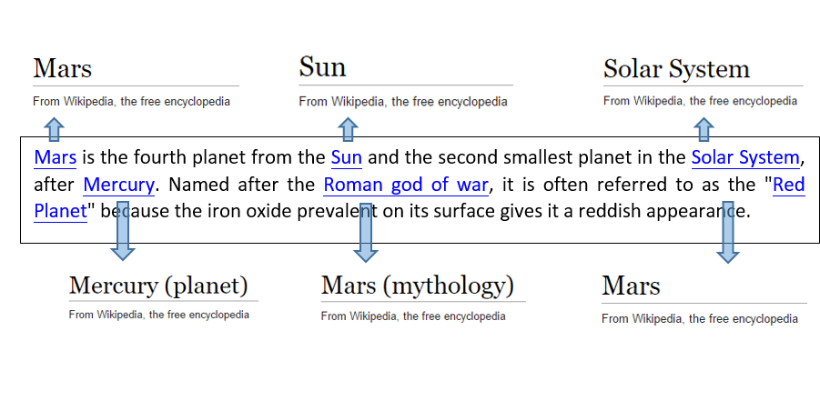

# What is the Entity Linking Intelligence Service API?

Welcome to the Entity Linking Intelligence Service, a web service created to help developers with tasks relating to entity linking.

## Entity Linking

Sometimes in different contexts, a word might be used as a named entity, a verb, or other word form within a given sentence. For example, in the case where “times” is a named entity, it still may refer to two separately distinguishable entities, such as “The New York Times” or “Times Square”. Given a specific paragraph within a document, the Entity Linking Intelligence Service will recognize and identify each separate entity based on its context.  

The illustration below shows an example of entity linking. Specifically, when using Wikipedia, the Entity Linking Intelligence Service detects all entities mentioned within the input text and links them to relevant reference points according to the page ID.

 
 
## Get Started
 
To quickly go through the Entity Linking basic functionalities and subscription process, refer to our getting started tutorial.
[Getting Started with Entity Linking API in C#](GettingStarted.md)

