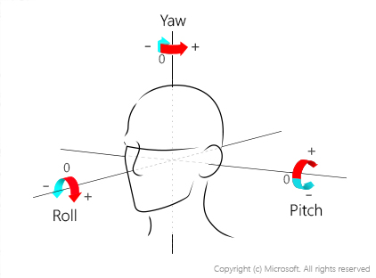

# Glossary

## A

#### Attributes

Attributes are optional in the [detection](#Detection-Face-Detection) results, such as [age](#Age-Attribute), [gender](#Gender-Attribute), [head pose](#Head-Pose-Attribute), [facial hair](#Facial-Hair-Attribute), [smiling](#Smile-Attribute).
They can be obtained from the [detection](#Detection-Face-Detection) API by specifying the query parameters: returnFaceAttributes. Attributes give extra information regarding selected [faces](#Face); in addition to the [face ID](#Face-ID) and the [rectangle](#Face-Rectangle).

For more details, please refer to the guide
[Face - Detect](https://westus.dev.cognitive.microsoft.com/docs/services/563879b61984550e40cbbe8d/operations/563879b61984550f30395236).

#### Age (Attribute)

Age is one of the [attributes](#Attributes) that describes the age of a particular face. The age attribute is optional in the [detection](#Detection-Face-Detection) results, and can be controlled with a [detection](#Detection-Face-Detection) request by specifying the returnFaceAttributes parameter.

For more details, please refer to the guide
[Face - Detect](https://westus.dev.cognitive.microsoft.com/docs/services/563879b61984550e40cbbe8d/operations/563879b61984550f30395236).

## B

## C

#### Candidate

Candidates are essentially [identification](#Identification) results (e.g. identified persons and level of confidence in detections). A candidate is represented by the [PersonID](#Person-ID) and [confidence](#Confidence), indicating that the person is identified with a high level of confidence.

For more details, please refer to the guide
[Face - Identify](https://westus.dev.cognitive.microsoft.com/docs/services/563879b61984550e40cbbe8d/operations/563879b61984550f30395239).

#### Confidence

Confidence is a measurement revealing the similarity between [faces](#Face) or [Person](#Person) in numerical values –which is used in [identification](#Identification), and [verification](#Verification) to indicate the similarities of searched, identified and verified results.

For more details, please refer to the following guides:
[Face - Find Similar](https://westus.dev.cognitive.microsoft.com/docs/services/563879b61984550e40cbbe8d/operations/563879b61984550f30395237),
[Face - Identify](https://westus.dev.cognitive.microsoft.com/docs/services/563879b61984550e40cbbe8d/operations/563879b61984550f30395239),
[Face - Verify](https://westus.dev.cognitive.microsoft.com/docs/services/563879b61984550e40cbbe8d/operations/563879b61984550f3039523a).

## D

#### Detection/Face Detection

Face detection is the action of locating faces in images. Users can upload an image or specify an image URL in the request. The detected faces are returned with [face IDs](#Face-ID)	indicating a unique identity in Face API. The rectangles indicate the face locations in the image in pixels, as well as the optional [attributes](#Attributes) for each face such as [age](#Age-Attribute), [gender](#Gender-Attribute), [head pose](#Head-Pose-Attribute), [facial hair](#Facial-Hair-Attribute) and [smiling](#Smile-Attribute).

For more details, please refer to the guide
[Face - Detect](https://westus.dev.cognitive.microsoft.com/docs/services/563879b61984550e40cbbe8d/operations/563879b61984550f30395236).

## E

## F

#### Face

Face is a unified term for the results derived from Face API related with detected faces. Ultimately, face is represented by a unified identity ([Face ID](#Face-ID)), a specified region in images ([Face Rectangle](#Face-Rectangle)), and extra face related [attributes](#Face-Attributes-Facial-Attributes), such as [age](#Age-Attribute), [gender](#Gender-Attribute), [landmarks](#Face-Landmarks-Facial-Landmarks) and [head pose](#Head-Pose-Attribute). Additionally, faces can be returned from [detection](#Detection-Face-Detection).

For more details, please refer to the guide
[Face - Detect](https://westus.dev.cognitive.microsoft.com/docs/services/563879b61984550e40cbbe8d/operations/563879b61984550f30395236).

#### Face API

Face API is a cloud-based API that provides the most advanced algorithms for face detection and recognition. The main functionality of Face API can be divided into two categories: face [detection](#Detection-Face-Detection) with [attributes](#Face-Attributes-Facial-Attributes), and face [recognition](#Recognition).

For more details, please refer to the following guides:
[Face API Overview](./Overview.md),
[Face - Detect](https://westus.dev.cognitive.microsoft.com/docs/services/563879b61984550e40cbbe8d/operations/563879b61984550f30395236),
[Face - Find Similar](https://westus.dev.cognitive.microsoft.com/docs/services/563879b61984550e40cbbe8d/operations/563879b61984550f30395237),
[Face - Group](https://westus.dev.cognitive.microsoft.com/docs/services/563879b61984550e40cbbe8d/operations/563879b61984550f30395238),
[Face - Identify](https://westus.dev.cognitive.microsoft.com/docs/services/563879b61984550e40cbbe8d/operations/563879b61984550f30395239),
[Face - Verify](https://westus.dev.cognitive.microsoft.com/docs/services/563879b61984550e40cbbe8d/operations/563879b61984550f3039523a).

#### Face Attributes/Facial Attributes

Please see [Attributes](#Attributes).

#### Face ID

Face ID is derived from the [detection](#Detection-Face-Detection) results, in which a string represents a [face](#Face) in [Face API](#Face-API).

For more details, please refer to the guide
[Face - Detect](https://westus.dev.cognitive.microsoft.com/docs/services/563879b61984550e40cbbe8d/operations/563879b61984550f30395236).

#### Face Landmarks/Facial Landmarks

Landmarks are optional in the [detection](#Detection-Face-Detection) results; which are semantic facial points, such as the eyes, nose and mouth (illustrated in following figure). Landmarks can be controlled with a [detection](#Detection-Face-Detection) request by the Boolean number returnFaceLandmarks. If returnFaceLandmarks is set as true, the returned faces will have landmark attributes.

For more details, please refer to the guide
[Face - Detect](https://westus.dev.cognitive.microsoft.com/docs/services/563879b61984550e40cbbe8d/operations/563879b61984550f30395236).

#### Face Rectangle

Face rectangle is derived from the [detection](#Detection-Face-Detection) results, which is an upright rectangle (left, top, width, height) in images in pixels. The top-left corner of a [face](#Face) (left, top), besides the width and height, indicates face sizes in x and y axes respectively.

For more details, please refer to the guide
[Face - Detect](https://westus.dev.cognitive.microsoft.com/docs/services/563879b61984550e40cbbe8d/operations/563879b61984550f30395236).

#### Facial Hair (Attribute)

Facial hair is one of the [attributes](#Attributes) used to describe the facial hair length of the available faces. The facial hair attribute is optional in the [detection](#Detection-Face-Detection) results, and can be controlled with a [detection](#Detection-Face-Detection) request by returnFaceAttributes. If returnFaceAttributes contains 'facialHair', the returned faces will have facial hair attributes.

For more details, please refer to the guide
[Face - Detect](https://westus.dev.cognitive.microsoft.com/docs/services/563879b61984550e40cbbe8d/operations/563879b61984550f30395236).

#### FaceList

FaceList is a collection of [PersistedFace](#PersistedFace) and is the unit of [Find Similar](#Find-Similar). A FaceList comes with a [FaceList ID](#FaceList-ID), as well as other attributes such as [Name](#Name) and [User Data](#UserData-User-Data).

For more details, please refer to the following guides:
[FaceList - Create](https://westus.dev.cognitive.microsoft.com/docs/services/563879b61984550e40cbbe8d/operations/563879b61984550f3039524b),
[FaceList - Get](https://westus.dev.cognitive.microsoft.com/docs/services/563879b61984550e40cbbe8d/operations/563879b61984550f3039524c).

#### FaceList ID

FaceList ID is a user provided string used as an identifier of a [FaceList](#FaceList). The FaceList ID must be unique within the subscription.

For more details, please refer to the following guides:
[FaceList - Create](https://westus.dev.cognitive.microsoft.com/docs/services/563879b61984550e40cbbe8d/operations/563879b61984550f3039524b),
[FaceList - Get](https://westus.dev.cognitive.microsoft.com/docs/services/563879b61984550e40cbbe8d/operations/563879b61984550f3039524c).

#### Find Similar

This API is used to search/query similar faces based on a collection of faces. Query faces and face collections are represented as [face IDs](#Face-ID) or [FceList ID](#FaceList-ID)/[LargeFaceList ID](#LargeFaceList-ID) in the request. Returned results are searched similar faces, represented by [face IDs](#Face-ID) or [PersistedFace IDs](#PersistedFace-ID).

For more details, please refer to the following guides:
[Face - Find Similar](https://westus.dev.cognitive.microsoft.com/docs/services/563879b61984550e40cbbe8d/operations/563879b61984550f30395237),
[LargeFaceList - Create](https://westus.dev.cognitive.microsoft.com/docs/services/563879b61984550e40cbbe8d/operations/5a157b68d2de3616c086f2cc),
[FaceList - Create](https://westus.dev.cognitive.microsoft.com/docs/services/563879b61984550e40cbbe8d/operations/563879b61984550f3039524b).

## G

#### Gender (Attribute)

Gender is one of the [attributes](#Attributes) used to describe the genders of the available faces. The gender attribute is optional in the [detection](#Detection-Face-Detection) results, and can be controlled with a [detection](#Detection-Face-Detection) request by returnFaceAttributes. If returnfaceAttributes contains 'gender', the returned faces will have gender attributes.

For more details, please refer to the guide
[Face - Detect](https://westus.dev.cognitive.microsoft.com/docs/services/563879b61984550e40cbbe8d/operations/563879b61984550f30395236).

#### Grouping

Face grouping is the grouping of a collection of faces according to facial similarities. Face collections are indicated by the face ID collections in the request. As a result of grouping, similar faces are grouped together as [groups](#Groups), and faces that are not similar to any other face are merged together as a messy group. There is at the most, one [messy group](#Messy-Group) in the grouping result.

For more details, please refer to the guide
[Face - Group](https://westus.dev.cognitive.microsoft.com/docs/services/563879b61984550e40cbbe8d/operations/563879b61984550f30395238).

#### Groups

Groups are derived from the [grouping](#Grouping) results. Each group contains a collection of similar faces, where faces are indicated by [face IDs](#Face-ID).

For more details, please refer to the guide
[Face - Group](https://westus.dev.cognitive.microsoft.com/docs/services/563879b61984550e40cbbe8d/operations/563879b61984550f30395238).

## H

#### Head Pose (Attribute)

Head pose is one of the [attributes](#Attributes) that represents face orientation in 3D space according to roll, pitch and yaw angles, as shown in following figure. The value ranges of roll and yaw are [-180, 180] and [-90, 90] in degrees. In the current version, the pitch value returned from detection is always 0. The head pose attribute is optional in the [detection](#Detection-Face-Detection) results, and can be controlled with a [detection](#Detection-Face-Detection) request by the returnFaceAttributes parameter. If returnFaceAttributes parameter contains 'headPose', the returned faces will have head pose attributes.

For more details, please refer to the guide
[Face - Detect](https://westus.dev.cognitive.microsoft.com/docs/services/563879b61984550e40cbbe8d/operations/563879b61984550f30395236).

## I

#### Identification

Identification is to identify one or more faces from a LargePersonGroup/PersonGroup.
A [PersonGroup](#PersonGroup)/[LargePersonGroup](#LargePersonGroup) is a collection of [Persons](#Person).
Faces and the LargePersonGroup/PersonGroup are represented by [face IDs](#Face-ID) and
[LargePersonGroup IDs](#LargePersonGroup-ID)/[PersonGroup IDs](#PersonGroup-ID) respectively in the request.
Identified results are [candidates](#Candidate), represented by [Persons](#Person) with confidence.
Multiple faces in the input are considered separately, and each face will have its own identified result.

> [!NOTE]
> The LargePersonGroup/PersonGroup should be trained successfully before identification. If the LargePersonGroup/PersonGroup is not trained, or the training [status](#Status-Train) is not shown as 'succeeded' (i.e. 'running', 'failed', or 'timeout'), the request response is 400.
> 

For more details, please refer to the following guides:
[Face - Identify](https://westus.dev.cognitive.microsoft.com/docs/services/563879b61984550e40cbbe8d/operations/563879b61984550f30395239),
[LargePersonGroup Person - Create](https://westus.dev.cognitive.microsoft.com/docs/services/563879b61984550e40cbbe8d/operations/599adcba3a7b9412a4d53f40),
[LargePersonGroup - Create](https://westus.dev.cognitive.microsoft.com/docs/services/563879b61984550e40cbbe8d/operations/599acdee6ac60f11b48b5a9d),
[LargePersonGroup - Train](https://westus.dev.cognitive.microsoft.com/docs/services/563879b61984550e40cbbe8d/operations/599ae2d16ac60f11b48b5aa4),
[PersonGroup Person - Create](https://westus.dev.cognitive.microsoft.com/docs/services/563879b61984550e40cbbe8d/operations/563879b61984550f3039523c),
[PersonGroup - Create](https://westus.dev.cognitive.microsoft.com/docs/services/563879b61984550e40cbbe8d/operations/563879b61984550f30395244),
[PersonGroup - Train](https://westus.dev.cognitive.microsoft.com/docs/services/563879b61984550e40cbbe8d/operations/563879b61984550f30395249).

#### IsIdentical

IsIdentical is a Boolean field of [verification](#Verification) results indicating whether two faces belong to the same person.

For more details, please refer to the guide
[Face - Verify](https://westus.dev.cognitive.microsoft.com/docs/services/563879b61984550e40cbbe8d/operations/563879b61984550f3039523a).

## J

## K

## L

#### Landmarks

Please see [face landmarks](#Face-Landmarks-Facial-Landmarks).

#### LargeFaceList

LargeFaceList is a collection of [PersistedFace](#PersistedFace) and is the unit of [Find Similar](#Find-Similar). A LargeFaceList comes with a [LargeFaceList ID](#LargeFaceList-ID), as well as other attributes such as [Name](#Name) and [User Data](#UserData-User-Data).

For more details, please refer to the following guides:
[LargeFaceList - Create](https://westus.dev.cognitive.microsoft.com/docs/services/563879b61984550e40cbbe8d/operations/5a157b68d2de3616c086f2cc),
[LargeFaceList - Get](https://westus.dev.cognitive.microsoft.com/docs/services/563879b61984550e40cbbe8d/operations/5a15827cd2de3616c086f2ce),
[LargeFaceList - List Face](https://westus.dev.cognitive.microsoft.com/docs/services/563879b61984550e40cbbe8d/operations/5a158db4d2de3616c086f2d6).

#### LargeFaceList ID

LargeFaceList ID is a user provided string used as an identifier of a [LargeFaceList](#LargeFaceList). The LargeFaceList ID must be unique within the subscription.

For more details, please refer to the following guides:
[LargeFaceList - Create](https://westus.dev.cognitive.microsoft.com/docs/services/563879b61984550e40cbbe8d/operations/5a157b68d2de3616c086f2cc),
[LargeFaceList - Get](https://westus.dev.cognitive.microsoft.com/docs/services/563879b61984550e40cbbe8d/operations/5a15827cd2de3616c086f2ce).

#### LargePersonGroup

LargePersonGroup is a collection of [Persons](#Person) and is the unit of [Identification](#Identification). A LargePersonGroup comes with a [LargePersonGroup ID](#LargePersonGroup-ID), as well as other attributes such as [Name](#Name) and [User Data](#UserData-User-Data).

For more details, please refer to the following guides:
[LargePersonGroup - Create](https://westus.dev.cognitive.microsoft.com/docs/services/563879b61984550e40cbbe8d/operations/599acdee6ac60f11b48b5a9d),
[LargePersonGroup - Get](https://westus.dev.cognitive.microsoft.com/docs/services/563879b61984550e40cbbe8d/operations/599acebb6ac60f11b48b5a9e),
[LargePersonGroup Person - List](https://westus.dev.cognitive.microsoft.com/docs/services/563879b61984550e40cbbe8d/operations/599adda06ac60f11b48b5aa1).

#### LargePersonGroup ID

LargePersonGroup ID is a user provided string used as an identifier of a [LargePersonGroup](#LargePersonGroup). The LargePersonGroup ID must be unique within the subscription.

For more details, please refer to the following guides:
[LargePersonGroup - Create](https://westus.dev.cognitive.microsoft.com/docs/services/563879b61984550e40cbbe8d/operations/599acdee6ac60f11b48b5a9d),
[LargePersonGroup - Get](https://westus.dev.cognitive.microsoft.com/docs/services/563879b61984550e40cbbe8d/operations/599acebb6ac60f11b48b5a9e).

## M

#### Messy group

Messy group is derived from the [grouping](#Grouping) results; which contains faces not similar to any other face. Each face in a messy group is indicated by the [face ID](#Face-ID).

For more details, please refer to the guide
[Face - Group](https://westus.dev.cognitive.microsoft.com/docs/services/563879b61984550e40cbbe8d/operations/563879b61984550f30395238).

## N

#### Name (Person)

Name is a user friendly descriptive string for [Person](#Person). Unlike the [Person ID](#Person-ID), the name of people can be duplicated within a group.

For more details, please refer to the following guides:
[LargePersonGroup Person - Create](https://westus.dev.cognitive.microsoft.com/docs/services/563879b61984550e40cbbe8d/operations/599adcba3a7b9412a4d53f40),
[LargePersonGroup Person - Get](https://westus.dev.cognitive.microsoft.com/docs/services/563879b61984550e40cbbe8d/operations/599add376ac60f11b48b5aa0),
[PersonGroup Person - Create](https://westus.dev.cognitive.microsoft.com/docs/services/563879b61984550e40cbbe8d/operations/563879b61984550f3039523c),
[PersonGroup Person - Get](https://westus.dev.cognitive.microsoft.com/docs/services/563879b61984550e40cbbe8d/operations/563879b61984550f3039523f).

#### Name (LargePersonGroup/PersonGroup)

Name is also a user friendly descriptive string for [LargePersonGroup](#LargePersonGroup)/[PersonGroup](#PersonGroup). Unlike the [LargePersonGroup ID](#LargePersonGroup-ID)/[PersonGroup ID](#PersonGroup-ID), the name of LargePersonGroups/PersonGroups can be duplicated within a subscription.

For more details, please refer to the following guides:
[LargePersonGroup - Create](https://westus.dev.cognitive.microsoft.com/docs/services/563879b61984550e40cbbe8d/operations/599acdee6ac60f11b48b5a9d),
[LargePersonGroup - Get](https://westus.dev.cognitive.microsoft.com/docs/services/563879b61984550e40cbbe8d/operations/599acebb6ac60f11b48b5a9e),
[PersonGroup - Create](https://westus.dev.cognitive.microsoft.com/docs/services/563879b61984550e40cbbe8d/operations/563879b61984550f30395244),
[PersonGroup - Get](https://westus.dev.cognitive.microsoft.com/docs/services/563879b61984550e40cbbe8d/operations/563879b61984550f30395246).

## O

## P

#### PersistedFace

PersistedFace is a data structure in Face API. PersistedFace comes with a [PersistedFace ID](#PersistedFace-ID), as well as other attributes such as [Name](#Name), and [User Data](#UserData-User-Data).

For more details, please refer to the following guides:
[LargeFaceList - Add Face](https://westus.dev.cognitive.microsoft.com/docs/services/563879b61984550e40cbbe8d/operations/5a158c10d2de3616c086f2d3),
[FaceList - Add Face](https://westus.dev.cognitive.microsoft.com/docs/services/563879b61984550e40cbbe8d/operations/563879b61984550f30395250),
[LargePersonGroup Person - Add Face](https://westus.dev.cognitive.microsoft.com/docs/services/563879b61984550e40cbbe8d/operations/599adf2a3a7b9412a4d53f42),
[PersonGroup Person - Add Face](https://westus.dev.cognitive.microsoft.com/docs/services/563879b61984550e40cbbe8d/operations/563879b61984550f3039523b).

#### Person ID

Person ID is generated when a [PersistedFace](#PersistedFace) is created successfully. A string is created to represent this Face in [Face API](#Face-API).

For more details, please refer to the following guides:
[LargeFaceList - Add Face](https://westus.dev.cognitive.microsoft.com/docs/services/563879b61984550e40cbbe8d/operations/5a158c10d2de3616c086f2d3),
[FaceList - Add Face](https://westus.dev.cognitive.microsoft.com/docs/services/563879b61984550e40cbbe8d/operations/563879b61984550f30395250),
[LargePersonGroup Person - Add Face](https://westus.dev.cognitive.microsoft.com/docs/services/563879b61984550e40cbbe8d/operations/599adf2a3a7b9412a4d53f42),
[PersonGroup Person - Add Face](https://westus.dev.cognitive.microsoft.com/docs/services/563879b61984550e40cbbe8d/operations/563879b61984550f3039523b).

#### Person

Person is a data structure managed in Face API. Person comes with a [Person ID](#Person-ID), as well as other attributes such as [Name](#Name), a collection of [PersistedFace](#PersistedFace), and [User Data](#UserData-User-Data).

For more details, please refer to the following guides:
[LargePersonGroup Person - Create](https://westus.dev.cognitive.microsoft.com/docs/services/563879b61984550e40cbbe8d/operations/599adcba3a7b9412a4d53f40),
[LargePersonGroup Person - Get](https://westus.dev.cognitive.microsoft.com/docs/services/563879b61984550e40cbbe8d/operations/599add376ac60f11b48b5aa0),
[PersonGroup Person - Create](https://westus.dev.cognitive.microsoft.com/docs/services/563879b61984550e40cbbe8d/operations/563879b61984550f3039523c),
[PersonGroup Person - Get](https://westus.dev.cognitive.microsoft.com/docs/services/563879b61984550e40cbbe8d/operations/563879b61984550f3039523f).

#### Person ID

Person ID is generated when a [Person](#Person) is created successfully. A string is created to represent this person in [Face API](#Face-API).

For more details, please refer to the following guides:
[LargePersonGroup Person - Create](https://westus.dev.cognitive.microsoft.com/docs/services/563879b61984550e40cbbe8d/operations/599adcba3a7b9412a4d53f40),
[LargePersonGroup Person - Get](https://westus.dev.cognitive.microsoft.com/docs/services/563879b61984550e40cbbe8d/operations/599add376ac60f11b48b5aa0),
[PersonGroup Person - Create](https://westus.dev.cognitive.microsoft.com/docs/services/563879b61984550e40cbbe8d/operations/563879b61984550f3039523c),
[PersonGroup Person - Get](https://westus.dev.cognitive.microsoft.com/docs/services/563879b61984550e40cbbe8d/operations/563879b61984550f3039523f).

#### PersonGroup

PersonGroup is a collection of [Persons](#Person) and is the unit of [Identification](#Identification). A PersonGroup comes with a [PersonGroup ID](#PersonGroup-ID), as well as other attributes such as [Name](#Name) and [User Data](#UserData-User-Data).

For more details, please refer to the following guides:
[PersonGroup - Create](https://westus.dev.cognitive.microsoft.com/docs/services/563879b61984550e40cbbe8d/operations/563879b61984550f30395244),
[PersonGroup - Get](https://westus.dev.cognitive.microsoft.com/docs/services/563879b61984550e40cbbe8d/operations/563879b61984550f30395246),
[PersonGroup Person - List](https://westus.dev.cognitive.microsoft.com/docs/services/563879b61984550e40cbbe8d/operations/563879b61984550f30395241).

#### PersonGroup ID

PersonGroup ID is a user provided string used as an identifier of a [PersonGroup](#PersonGroup). The group ID must be unique within the subscription.

For more details, please refer to the following guides:
[PersonGroup - Create](https://westus.dev.cognitive.microsoft.com/docs/services/563879b61984550e40cbbe8d/operations/563879b61984550f30395244),
[PersonGroup - Get](https://westus.dev.cognitive.microsoft.com/docs/services/563879b61984550e40cbbe8d/operations/563879b61984550f30395246).

#### Pose (Attribute)

Please see [Head Pose](#Head-Pose-Attribute).

## Q

## R

#### Recognition

Recognition is a popular application area for face technologies, such as [Find Similar](#Find-Similar), [Grouping](#Grouping), [Identify](#Identification),[verifying two faces same or not](#Verification).

For more details, please refer to the following guides:
[Face - Find Similar](https://westus.dev.cognitive.microsoft.com/docs/services/563879b61984550e40cbbe8d/operations/563879b61984550f30395237),
[Face - Group](https://westus.dev.cognitive.microsoft.com/docs/services/563879b61984550e40cbbe8d/operations/563879b61984550f30395238),
[Face - Identify](https://westus.dev.cognitive.microsoft.com/docs/services/563879b61984550e40cbbe8d/operations/563879b61984550f30395239),
[Face - Verify](https://westus.dev.cognitive.microsoft.com/docs/services/563879b61984550e40cbbe8d/operations/563879b61984550f3039523a).

#### Rectangle (Face)

Please see [face rectangle](#Face-Rectangle).

## S

#### Smile (Attribute)

Smile is one of the [attributes](#Attributes) used to describe the smile expression of the available faces. The smile attribute is optional in the [detection](#Detection-Face-Detection) results, and can be controlled with a [detection](#Detection-Face-Detection) request by returnFaceAttributes. If returnFaceAttributes contains 'smile', the returned faces will have smile attributes.

For more details, please refer to the guide
[Face - Detect](https://westus.dev.cognitive.microsoft.com/docs/services/563879b61984550e40cbbe8d/operations/563879b61984550f30395236).

#### Similar Face Searching

Please see [Find Similar](#Find-Similar).

#### Status (Train)

Status is a string used to describe the procedure for [Training LargeFaceList/LargePersonGroups/PersonGroups](#Train), including 'notstarted', 'running', 'succeeded', 'failed'.

For more details, please refer to the guide
[LargeFaceList - Train](https://westus.dev.cognitive.microsoft.com/docs/services/563879b61984550e40cbbe8d/operations/5a158422d2de3616c086f2d1),
[LargePersonGroup - Train](https://westus.dev.cognitive.microsoft.com/docs/services/563879b61984550e40cbbe8d/operations/599ae2d16ac60f11b48b5aa4),
[PersonGroup - Train](https://westus.dev.cognitive.microsoft.com/docs/services/563879b61984550e40cbbe8d/operations/563879b61984550f30395249).

#### Subscription key

Subscription key is a string that you need to specify as a query string parameter in order to invoke any Face API. The subscription key can be found in My Subscriptions page after you sign in to Microsoft Cognitive Services portal. There will be two keys associated with each subscription: one primary key and one secondary key. Both can be used to invoke API identically. You need to keep the subscription keys secure, and you can regenerate subscription keys at any time from My Subscriptions page as well.

## T

#### Train (LargeFaceList/LargePersonGroup/PersonGroup)

This API is used to pre-process the [LargeFaceList](#LargeFaceList)/[LargePersonGroup](#LargePersonGroup)/[PersonGroup](#PersonGroup) to ensure the [Find Similar](#Find-Similar)/[Identification](#Identification) performance. If the training is not operated, or the [Training Status](#Status-Train) is not shown as succeeded, the identification for this PersonGroup will result in failure.

For more details, please refer to the following guides:
[LargeFaceList - Train](https://westus.dev.cognitive.microsoft.com/docs/services/563879b61984550e40cbbe8d/operations/5a158422d2de3616c086f2d1),
[LargePersonGroup - Train](https://westus.dev.cognitive.microsoft.com/docs/services/563879b61984550e40cbbe8d/operations/599ae2d16ac60f11b48b5aa4),
[PersonGroup - Train](https://westus.dev.cognitive.microsoft.com/docs/services/563879b61984550e40cbbe8d/operations/563879b61984550f30395249),
[Face - Identify](https://westus.dev.cognitive.microsoft.com/docs/services/563879b61984550e40cbbe8d/operations/563879b61984550f30395239).

## U

#### UserData/User Data

User data is extra information associated with [Person](#Person) and [PersonGroup](#PersonGroup)/[LargePersonGroup](#LargePersonGroup). User data is set by users to make data easier to use, understand and remember.

For more details, please refer to the following guides:
[LargePersonGroup - Create](https://westus.dev.cognitive.microsoft.com/docs/services/563879b61984550e40cbbe8d/operations/599acdee6ac60f11b48b5a9d),
[LargePersonGroup - Update](https://westus.dev.cognitive.microsoft.com/docs/services/563879b61984550e40cbbe8d/operations/599acfc83a7b9412a4d53f3f),
[LargePersonGroup Person - Create](https://westus.dev.cognitive.microsoft.com/docs/services/563879b61984550e40cbbe8d/operations/599adcba3a7b9412a4d53f40),
[LargePersonGroup Person - Update](https://westus.dev.cognitive.microsoft.com/docs/services/563879b61984550e40cbbe8d/operations/599ade043a7b9412a4d53f41),
[PersonGroup - Create](https://westus.dev.cognitive.microsoft.com/docs/services/563879b61984550e40cbbe8d/operations/563879b61984550f30395244),
[PersonGroup - Update](https://westus.dev.cognitive.microsoft.com/docs/services/563879b61984550e40cbbe8d/operations/563879b61984550f3039524a),
[PersonGroup Person - Create](https://westus.dev.cognitive.microsoft.com/docs/services/563879b61984550e40cbbe8d/operations/563879b61984550f3039523c),
[PersonGroup Person - Update](https://westus.dev.cognitive.microsoft.com/docs/services/563879b61984550e40cbbe8d/operations/563879b61984550f30395242).

## V

#### Verification

This API is used to verify whether two faces are the same or not. Both faces are represented as face IDs in the request. Verified results contain a Boolean field ([isIdentical](#Is-Identical)) indicating same if true and a number field ([confidence](#Confidence)) indicating the level of confidence.

For more details, please refer to the guide
[Face - Verify](https://westus.dev.cognitive.microsoft.com/docs/services/563879b61984550e40cbbe8d/operations/563879b61984550f3039523a).

## W

## X

## Y

## Z
