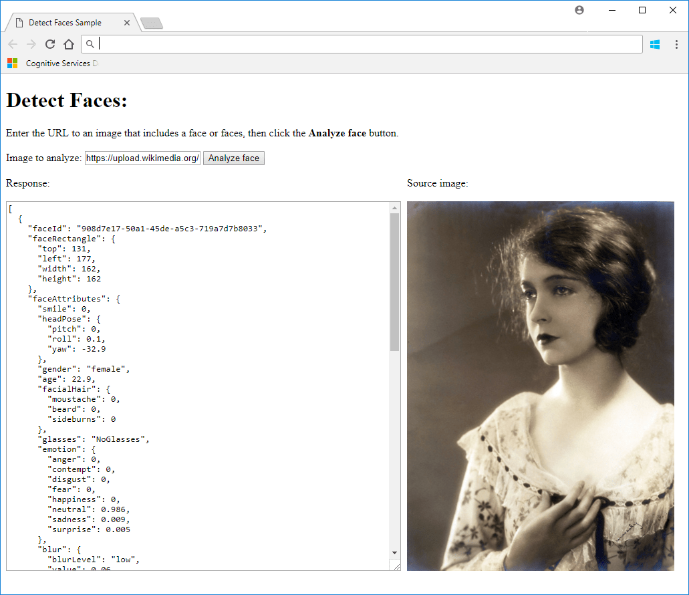

# Quickstart: Detect faces in an image using the REST API and JavaScript

In this quickstart, you'll use the Azure Face REST API with JavaScript to detect human faces in an image.

## Prerequisites

- A Face subscription key. You can get a free trial subscription key from [Try Cognitive Services](https://azure.microsoft.com/try/cognitive-services/?api=face-api). Or, follow the instructions in [Create a Cognitive Services account](https://docs.microsoft.com/azure/cognitive-services/cognitive-services-apis-create-account) to subscribe to the Face service and get your key.
- A code editor such as [Visual Studio Code](https://code.visualstudio.com/download)

## Initialize the HTML file

Create a new HTML file, *detectFaces.html*, and add the following code.

```html
<!DOCTYPE html>
<html>
    <head>
        <title>Detect Faces Sample</title>
        <script src="https://ajax.googleapis.com/ajax/libs/jquery/1.9.0/jquery.min.js"></script>
    </head>
    <body></body>
</html>
```

Then add the following code inside the `body` element of the document. This code sets up a basic user interface with a URL field, an **Analyze face** button, a response pane, and an image display pane.

```html
<h1>Detect Faces:</h1>
Enter the URL to an image that includes a face or faces, then click
the <strong>Analyze face</strong> button.<br><br>
Image to analyze: <input type="text" name="inputImage" id="inputImage"
    value="https://upload.wikimedia.org/wikipedia/commons/c/c3/RH_Louise_Lillian_Gish.jpg" />
<button onclick="processImage()">Analyze face</button><br><br>
<div id="wrapper" style="width:1020px; display:table;">
    <div id="jsonOutput" style="width:600px; display:table-cell;">
        Response:<br><br>
        <textarea id="responseTextArea" class="UIInput"
            style="width:580px; height:400px;"></textarea>
    </div>
    <div id="imageDiv" style="width:420px; display:table-cell;">
        Source image:<br><br>
        
    </div>
</div>
```

## Write the JavaScript script

Add the following code immediately above the `h1` element in your document. This code sets up the JavaScript code that calls the Face API.

```html
<script type="text/javascript">
    function processImage() {
        // Replace <Subscription Key> with your valid subscription key.
        var subscriptionKey = "<Subscription Key>";
    
        var uriBase =
            "https://<My Endpoint String>.com/face/v1.0/detect";
    
        // Request parameters.
        var params = {
            "returnFaceId": "true",
            "returnFaceLandmarks": "false",
            "returnFaceAttributes":
                "age,gender,headPose,smile,facialHair,glasses,emotion," +
                "hair,makeup,occlusion,accessories,blur,exposure,noise"
        };
    
        // Display the image.
        var sourceImageUrl = document.getElementById("inputImage").value;
        document.querySelector("#sourceImage").src = sourceImageUrl;
    
        // Perform the REST API call.
        $.ajax({
            url: uriBase + "?" + $.param(params),
    
            // Request headers.
            beforeSend: function(xhrObj){
                xhrObj.setRequestHeader("Content-Type","application/json");
                xhrObj.setRequestHeader("Ocp-Apim-Subscription-Key", subscriptionKey);
            },
    
            type: "POST",
    
            // Request body.
            data: '{"url": ' + '"' + sourceImageUrl + '"}',
        })
    
        .done(function(data) {
            // Show formatted JSON on webpage.
            $("#responseTextArea").val(JSON.stringify(data, null, 2));
        })
    
        .fail(function(jqXHR, textStatus, errorThrown) {
            // Display error message.
            var errorString = (errorThrown === "") ?
                "Error. " : errorThrown + " (" + jqXHR.status + "): ";
            errorString += (jqXHR.responseText === "") ?
                "" : (jQuery.parseJSON(jqXHR.responseText).message) ?
                    jQuery.parseJSON(jqXHR.responseText).message :
                        jQuery.parseJSON(jqXHR.responseText).error.message;
            alert(errorString);
        });
    };
</script>
```

You'll need to update the `subscriptionKey` field with the value of your subscription key, and you need to change the `uriBase` string so that it contains the correct endpoint string. The `returnFaceAttributes` field specifies which face attributes to retrieve; you may wish to change this string depending on your intended use.

[!INCLUDE [subdomains-note](../../../../includes/cognitive-services-custom-subdomains-note.md)]

## Run the script

Open *detectFaces.html* in your browser. When you click the **Analyze face** button, the app should display the image from the given URL and print out a JSON string of face data.



The following text is an example of a successful JSON response.

```json
[
  {
    "faceId": "49d55c17-e018-4a42-ba7b-8cbbdfae7c6f",
    "faceRectangle": {
      "top": 131,
      "left": 177,
      "width": 162,
      "height": 162
    },
    "faceAttributes": {
      "smile": 0,
      "headPose": {
        "pitch": 0,
        "roll": 0.1,
        "yaw": -32.9
      },
      "gender": "female",
      "age": 22.9,
      "facialHair": {
        "moustache": 0,
        "beard": 0,
        "sideburns": 0
      },
      "glasses": "NoGlasses",
      "emotion": {
        "anger": 0,
        "contempt": 0,
        "disgust": 0,
        "fear": 0,
        "happiness": 0,
        "neutral": 0.986,
        "sadness": 0.009,
        "surprise": 0.005
      },
      "blur": {
        "blurLevel": "low",
        "value": 0.06
      },
      "exposure": {
        "exposureLevel": "goodExposure",
        "value": 0.67
      },
      "noise": {
        "noiseLevel": "low",
        "value": 0
      },
      "makeup": {
        "eyeMakeup": true,
        "lipMakeup": true
      },
      "accessories": [],
      "occlusion": {
        "foreheadOccluded": false,
        "eyeOccluded": false,
        "mouthOccluded": false
      },
      "hair": {
        "bald": 0,
        "invisible": false,
        "hairColor": [
          {
            "color": "brown",
            "confidence": 1
          },
          {
            "color": "black",
            "confidence": 0.87
          },
          {
            "color": "other",
            "confidence": 0.51
          },
          {
            "color": "blond",
            "confidence": 0.08
          },
          {
            "color": "red",
            "confidence": 0.08
          },
          {
            "color": "gray",
            "confidence": 0.02
          }
        ]
      }
    }
  }
]
```

## Next steps

In this quickstart, you wrote a JavaScript script that calls the Azure Face service to detect faces in an image and return their attributes. Next, explore the Face API reference documentation to learn more.

> [!div class="nextstepaction"]
> [Face API](https://westus.dev.cognitive.microsoft.com/docs/services/563879b61984550e40cbbe8d/operations/563879b61984550f30395236)
