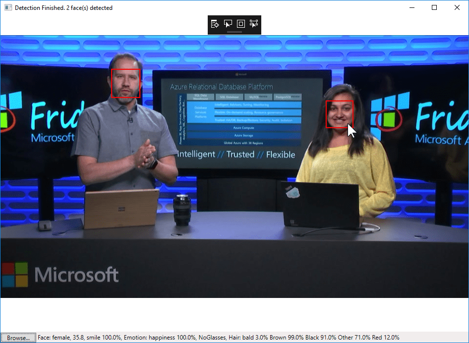
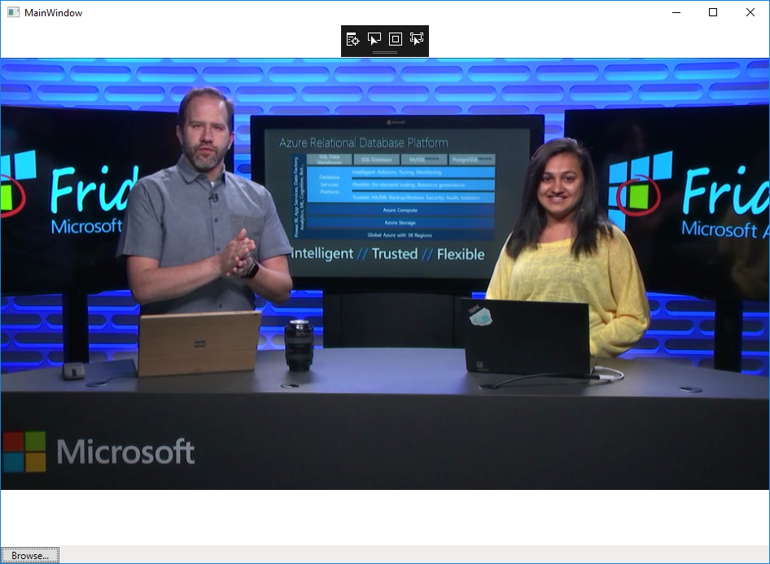

# Tutorial: Create a WPF app to detect and frame faces in an image

In this tutorial, you create a Windows Presentation Framework (WPF) application that uses the Face service through its .NET client library. The app detects faces in an image, draws a frame around each face, and displays a description of the face on the status bar. The complete sample code is available on GitHub at [Detect and frame faces in an image on Windows](https://github.com/Azure-Samples/Cognitive-Face-CSharp-sample).



This tutorial shows you how to:

> [!div class="checklist"]
> - Create a WPF application
> - Install the Face service client library
> - Use the client library to detect faces in an image
> - Draw a frame around each detected face
> - Display a description of the face on the status bar

## Prerequisites

- You need a subscription key to run the sample. You can get free trial subscription keys from [Try Cognitive Services](https://azure.microsoft.com/try/cognitive-services/?api=face-api).
- Any edition of [Visual Studio 2015 or 2017](https://www.visualstudio.com/downloads/). For Visual Studio 2017, the .NET Desktop application development workload is required. This tutorial uses Visual Studio 2017 Community Edition.
- The [Microsoft.Azure.CognitiveServices.Vision.Face 2.2.0-preview](https://www.nuget.org/packages/Microsoft.Azure.CognitiveServices.Vision.Face/2.2.0-preview) client library NuGet package. It isn't necessary to download the package. Installation instructions are provided below.

## Create the Visual Studio solution

Follow these steps to create a Windows WPF application project.

1. Open Visual Studio and from the **File** menu, click **New**, then **Project**.
   - In Visual Studio 2017, expand **Installed**, then **Other Languages**. Select **Visual C#**, then **WPF App (.NET Framework)**.
   - In Visual Studio 2015, expand **Installed**, then **Templates**. Select **Visual C#**, then **WPF Application**.
1. Name the application **FaceTutorial**, then click **OK**.

## Install the Face service client library

Follow these instructions to install the client library.

1. From the **Tools** menu, select **NuGet Package Manager**, then **Package Manager Console**.
1. In the **Package Manager Console**, paste the following, then press **Enter**.

    `Install-Package Microsoft.Azure.CognitiveServices.Vision.Face -Version 2.2.0-preview`

## Add the initial code

### MainWindow.xaml

Open *MainWindow.xaml* (tip: swap panes using the **up/down arrow icon**) and replace the contents with the following code. This xaml code is used to create the UI window. Note the event handlers, `FacePhoto_MouseMove` and `BrowseButton_Click`.

```xml
<Window x:Class="FaceTutorial.MainWindow"
        xmlns="http://schemas.microsoft.com/winfx/2006/xaml/presentation"
        xmlns:x="http://schemas.microsoft.com/winfx/2006/xaml"
        Title="MainWindow" Height="700" Width="960">
    <Grid x:Name="BackPanel">
        <Image x:Name="FacePhoto" Stretch="Uniform" Margin="0,0,0,50" MouseMove="FacePhoto_MouseMove" />
        <DockPanel DockPanel.Dock="Bottom">
            <Button x:Name="BrowseButton" Width="72" Height="20" VerticalAlignment="Bottom" HorizontalAlignment="Left"
                    Content="Browse..."
                    Click="BrowseButton_Click" />
            <StatusBar VerticalAlignment="Bottom">
                <StatusBarItem>
                    <TextBlock Name="faceDescriptionStatusBar" />
                </StatusBarItem>
            </StatusBar>
        </DockPanel>
    </Grid>
</Window>
```

### MainWindow.xaml.cs

Expand *MainWindow.xaml*, then open *MainWindow.xaml.cs*, and replace the contents with the following code. Ignore the squiggly red underlines; they'll disappear after the first build.

The first two lines import the client library namespaces. Next, the `FaceClient` is created, passing in the subscription key, while the Azure region is set in the `MainWindow` constructor. The two methods, `BrowseButton_Click` and `FacePhoto_MouseMove`, correspond to the event handlers declared in *MainWindow.xaml*.

`BrowseButton_Click` creates an `OpenFileDialog`, which allows the user to select a jpg image. The image is read and displayed in the main window. The remaining code for `BrowseButton_Click` and the code for `FacePhoto_MouseMove` are inserted in subsequent steps.

```csharp
using Microsoft.Azure.CognitiveServices.Vision.Face;
using Microsoft.Azure.CognitiveServices.Vision.Face.Models;

using System;
using System.Collections.Generic;
using System.IO;
using System.Text;
using System.Threading.Tasks;
using System.Windows;
using System.Windows.Input;
using System.Windows.Media;
using System.Windows.Media.Imaging;

namespace FaceTutorial
{
    public partial class MainWindow : Window
    {
        // Replace <SubscriptionKey> with your valid subscription key.
        // For example, subscriptionKey = "0123456789abcdef0123456789ABCDEF"
        private const string subscriptionKey = "<SubscriptionKey>";

        // Replace or verify the region.
        //
        // You must use the same region as you used to obtain your subscription
        // keys. For example, if you obtained your subscription keys from the
        // westus region, replace "westcentralus" with "westus".
        //
        // NOTE: Free trial subscription keys are generated in the westcentralus
        // region, so if you are using a free trial subscription key, you should
        // not need to change this region.
        private const string faceEndpoint =
            "https://westcentralus.api.cognitive.microsoft.com";

        private readonly IFaceClient faceClient = new FaceClient(
            new ApiKeyServiceClientCredentials(subscriptionKey),
            new System.Net.Http.DelegatingHandler[] { });

        IList<DetectedFace> faceList;   // The list of detected faces.
        String[] faceDescriptions;      // The list of descriptions for the detected faces.
        double resizeFactor;            // The resize factor for the displayed image.

        public MainWindow()
        {
            InitializeComponent();

            if (Uri.IsWellFormedUriString(faceEndpoint, UriKind.Absolute))
            {
                faceClient.Endpoint = faceEndpoint;
            }
            else
            {
                MessageBox.Show(faceEndpoint,
                    "Invalid URI", MessageBoxButton.OK, MessageBoxImage.Error);
                Environment.Exit(0);
            }
        }

        // Displays the image and calls UploadAndDetectFaces.
        private async void BrowseButton_Click(object sender, RoutedEventArgs e)
        {
            // Get the image file to scan from the user.
            var openDlg = new Microsoft.Win32.OpenFileDialog();

            openDlg.Filter = "JPEG Image(*.jpg)|*.jpg";
            bool? result = openDlg.ShowDialog(this);

            // Return if canceled.
            if (!(bool)result)
            {
                return;
            }

            // Display the image file.
            string filePath = openDlg.FileName;

            Uri fileUri = new Uri(filePath);
            BitmapImage bitmapSource = new BitmapImage();

            bitmapSource.BeginInit();
            bitmapSource.CacheOption = BitmapCacheOption.None;
            bitmapSource.UriSource = fileUri;
            bitmapSource.EndInit();

            FacePhoto.Source = bitmapSource;
        }

        // Displays the face description when the mouse is over a face rectangle.
        private void FacePhoto_MouseMove(object sender, MouseEventArgs e)
        {
        }
    }
}
```

### Insert your subscription key and verify or change the region

- Find the following line in *MainWindow.xaml.cs* and replace `<Subscription Key>` with your Face API subscription key:

    ```csharp
    private const string subscriptionKey = "<SubscriptionKey>";
    ```

- Find the following line in *MainWindow.xaml.cs* and replace or verify the Azure region associated with your subscription key:

    ```csharp
    private const string Endpoint =
        "https://westcentralus.api.cognitive.microsoft.com";
    ```

    Make sure the location is the same as where you obtained your subscription keys. If you obtained your subscription keys from the **westus** region, for example, replace `Westcentralus` with `Westus`.

    If you received your subscription keys by using the free trial, the region for your keys is **westcentralus**, so no change is required.

### Test the app

Press **Start** on the menu to test your app. When the window opens, click **Browse** in the lower left corner. A **File Open** dialog appears where you can browse and select a photo, which is then displayed in the window.



## Upload an image to detect faces

The most straightforward way to detect faces is by calling the `FaceClient.Face.DetectWithStreamAsync` method, which wraps the [Detect](https://westus.dev.cognitive.microsoft.com/docs/services/563879b61984550e40cbbe8d/operations/563879b61984550f30395236) API method for uploading the local image.

Insert the following method in the `MainWindow` class, below the `FacePhoto_MouseMove` method.

A list of face attributes to analyze is created and the submitted image file is read into a `Stream`. Both are passed to the `DetectWithStreamAsync` call.

```csharp
// Uploads the image file and calls DetectWithStreamAsync.
private async Task<IList<DetectedFace>> UploadAndDetectFaces(string imageFilePath)
{
    // The list of Face attributes to return.
    IList<FaceAttributeType> faceAttributes =
        new FaceAttributeType[]
        {
            FaceAttributeType.Gender, FaceAttributeType.Age,
            FaceAttributeType.Smile, FaceAttributeType.Emotion,
            FaceAttributeType.Glasses, FaceAttributeType.Hair
        };

    // Call the Face API.
    try
    {
        using (Stream imageFileStream = File.OpenRead(imageFilePath))
        {
            // The second argument specifies to return the faceId, while
            // the third argument specifies not to return face landmarks.
            IList<DetectedFace> faceList =
                await faceClient.Face.DetectWithStreamAsync(
                    imageFileStream, true, false, faceAttributes);
            return faceList;
        }
    }
    // Catch and display Face API errors.
    catch (APIErrorException f)
    {
        MessageBox.Show(f.Message);
        return new List<DetectedFace>();
    }
    // Catch and display all other errors.
    catch (Exception e)
    {
        MessageBox.Show(e.Message, "Error");
        return new List<DetectedFace>();
    }
}
```

## Draw rectangles around each face

Add the code to draw a rectangle around each detected face in the image.

In *MainWindow.xaml.cs*, add the `async` modifier to the `BrowseButton_Click` method.

```csharp
private async void BrowseButton_Click(object sender, RoutedEventArgs e)
```

Insert the following code at the end of the `BrowseButton_Click` method, after the `FacePhoto.Source = bitmapSource` line.

The list of detected faces is populated by the call to `UploadAndDetectFaces`. Next, a rectangle is drawn around each face, and the modified image is displayed in the main window.

```csharp
// Detect any faces in the image.
Title = "Detecting...";
faceList = await UploadAndDetectFaces(filePath);
Title = String.Format(
    "Detection Finished. {0} face(s) detected", faceList.Count);

if (faceList.Count > 0)
{
    // Prepare to draw rectangles around the faces.
    DrawingVisual visual = new DrawingVisual();
    DrawingContext drawingContext = visual.RenderOpen();
    drawingContext.DrawImage(bitmapSource,
        new Rect(0, 0, bitmapSource.Width, bitmapSource.Height));
    double dpi = bitmapSource.DpiX;
    resizeFactor = (dpi > 0) ? 96 / dpi : 1;
    faceDescriptions = new String[faceList.Count];

    for (int i = 0; i < faceList.Count; ++i)
    {
        DetectedFace face = faceList[i];

        // Draw a rectangle on the face.
        drawingContext.DrawRectangle(
            Brushes.Transparent,
            new Pen(Brushes.Red, 2),
            new Rect(
                face.FaceRectangle.Left * resizeFactor,
                face.FaceRectangle.Top * resizeFactor,
                face.FaceRectangle.Width * resizeFactor,
                face.FaceRectangle.Height * resizeFactor
                )
        );

        // Store the face description.
        faceDescriptions[i] = FaceDescription(face);
    }

    drawingContext.Close();

    // Display the image with the rectangle around the face.
    RenderTargetBitmap faceWithRectBitmap = new RenderTargetBitmap(
        (int)(bitmapSource.PixelWidth * resizeFactor),
        (int)(bitmapSource.PixelHeight * resizeFactor),
        96,
        96,
        PixelFormats.Pbgra32);

    faceWithRectBitmap.Render(visual);
    FacePhoto.Source = faceWithRectBitmap;

    // Set the status bar text.
    faceDescriptionStatusBar.Text =
        "Place the mouse pointer over a face to see the face description.";
}
```

## Describe the faces in the image

Append the following method to the `MainWindow` class, below the `UploadAndDetectFaces` method.

The method converts the face attributes into a string describing the face. The string is displayed when the mouse pointer hovers over the face rectangle.

```csharp
// Creates a string out of the attributes describing the face.
private string FaceDescription(DetectedFace face)
{
    StringBuilder sb = new StringBuilder();

    sb.Append("Face: ");

    // Add the gender, age, and smile.
    sb.Append(face.FaceAttributes.Gender);
    sb.Append(", ");
    sb.Append(face.FaceAttributes.Age);
    sb.Append(", ");
    sb.Append(String.Format("smile {0:F1}%, ", face.FaceAttributes.Smile * 100));

    // Add the emotions. Display all emotions over 10%.
    sb.Append("Emotion: ");
    Emotion emotionScores = face.FaceAttributes.Emotion;
    if (emotionScores.Anger >= 0.1f)
        sb.Append(String.Format("anger {0:F1}%, ", emotionScores.Anger * 100));
    if (emotionScores.Contempt >= 0.1f)
        sb.Append(String.Format("contempt {0:F1}%, ", emotionScores.Contempt * 100));
    if (emotionScores.Disgust >= 0.1f)
        sb.Append(String.Format("disgust {0:F1}%, ", emotionScores.Disgust * 100));
    if (emotionScores.Fear >= 0.1f)
        sb.Append(String.Format("fear {0:F1}%, ", emotionScores.Fear * 100));
    if (emotionScores.Happiness >= 0.1f)
        sb.Append(String.Format("happiness {0:F1}%, ", emotionScores.Happiness * 100));
    if (emotionScores.Neutral >= 0.1f)
        sb.Append(String.Format("neutral {0:F1}%, ", emotionScores.Neutral * 100));
    if (emotionScores.Sadness >= 0.1f)
        sb.Append(String.Format("sadness {0:F1}%, ", emotionScores.Sadness * 100));
    if (emotionScores.Surprise >= 0.1f)
        sb.Append(String.Format("surprise {0:F1}%, ", emotionScores.Surprise * 100));

    // Add glasses.
    sb.Append(face.FaceAttributes.Glasses);
    sb.Append(", ");

    // Add hair.
    sb.Append("Hair: ");

    // Display baldness confidence if over 1%.
    if (face.FaceAttributes.Hair.Bald >= 0.01f)
        sb.Append(String.Format("bald {0:F1}% ", face.FaceAttributes.Hair.Bald * 100));

    // Display all hair color attributes over 10%.
    IList<HairColor> hairColors = face.FaceAttributes.Hair.HairColor;
    foreach (HairColor hairColor in hairColors)
    {
        if (hairColor.Confidence >= 0.1f)
        {
            sb.Append(hairColor.Color.ToString());
            sb.Append(String.Format(" {0:F1}% ", hairColor.Confidence * 100));
        }
    }

    // Return the built string.
    return sb.ToString();
}
```

## Display the face description

Replace the `FacePhoto_MouseMove` method with the following code.

This event handler  displays the face description string when the mouse pointer hovers over the face rectangle.

```csharp
private void FacePhoto_MouseMove(object sender, MouseEventArgs e)
{
    // If the REST call has not completed, return.
    if (faceList == null)
        return;

    // Find the mouse position relative to the image.
    Point mouseXY = e.GetPosition(FacePhoto);

    ImageSource imageSource = FacePhoto.Source;
    BitmapSource bitmapSource = (BitmapSource)imageSource;

    // Scale adjustment between the actual size and displayed size.
    var scale = FacePhoto.ActualWidth / (bitmapSource.PixelWidth / resizeFactor);

    // Check if this mouse position is over a face rectangle.
    bool mouseOverFace = false;

    for (int i = 0; i < faceList.Count; ++i)
    {
        FaceRectangle fr = faceList[i].FaceRectangle;
        double left = fr.Left * scale;
        double top = fr.Top * scale;
        double width = fr.Width * scale;
        double height = fr.Height * scale;

        // Display the face description if the mouse is over this face rectangle.
        if (mouseXY.X >= left && mouseXY.X <= left + width &&
            mouseXY.Y >= top  && mouseXY.Y <= top + height)
        {
            faceDescriptionStatusBar.Text = faceDescriptions[i];
            mouseOverFace = true;
            break;
        }
    }

    // String to display when the mouse is not over a face rectangle.
    if (!mouseOverFace)
        faceDescriptionStatusBar.Text =
            "Place the mouse pointer over a face to see the face description.";
}
```

## Run the app

Run the application and browse for an image containing a face. Wait for a few seconds to allow the Face service to respond. After that, you'll see a red rectangle on the faces in the image. By moving the mouse over a face rectangle, the description of that face appears on the status bar.


## Summary

In this tutorial, you learned the basic process for using the Face service client library, and created an application to display and frame faces in an image.

## Next steps

Learn about detecting and using face landmarks.

> [!div class="nextstepaction"]
> [How to Detect Faces in an Image](../Face-API-How-to-Topics/HowtoDetectFacesinImage.md)
