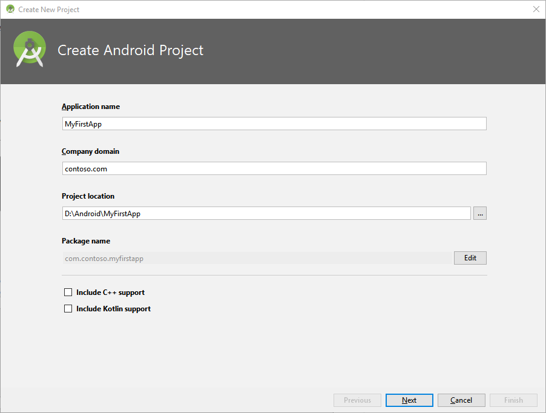
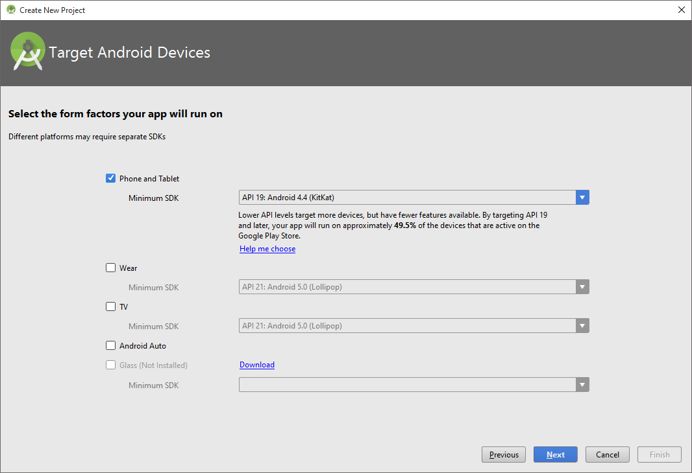
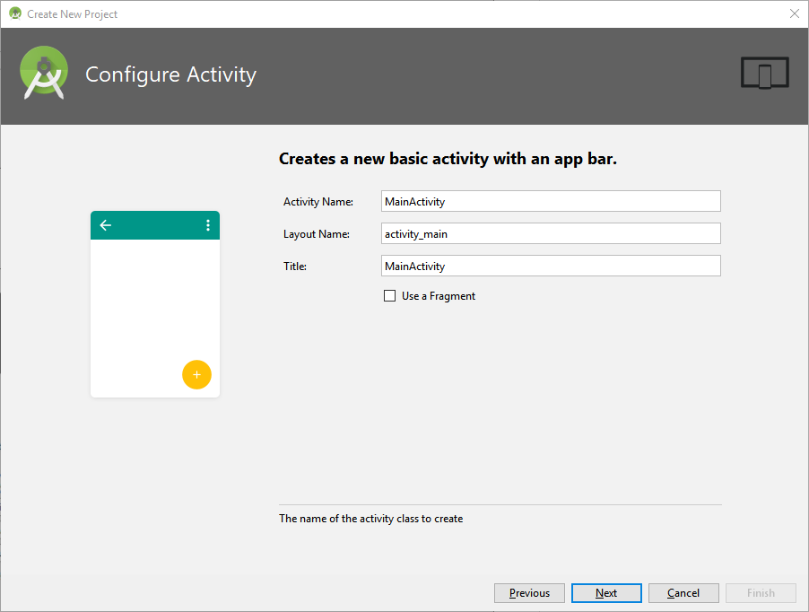

# Getting Started with Face API in Java for Android Tutorial

In this tutorial, you will learn to create and develop a simple Android application that invokes the Face API to detect human faces in an image. The application shows the result by framing the faces that it detects.     


## <a name="preparation"></a> Preparation

To use the tutorial, you will need the following prerequisites:

- Android Studio and SDK installed
- Android device (optional for testing) 

## <a name="step1"></a>Step 1: Subscribe for Face API and get your subscription key

Before using any Face API, you must sign up to subscribe to Face API in the Microsoft Cognitive Services portal. See [subscriptions](https://azure.microsoft.com/en-us/try/cognitive-services/). Both primary and secondary key can be used in this tutorial.

## <a name="step2"></a>Step 2: Create the application framework

In this step you will create an Android application project to implement the basic UI for picking up and displaying an image. Simply follow the instructions below: 

1. Open Android Studio.
2. From the File menu, click New Project…
3. Name the application MyFirstApp, and then click Next. 

    

4. Choose target platform as required, and then click Next. 

    

5. Select "Basic Activity" and then click Next.
6. Name the activity as follows, and then click Finish. 

    

7. Open activity_main.xml, you should see the Layout Editor of this activity.
8. View Text source file and then edit the activity layout as follows:			 

    ```xml
    <RelativeLayout xmlns:android="http://schemas.android.com/apk/res/android"
        xmlns:tools="http://schemas.android.com/tools" android:layout_width="match_parent"
        android:layout_height="match_parent" android:paddingLeft="@dimen/activity_horizontal_margin"
        android:paddingRight="@dimen/activity_horizontal_margin"
        android:paddingTop="@dimen/activity_vertical_margin"
        android:paddingBottom="@dimen/activity_vertical_margin" tools:context=".MainActivity">
     
        <ImageView
            android:layout_width="match_parent"
            android:layout_height="fill_parent"
            android:id="@+id/imageView1"
            android:layout_above="@+id/button1" />
    
        <Button
            android:layout_width="match_parent"
            android:layout_height="wrap_content"
            android:text="Browse"
            android:id="@+id/button1"
            android:layout_alignParentBottom="true" />
    </RelativeLayout>
    ```  

9. Open MainActivity.java and insert the following import directives at the beginning of the file:			 

		import java.io.*; 
		import android.app.*; 
		import android.content.*; 
		import android.net.*; 
		import android.os.*; 
		import android.view.*; 
		import android.graphics.*; 
		import android.widget.*; 
		import android.provider.*;
	  
	Secondly, Modify the onCreate method of the MainActivity class for the 'Browse' button logic:  

		private final int PICK_IMAGE = 1;
		private ProgressDialog detectionProgressDialog;
		 
		@Override
		protected void onCreate(Bundle savedInstanceState) {
		    super.onCreate(savedInstanceState);
		    setContentView(R.layout.activity_main);
		    Button button1 = (Button)findViewById(R.id.button1);
		    button1.setOnClickListener(new View.OnClickListener() {
		        @Override
		        public void onClick(View v) {
		            Intent gallIntent = new Intent(Intent.ACTION_GET_CONTENT);
		            gallIntent.setType("image/*");
		            startActivityForResult(Intent.createChooser(gallIntent, "Select Picture"), PICK_IMAGE);
		        }
		});
		 
		detectionProgressDialog = new ProgressDialog(this);
		}
		@Override
		protected void onActivityResult(int requestCode, int resultCode, Intent data) {
		    super.onActivityResult(requestCode, resultCode, data);
		    if (requestCode == PICK_IMAGE && resultCode == RESULT_OK && data != null && data.getData() != null) {
		        Uri uri = data.getData();
		        try {
		            Bitmap bitmap = MediaStore.Images.Media.getBitmap(getContentResolver(), uri);
		            ImageView imageView = (ImageView) findViewById(R.id.imageView1);
		            imageView.setImageBitmap(bitmap);
		        } catch (IOException e) {
		            e.printStackTrace();
		        }
		    }
		}  

Now your app can browse for a photo from the gallery and display it in the window similar to the image below:


## <a name="step3"></a>Step 3: Configure the Face API client library

The Face API is a cloud API which you can invoke using HTTPS requests. For a more convenient way of using the Face API in .NET platform applications, a client library is also provided to encapsulate the web requests. In this example, we use the client library to simplify our work. 

Follow the instructions below to configure the client library: 

1. Locate the top-level build.gradle file of your project from the Project panel shown in the exapmle. Note that there are several other build.gradle files in your project tree, and you need to open the top-level build.gradle file at first. 		 
2. Add mavenCentral() to your projects' repositories. You can also use jcenter(), which is the default repository of Android Studio, since jcenter() is a superset of mavenCentral().  

		allprojects {
		    repositories {
		        ...
		        mavenCentral()
		    }
		}

3. Open the build.gradle file in your 'app' project.
4. Add a dependency for our client library stored in the Maven Central Repository:

		dependencies {  
		    ...  
		    compile 'com.microsoft.projectoxford:face:1.0.0'  
		}  

5. Open MainActivity.java in your 'app' project and insert the following import directives: 
	
		import com.microsoft.projectoxford.face.\*;  
		import com.microsoft.projectoxford.face.contract.\*;  
	
   And then insert the following code in the MainActivity class:

	    private FaceServiceClient faceServiceClient =  
	                new FaceServiceRestClient("your subscription key");  

   Replace the string above with the subscription key you obtained in step 1.  
6. Open the file called AndroidManifest.xml in your 'app' project (in the app/src/main directory). Insert the following element into the manifest element:  

		<uses-permission android:name="android.permission.INTERNET" />  

7. Now you are ready to call the Face API from your application. 

## <a name="step4"></a>Step 4: Upload images to detect faces

The most straightforward way to detect faces is by calling the [Face – Detect](https://westus.dev.cognitive.microsoft.com/docs/services/563879b61984550e40cbbe8d/operations/563879b61984550f30395236) API by uploading the image file directly. When using the client library, this can be done by using an asynchronous method DetectAsync of FaceServiceClient. Each returned face contains a rectangle to indicate its location, combined with a series of optional face attributes. In this example, we only need to retrieve the face location. Here we need to insert a method into the MainActivity class for face detection: 

    // Detect faces by uploading face images
    // Frame faces after detection
    
    private void detectAndFrame(final Bitmap imageBitmap)
    {
        ByteArrayOutputStream outputStream = new ByteArrayOutputStream();
        imageBitmap.compress(Bitmap.CompressFormat.JPEG, 100, outputStream);
        ByteArrayInputStream inputStream = 
            new ByteArrayInputStream(outputStream.toByteArray());
        AsyncTask<InputStream, String, Face[]> detectTask =
            new AsyncTask<InputStream, String, Face[]>() {
                @Override
                protected Face[] doInBackground(InputStream... params) {
                    try {
                        publishProgress("Detecting...");
                        Face[] result = faceServiceClient.detect(
                                params[0], 
                                true,         // returnFaceId
                                false,        // returnFaceLandmarks
                                null           // returnFaceAttributes: a string like "age, gender"
                        );
                        if (result == null)
                        {
                            publishProgress("Detection Finished. Nothing detected");
                            return null;
                        }
                        publishProgress(
                                String.format("Detection Finished. %d face(s) detected",
                                        result.length));
                        return result;
                    } catch (Exception e) {
                        publishProgress("Detection failed");
                        return null;
                    }
                }
                @Override
                protected void onPreExecute() {
                    //TODO: show progress dialog
                }
                @Override
                protected void onProgressUpdate(String... progress) {
                    //TODO: update progress
                }
                @Override
                protected void onPostExecute(Face[] result) {
                    //TODO: update face frames
                }
            };
        detectTask.execute(inputStream);
    }

## <a name="step5"></a>Step 5: Mark faces in the image

In this last step, we combine all the above steps together and mark the detected faces with frames in the image. First, open MainActivity.java and insert a helper method in MainActivity.java to draw rectangles: 

    private static Bitmap drawFaceRectanglesOnBitmap(Bitmap originalBitmap, Face[] faces) {
        Bitmap bitmap = originalBitmap.copy(Bitmap.Config.ARGB_8888, true);
        Canvas canvas = new Canvas(bitmap);
        Paint paint = new Paint();
        paint.setAntiAlias(true);
        paint.setStyle(Paint.Style.STROKE);
        paint.setColor(Color.RED);
        int stokeWidth = 2;
        paint.setStrokeWidth(stokeWidth);
        if (faces != null) {
            for (Face face : faces) {
                FaceRectangle faceRectangle = face.faceRectangle;
                canvas.drawRect(
                        faceRectangle.left,
                        faceRectangle.top,
                        faceRectangle.left + faceRectangle.width,
                        faceRectangle.top + faceRectangle.height,
                        paint);
            }
        }
        return bitmap;
    }

Now finish the TODO parts in the detectAndFrame method in order to frame faces and report status.   

    @Override
    protected void onPreExecute() {
        
        detectionProgressDialog.show();
    }
    @Override
    protected void onProgressUpdate(String... progress) {
        
        detectionProgressDialog.setMessage(progress[0]);
    }
    @Override
    protected void onPostExecute(Face[] result) {
        
        detectionProgressDialog.dismiss();
        if (result == null) return;
        ImageView imageView = (ImageView)findViewById(R.id.imageView1);
        imageView.setImageBitmap(drawFaceRectanglesOnBitmap(imageBitmap, result));
        imageBitmap.recycle();
    }
 
Finally, add a call to the detectAndFrame method from the onActivityResult method, as shown below. (Note that the asterisks are only intended to highlight the new addition. You must remove them before attempting to build the code.)	 

    @Override
    protected void onActivityResult(int requestCode, int resultCode, Intent data) {
        super.onActivityResult(requestCode, resultCode, data);
        if (requestCode == PICK_IMAGE && resultCode == RESULT_OK && data != null && data.getData() != null) {
            Uri uri = data.getData();
            try {
                Bitmap bitmap = MediaStore.Images.Media.getBitmap(getContentResolver(), uri);
                ImageView imageView = (ImageView) findViewById(R.id.imageView1);
                imageView.setImageBitmap(bitmap);
     
                **detectAndFrame(bitmap);**
     
            } catch (IOException e) {
                e.printStackTrace();
            }
        }
    }

Run this application and browse for an image containing a face. Please wait for a few seconds to allow the cloud API to respond. After that, you will get a result similar to the image below: 


## <a name="summary"></a> Summary

In this tutorial, you learned the basic process for using the Face API and created an application to display face marks in images. For more information on the Face API, refer to the How-To and [API Reference](https://westus.dev.cognitive.microsoft.com/docs/services/563879b61984550e40cbbe8d/operations/563879b61984550f30395236). 

## <a name="related"></a> Related Tutorials

- [Getting Started with Face API in CSharp Tutorial](FaceAPIinCSharpTutorial.md)
- [Getting Started with Face API in Python Tutorial](FaceAPIinPythonTutorial.md)
