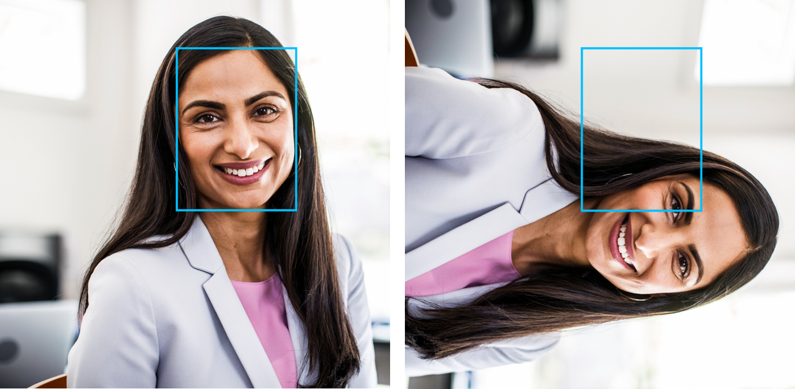

# Face detection and attributes

This article explains the concepts of face detection and face attribute data. Face detection is the action of locating human faces in an image and optionally returning different kinds of face-related data.

You use the [Face - Detect](https://westus.dev.cognitive.microsoft.com/docs/services/563879b61984550e40cbbe8d/operations/563879b61984550f30395236) operation to detect faces in an image. At a minimum, each detected face corresponds to a faceRectangle field in the response. This set of pixel coordinates for the left, top, width, and height mark the located face. Using these coordinates, you can get the location of the face and its size. In the API response, faces are listed in size order from largest to smallest.

## Face ID

The face ID is a unique identifier string for each detected face in an image. You can request a face ID in your [Face - Detect](https://westus.dev.cognitive.microsoft.com/docs/services/563879b61984550e40cbbe8d/operations/563879b61984550f30395236) API call.

## Face landmarks

Face landmarks are a set of easy-to-find points on a face, such as the pupils or the tip of the nose. By default, there are 27 predefined landmark points. The following figure shows all 27 points:

The coordinates of the points are returned in units of pixels.

## Attributes

Attributes are a set of features that can optionally be detected by the [Face - Detect](https://westus.dev.cognitive.microsoft.com/docs/services/563879b61984550e40cbbe8d/operations/563879b61984550f30395236) API. The following attributes can be detected:

* **Accessories**. Whether the given face has accessories. This attribute returns possible accessories including headwear, glasses, and mask, with confidence score between zero and one for each accessory.
* **Age**. The estimated age in years of a particular face.
* **Blur**. The blurriness of the face in the image. This attribute returns a value between zero and one and an informal rating of low, medium, or high.
* **Emotion**. A list of emotions with their detection confidence for the given face. Confidence scores are normalized, and the scores across all emotions add up to one. The emotions returned are happiness, sadness, neutral, anger, contempt, disgust, surprise, and fear.
* **Exposure**. The exposure of the face in the image. This attribute returns a value between zero and one and an informal rating of underExposure, goodExposure, or overExposure.
* **Facial hair**. The estimated facial hair presence and the length for the given face.
* **Gender**. The estimated gender of the given face. Possible values are male, female, and genderless.
* **Glasses**. Whether the given face has eyeglasses. Possible values are NoGlasses, ReadingGlasses, Sunglasses, and Swimming Goggles.
* **Hair**. The hair type of the face. This attribute shows whether the hair is visible, whether baldness is detected, and what hair colors are detected.
* **Head pose**. The face's orientation in 3D space. This attribute is described by the roll, yaw, and pitch angles in degrees, which are defined according to the [right-hand rule](https://en.wikipedia.org/wiki/Right-hand_rule). The order of three angles is roll-yaw-pitch, and each angle's value range is from -180 degrees to 180 degrees. 3D orientation of the face is estimated by the roll, yaw, and pitch angles in order. See the following diagram for angle mappings:

    
* **Makeup**. Whether the face has makeup. This attribute returns a Boolean value for eyeMakeup and lipMakeup.
* **Mask**.  Whether the face is wearing a mask. This attribute returns a possible mask type, and a Boolean value to indicate whether nose and mouth are covered.
* **Noise**. The visual noise detected in the face image. This attribute returns a value between zero and one and an informal rating of low, medium, or high.
* **Occlusion**. Whether there are objects blocking parts of the face. This attribute returns a Boolean value for eyeOccluded, foreheadOccluded, and mouthOccluded.
* **Smile**. The smile expression of the given face. This value is between zero for no smile and one for a clear smile.

> [!IMPORTANT]
> Face attributes are predicted through the use of statistical algorithms. They might not always be accurate. Use caution when you make decisions based on attribute data.

## Input data

Use the following tips to make sure that your input images give the most accurate detection results:

* The supported input image formats are JPEG, PNG, GIF for the first frame, and BMP.
* The image file size should be no larger than 6 MB.
* The minimum detectable face size is 36 x 36 pixels in an image that is no larger than 1920 x 1080 pixels. Images with larger than 1920 x 1080 pixels have a proportionally larger minimum face size. Reducing the face size might cause some faces not to be detected, even if they are larger than the minimum detectable face size.
* The maximum detectable face size is 4096 x 4096 pixels.
* Faces outside the size range of 36 x 36 to 4096 x 4096 pixels will not be detected.
* Some faces might not be detected because of technical challenges. Extreme face angles (head pose) or face occlusion (objects such as sunglasses or hands that block part of the face) can affect detection. Frontal and near-frontal faces give the best results.

Input data with orientation information:
* Some input images with JPEG format might contain orientation information in Exchangeable image file format (Exif) metadata. If Exif orientation is available, images will be automatically rotated to the correct orientation before sending for face detection. The face rectangle, landmarks, and head pose for each detected face will be estimated based on the rotated image.
* To properly display the face rectangle and landmarks, you need to make sure the image is rotated correctly. Most of image visualization tools will auto-rotate the image according to its Exif orientation by default. For other tools, you might need to apply the rotation using your own code. The following examples show a face rectangle on a rotated image (left) and a non-rotated image (right).

If you're detecting faces from a video feed, you may be able to improve performance by adjusting certain settings on your video camera:

* **Smoothing**: Many video cameras apply a smoothing effect. You should turn this off if you can because it creates a blur between frames and reduces clarity.
* **Shutter Speed**: A faster shutter speed reduces the amount of motion between frames and makes each frame clearer. We recommend shutter speeds of 1/60 second or faster.
* **Shutter Angle**: Some cameras specify shutter angle instead of shutter speed. You should use a lower shutter angle if possible. This will result in clearer video frames.

    >[!NOTE]
    > A camera with a lower shutter angle will receive less light in each frame, so the image will be darker. You'll need to determine the right level to use.

## Next steps

Now that you're familiar with face detection concepts, learn how to write a script that detects faces in a given image.

* [Detect faces in an image](../Face-API-How-to-Topics/HowtoDetectFacesinImage.md)
