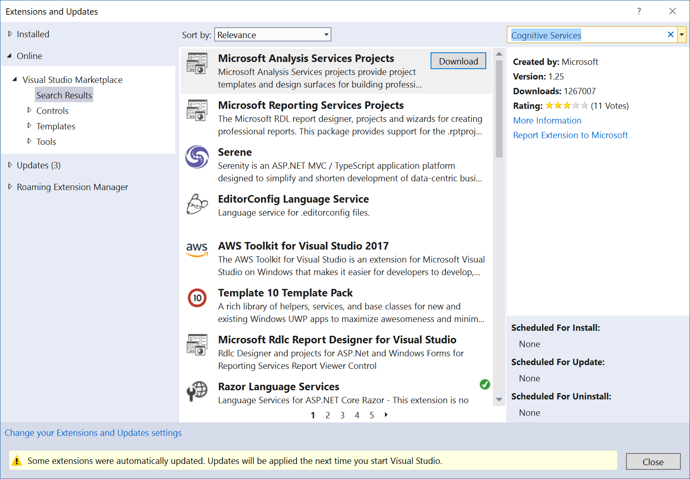

## Install the Cognitive Services VSIX Extension

1. In Visual Studio, choose **Tools** > **Extensions and Updates**, search for **Cognitive Services**, and choose **Install**.

   

   Installing an extension requires a restart of the IDE.

2. Restart Visual Studio. The extension installs when you close Visual Studio and is available next time you launch the IDE.

