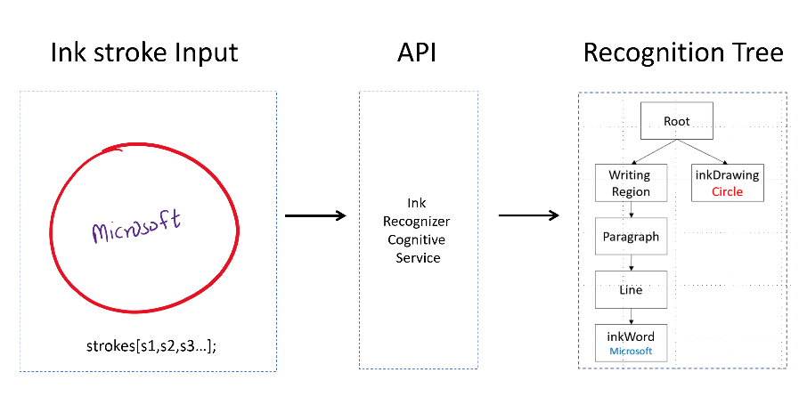

# What is the Ink Recognizer API?

The Ink Recognizer Cognitive Service provides a cloud-based REST API to analyze and recognize digital ink content. Unlike services that use Optical Character Recognition (OCR), the API requires digital ink stroke data as input. Digital ink strokes are time-ordered sets of 2D points (X,Y coordinates) that represent the motion of input tools such as digital pens or fingers. It then recognizes the shapes and handwritten content from the input and returns a JSON response containing all recognized entities.

## Features

With the Ink Recognizer API, you can easily recognize handwritten content in your applications. 

|Feature  |Description  |
|---------|---------|
| Handwriting recognition | Recognize handwritten content in 63 core languages and locales. | 
| Layout recognition | Get structural information about the digital ink content. Break the content into writing regions, paragraphs, lines, words, bulleted lists. Your applications can then use the layout information to build additional features like automatic list formatting, and shape alignment. |
| Shape recognition | Recognize the most commonly used geometric shapes when taking notes. |
| Combined shapes and text recognition | Recognize which ink strokes belong to shapes or handwritten content, and separately classify them.|

## Workflow

The Ink Recognizer API is a RESTful web service, making it easy to call from any programming language that can make HTTP requests and parse JSON.

[!INCLUDE [cognitive-services-ink-recognizer-signup-requirements](../../../includes/cognitive-services-ink-recognizer-signup-requirements.md)]

After signing up:

1. Take your ink stroke data and [format it](concepts/recommended-calling-patterns.md#sending-ink-data-to-the-api) into valid JSON.
1. Send a request to the Ink Recognizer API with your data.
1. Process the API response by parsing the returned JSON message.

## Next steps

Try a quickstart in the following languages to begin making calls to the Ink Recognizer API.
* [C#](quickstarts/csharp.md)
* [Java](quickstarts/java.md)
* [JavaScript](quickstarts/csharp.md)

To see how the Ink Recognition API works in a digital inking app, take a look at the following sample applications on GitHub:
* [C# and Universal Windows Platform(UWP)](https://github.com/Azure-Samples/cognitive-services-csharp-ink-recognition)  
* [C# and Windows Presentation Foundation(WPF)](https://github.com/Azure-Samples/cognitive-services-csharp-wpf-ink-recognition)
* [Javascript web-browser app](https://github.com/Azure-Samples/cognitive-services-javascript-ink-recognition)       
* [Java and Android mobile app](https://github.com/Azure-Samples/cognitive-services-java-android-ink-recognition)
* [Swift and iOS mobile app](https://github.com/Azure-Samples/cognitive-services-swift-ios-ink-recognition)
