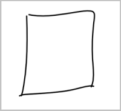

# Quickstart: Recognize digital ink with the Ink Recognizer REST API and Node.js

Use this quickstart to begin using the Ink Recognizer API on digital ink strokes. This Node.js application sends an API request containing JSON-formatted ink stroke data, and gets the response.

 While this application is written in Javascript and runs on Node.js, the API is a RESTful web service compatible with most programming languages.

## Prerequisites

Usually you would call the API from an app that accepts digital inking. This quickstart simulates sending ink stroke data by using a JSON file with the ink strokes for the following drawn square. 

The example data for this quickstart can be found on [GitHub](https://github.com/Azure-Samples/anomalydetector/blob/master/example-data/request-data.json).

[!INCLUDE [cognitive-services-ink-recognizer-signup-requirements](../../../../includes/cognitive-services-ink-recognizer-signup-requirements.md)]

## Create a new Node.js application

