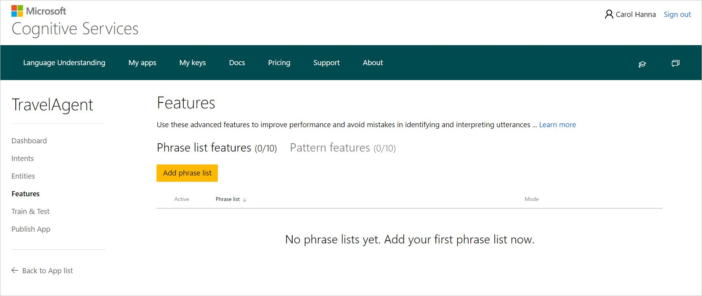
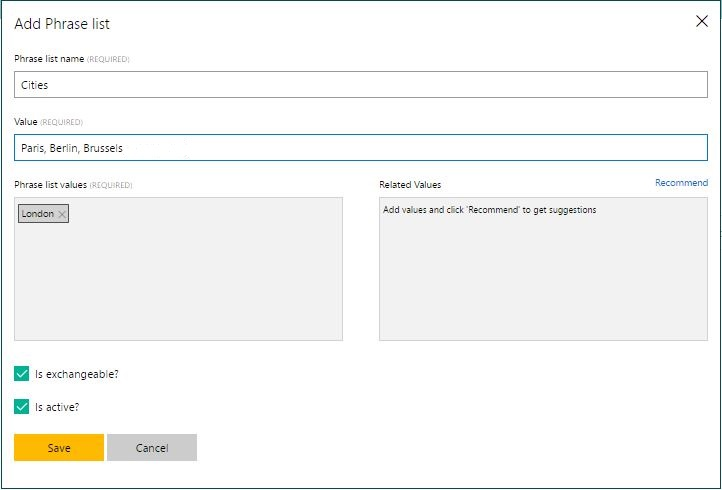
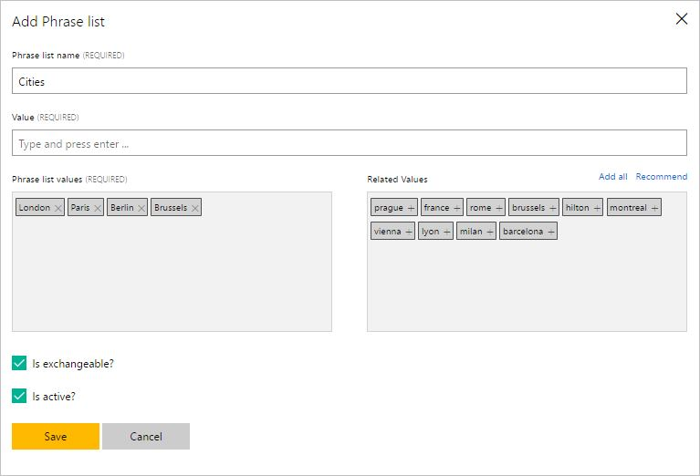
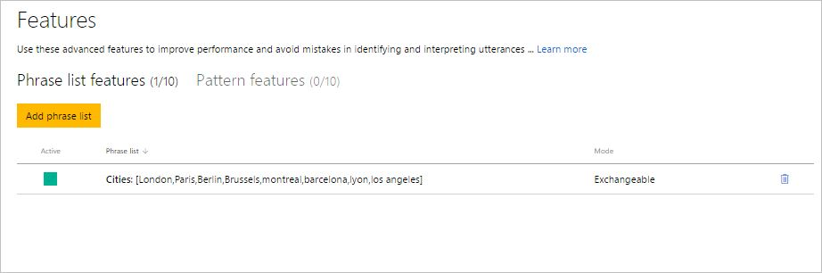
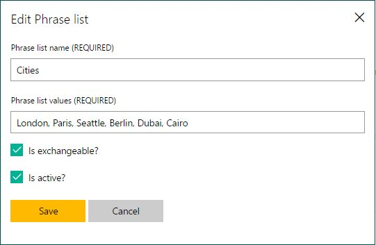
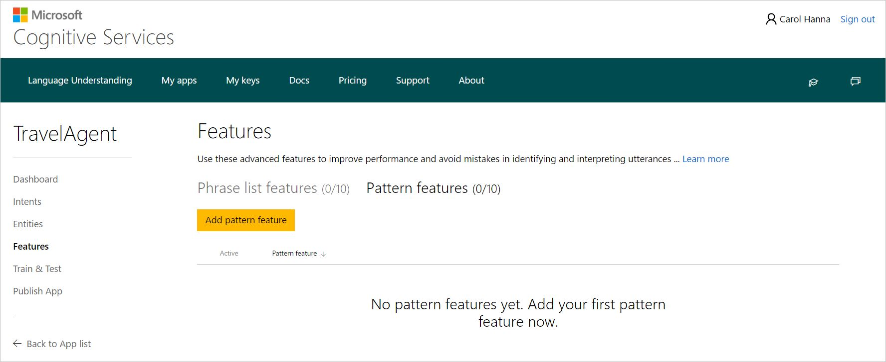
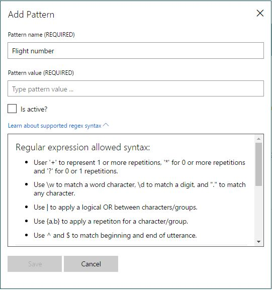
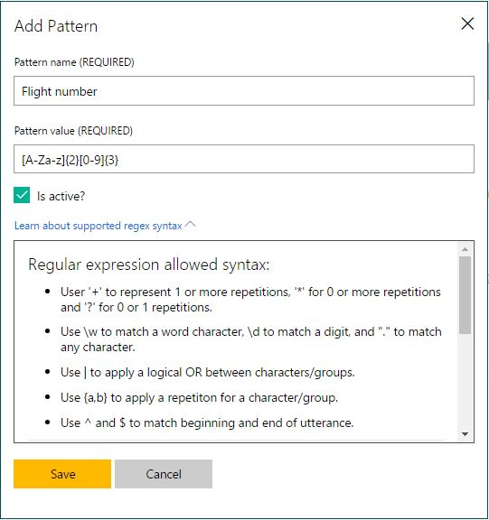
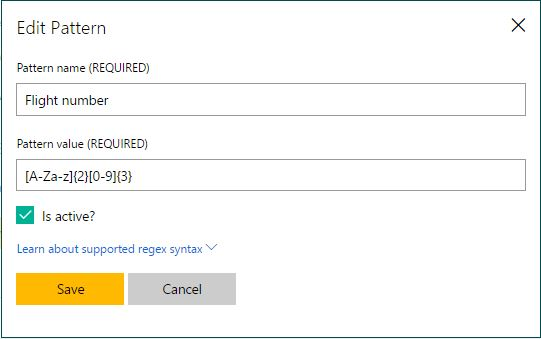

# Use features to improve your LUIS app's performance  

You can add features to your LUIS app to improve its performance. Features help LUIS recognize both intents and entities, by providing hints to LUIS that certain words and phrases are part of a category or follow a pattern. When your LUIS app has difficulty identifying an entity, adding a feature and retraining the LUIS app can often help improve the detection of related intents and entities.   

* **Phrase list** features contain some or all of an entity's potential values. If LUIS learns how to recognize one member of the category, it can treat the others similarly.
* **Pattern features** help your LUIS app easily recognize regular patterns that are frequently used in your application's domain, such as the pattern of flight numbers in a travel app or product codes in a shopping app.

> [!NOTE]
> Features don't define entities. They simply provide examples or patterns to help LUIS recognize entities and related intents. 

## Phrase list features
You can create a *phrase list* including a group of values (words or phrases) that belong to the same class and must be treated similarly (for example, names of cities or products). What LUIS learns about one of them will be automatically applied to the others as well. 

For example, in a travel agent app, you can create a phrase list named "Cities" that contains the values London, Paris, and Cairo. If you label one of these values as an entity, LUIS will learn to recognize the others. 

> [!NOTE]
> Phrase list features show LUIS some examples of an entity's potential values. The phrase list does not have to include all members of a category, although it may. 

The maximum length of a phrase list is 5000 items. You may have a maximum of 10 phrase lists per LUIS app.
<!--

> [!NOTE] 
> *Phrase list* features are different from *list entities*. 
> * When you use a phrase list, LUIS could still take context into account and intelligently identify items that are similar to, but not an exact match as items in the list. 
> * In contrast, a list entity explicity defines every value an entity can take, and only identifies values those that match exactly.

-->

### Use phrase lists for rare, proprietary and foreign words

LUIS may be unable to recognize rare and proprietary words, as well as foreign words (outside of the culture of the app), and therefore they should be added to a phrase list feature. 
This phrase list should be marked non-exchangeable, to indicate that the set of rare words form a class that LUIS should learn to recognize, but they are not synonyms or exchangable with each other.

### How to add a phrase list

1. Open your app by clicking its name on **My Apps** page, and then click **Features** in your app's left panel. 

2. On the **Features** page, click **Add phrase list**. 
 
    
    
3. In the **Add Phrase List** dialog box, type "Cities" as the name of the phrase list in the **Phrase list name** box.
4. In the **Value** box, type the values of the phrase list. You can type one value at a time, or a set of values separated by commas (e.g. London, Paris,  Berlin, Brussels, etc), and then press Enter.
 
    
    
5. If your app culture is English, LUIS can propose some related values to add to your phrase list. Click **Recommend** to get a group of proposed values that are semantically related to the added value(s). You can click any of the proposed values to add it, or click **Add All** to add them all.

 

6. Click **Is exchangeable** if the added phrase list values are alternatives that can be used interchangeably.
7. Click **Is active** if you want this phrase list to be active (i.e. applicable and used) in your app.

8. Click **Save**. The phrase list will be added to phrase list features on the **Features** page.

 

**To edit a phrase list:**

* Click the name of the phrase list  (e.g. Cities) on the **Features** page (the previous screenshot). In the **Edit Phrase List** dialog box that opens, make any required editing changes and then click **Save**.

    

**To delete a phrase list:** 

* Click the trash bin button  next to the phrase list name on the **Features** page.

## Pattern features

**Pattern** features define a regular expression to help LUIS recognize regular patterns that are frequently used in your application's domain, such as the pattern of flight numbers in a travel app or product codes in a shopping app. 

<!-- You can create a structured “pattern” to represent a certain class of objects (e.g. flight numbers, product codes, etc.). A pattern is defined in regular expression (Regex).--> This will help LUIS easily recognize the string of the defined pattern in utterances, and thus classify it correctly. For example, in a travel app, flight numbers might follow a regular pattern of two letters followed by three digits.

> [!NOTE:]
> A pattern feature isn't meant to guarantee exact matching every time an utterance matches regular expression. It's just a hint to LUIS that an entity takes a certain form. LUIS still takes context into account when labeling entities that match a pattern.

### How to add a pattern

1. Open your app by clicking its name on **My Apps** page, and then click **Features** in your app's left panel. 
2. On the **Features** page, click the **Pattern Features** tab, and then click **Add Pattern Feature**.

    
3. In the **Add Pattern** dialog box, type "Flight number" in the **Pattern name** text box.
4.  To learn about the supported regex syntax, click **learn about supported regex syntax** to expand the dialog and display it, as in the screen below. To collapse the dialog and hide syntax, click it again.

    
5. In the **Pattern value** text box, type [A-Za-z]{2}[0-9]{3} as the value of the flight number pattern.

    
6. Click **Is active** if you want this pattern to be active (i.e. applicable and used) in your app. A feature is active by default.
7. Click **Save**. The pattern will be added to pattern features on the **Features** page.

**To edit a pattern:**

* Click the pattern name in the list of pattern features. In the **Edit Pattern** dialog box that opens, make the required editing changes and then click **Save**.

    

**To delete a pattern:** 

* Click the trash bin button  next to the pattern name in the list of pattern features.

## Next steps

After adding a pattern, [train and test the app](Train-Test.md) again to see if performance improves.
