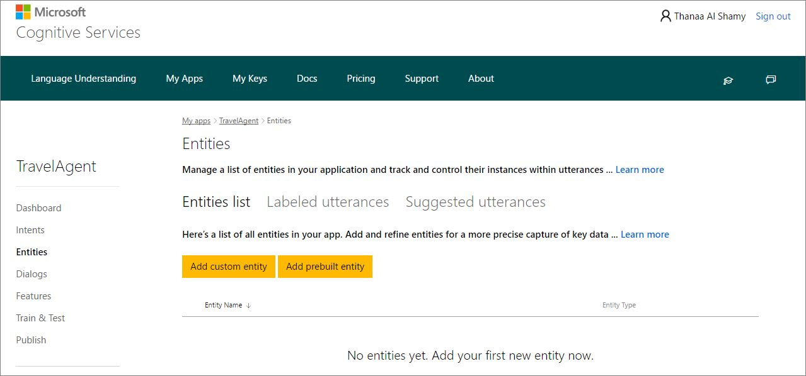
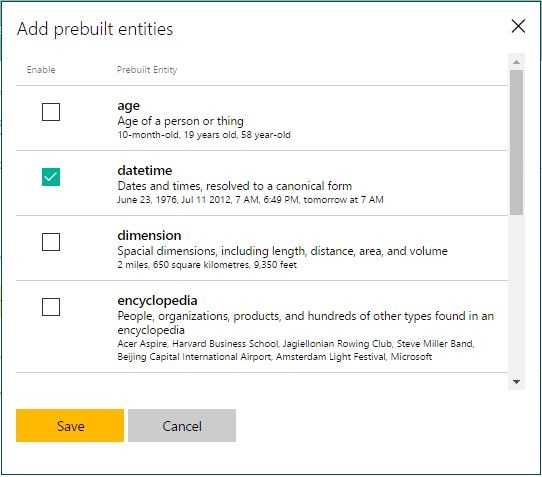
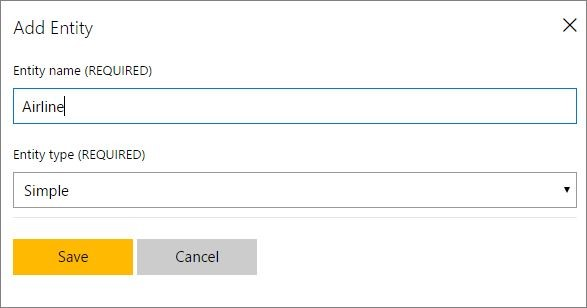
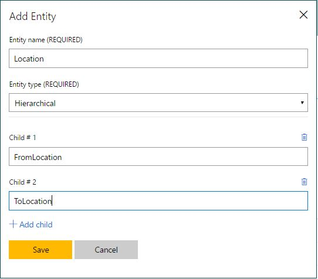
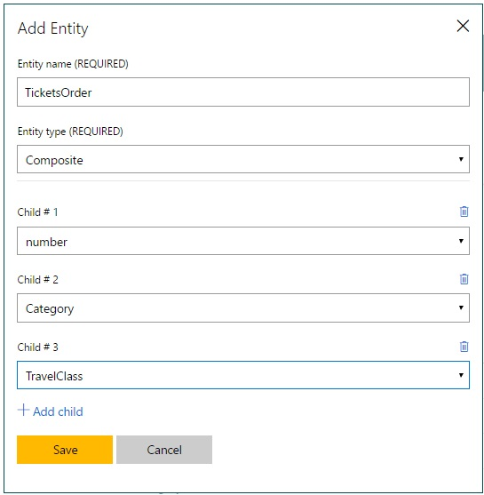
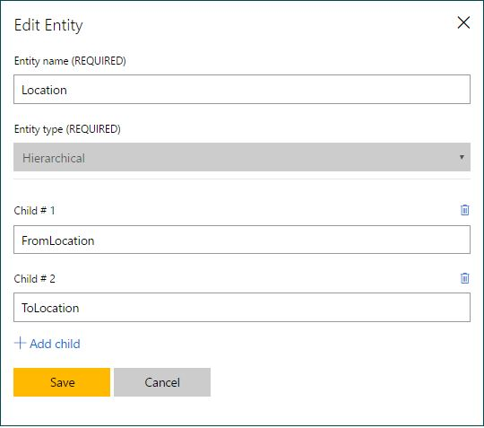
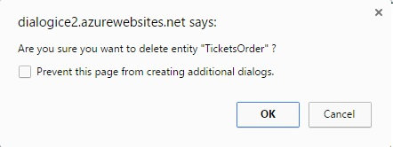
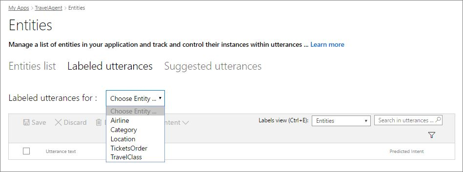

# Add Entities
Entities are key data in your application’s domain. An entity represents a class including a collection of similar objects (places, things, people, events or concepts). Entities describe information relevant to the intent, and sometimes they are essential for your app to perform its task. For example, a News Search app may include entities such as “topic”, “source”, “keyword” and “publishing date”, which are key data to search for news. In a travel booking app, the “location”, “date”, "airline", "travel class" and "tickets" are key information for flight booking (relevant to the "Bookflight" intent). So, we'll add them as entities. 

You do not need to create entities for every concept in your app, but only for those required for the app to take action. You can add up to **10** entities in a single LUIS app. 

You can add, edit or delete entities in your app through the **Entities list** on the **Entities** page. Luis offers many types of entities; prebuilt entities, custom machine learned entities and close list entities.

## Add Prebuilt Entities
LUIS provides a set of prebuilt (system-defined) entities, covering many examples of the most common knowledge concepts such as date, age, temperature, percentage, dimension, cardinal and ordinal numbers, etc.  

For example, the TravelAgent app may receive a request like "Book me a flight to Boston on May 4". This will require your app to understand date and time words in order to interpret the request properly. Rather than creating entities for such concepts from scratch, you can enable a ready-made prebuilt entity called "datetime". 

As another example, a travel booking request like “Book me the first flight to Boston” might be sent to your app. This requires understanding of ordinal words (e.g. first, second). Therefore, you must add a prebuilt entity called "ordinal", for your app to recognize ordinal numbers.

For a full list of prebuilt entities and their use, see [Prebuilt Entities List](Pre-builtEntities.md).

**To add a prebuilt entity:**

1. Open the TravelAgent app by clicking its name on **My Apps** page, and then click **Entities** in the left panel. 
2. On the **Entities** page, click **Add prebuilt entity**.

    
3. In **Add prebuilt entities** dialog box, click the prebuilt entity you want to add  (e.g. “datetime”), and then click **Save**.

    

## Add Custom Entities
Custom entities are the entities you create in your app. There are three types of custom entities:

* **Simple:** a generic entity.
* **Hierarchical:** a parent including children (sub-types) which are dependent on the parent.
* **Composite:** a compound of two or more separate entities combined together forming a composite and treated as a single entity.

### Simple Entities
A simple entity is a generic entity that describes a single concept. In the example of the TravelAgent app, a user may say "Book me a flight to London tomorrow on British Airways", where "British Airways" is the name of an airline company. In order to capture the notion of airline names, let's create the entity "Airline". 

**To add a simple entity:**

1. Open the TravelAgent app by clicking its name on **My Apps** page, and then click **Entities** in the left panel. 
2. On the **Entities** page, click **Add custom entity**.
3. In the **Add Entity** dialog box, type "Airline" in the **Entity name** box,  select **Simple** from the **Entity type** list, and then click **Save**.

    

### Hierarchical Entities
You can define relationships between entities based on hereditary hierarchical patterns, where the generic entity acts as the parent and the children are sub-types under the parent, and they share the same characteristics. For example, in the TravelAgent app, you can add three hierarchical entities:

* “Location”, including the entity children “FromLocation” and “ToLocation”, representing source and destination locations.
* "TravelClass", including the travel classes as children ("first", "business" and "economy")
* "Category", including ticket categories ("adult", "child" and "infant").

Do the following steps to add hierarchical entities and make sure to add the children at the same time you are creating the parent entity. You can add up to 10 entity children for each parent.

**To add a hierarchical entity:**

1. Open the TravelAgent app by clicking its name on **My Apps** page, and then click **Entities** in the left panel. 
2. On the **Entities** page, click **Add custom entity**.
3. In the **Add Entity** dialog box, type "Location" in the **Entity name** box, and then select **Hierarchical** from the **Entity type** list.

    

4. Click **Add Child**, and then type "FromLocation" in **Child #1** box. 
5. Click **Add Child**, and then type "ToLocation" in **Child #2** box. 
    >[!NOTE]
    >To delete a child (in case of a mistake), click the trash bin icon next to it.

6. Click **Save**.

 
### Composite Entities
You can also define relationships between entities based on associative patterns by creating “composite entities”. A composite entity is created by combining two or more existing entities (simple or hierarchical) and treating them as one entity. Unlike a hierarchical entity, the composite entity and the children forming it are not in a parent-child relationship; they are independent of each other and they do not share common characteristics. The composite pattern enables your app to identify entities, not only individually, but also in groups. 

In the TravelAgent app example, a user may say “Book 2 adult business tickets to Paris next Monday”. In this example, we can create a composite entity called “TicketsOrder”, including three children entities: “number”, “category” and "class" which describe the tickets to be booked. Before creating a composite entity, you must first add the entities forming it, if they do not already exist. 

**To add the entities forming the composite:**

1. Add the prebuilt entity “number”. For instructions, see the Add Prebuilt Entities section above. 
2. Add the hierarchical entity "Category", including the sub-types: “adult”, “child” and “infant”, and "TravelClass" including "first", "business" and "economy". For more info, see the Hierarchical Entities section above. 

**To add the composite entity:**

1. Open the TravelAgent app by clicking its name on **My Apps** page and click **Entities** in the app's left panel.
2. On the **Entities** page, click **Add custom entity**.
3. In the **Add Entity** dialog box, type "TicketsOrder" in the **Entity name** box, and then select **Composite** from the **Entity type** list. Click on the add child link to add new child.
4. In **Child #1**, select the entity "number" from the list.
5. In **Child #2**, select the parent entity "Category" from the list. 
6. In **Child #3**, select the parent entity "TravelClass" from the list. 

    

7. Click **Save**.

    >[!NOTE]
    >To delete a child (in case of a mistake), click the trash icon next to it.

## Edit/Delete Entities
You can edit or delete entities from the **Entities list** on the **Entities** page of your app. 

**To edit an entity:**

1. On the **Entities** page, click the entity in the **Entities list**.
2. In the **Edit Entity** dialog box, you can edit the entity name and children names, or add more children (for hierarchical/composite entities), but the entity type is not editable. 

    

3. Click **Save**.

**To delete an entity:**

* In the **Entities list**, click the trash bin icon next to the entity you want to delete. Then, click **OK** in the confirmation message to confirm deletion.
 
    

    >[!NOTE]
    >* Deleting a hierarchical entity deletes all its children entities.
    >* Deleting a composite entity deletes only the composite and breaks the composite relationship, but doesn't delete the entities forming it.

## Review Labeled Utterances for Entities
To review the labeled utterances that contain a specific entity, click the **Labeled Utterances** tab on the **Entities** page, and choose the entity for which you want to display all labeled utterances. You can modify entity labels in labeled utterances, if required, and then click **Save**.

Now that you have added intents, utterances and entities, you have a basic LUIS app ready to be trained and tested for publishing. 
For more information on how to train and test your app, [click here](Train-Test.md).
 
