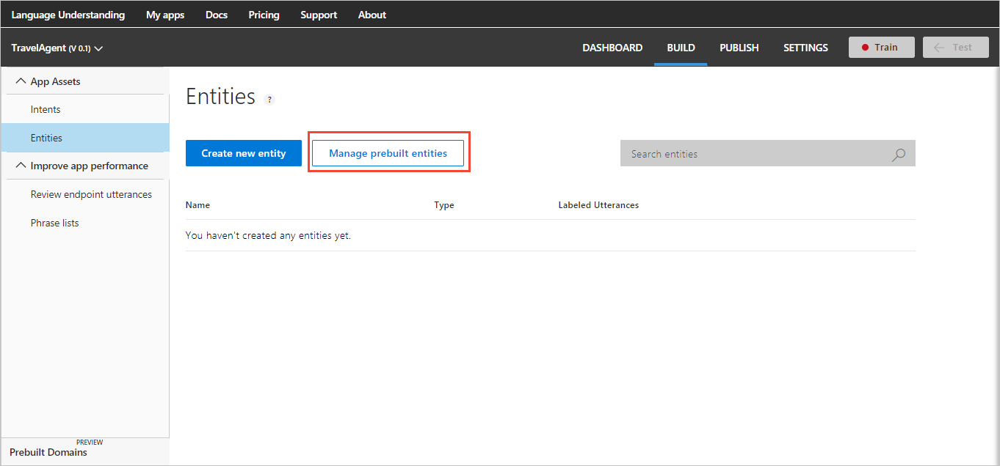
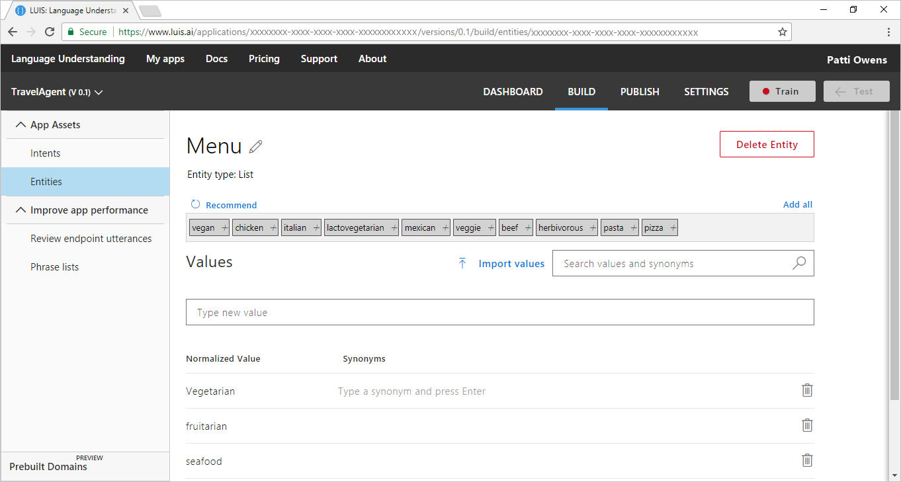
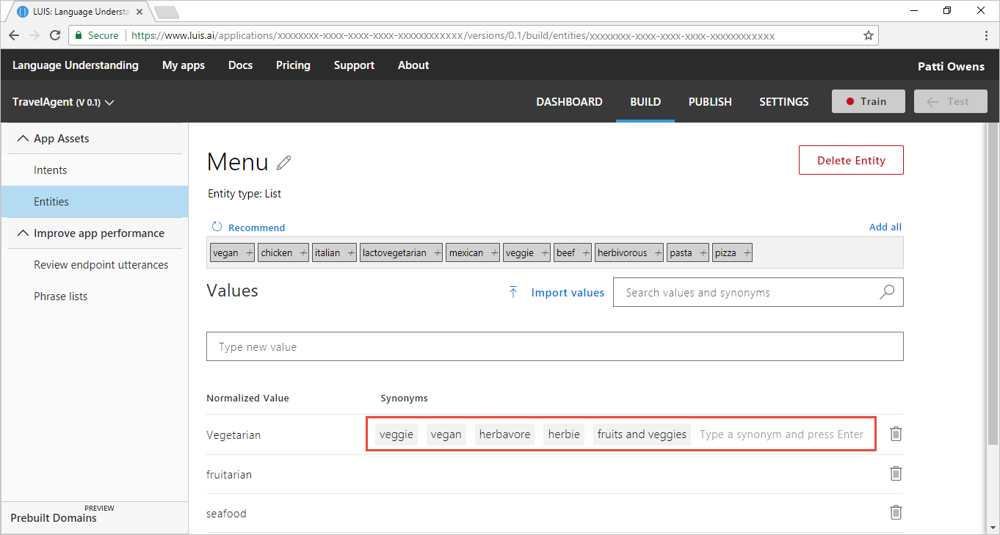

# Manage entities
After you identify your app's [intents](luis-concept-intent.md), you need to [label example utterances](luis-concept-utterance.md) with [entities](luis-concept-entity-types.md). Entities are the important pieces of a command or question, and may be essential for your client app to perform its task. 

You can add, edit, or delete entities in your app through the **Entities list** on the **Entities** page. LUIS offers two main types of entities: [prebuilt entities](luis-reference-prebuilt-entities.md), and your own custom entities.

## Add prebuilt entity

1. Open the TravelAgent app by clicking its name on **My Apps** page, and then click **Entities** in the left panel. 
2. On the **Entities** page, click **Manage prebuilt entities**.

    

3. In **Add or remove prebuilt entities** dialog box, click the **number** and **datetimeV2** prebuilt entities. Then click **Done**.

    


## Add simple entities
A simple entity is a generic entity that describes a single concept. 

1. Open the TravelAgent app by clicking its name on **My Apps** page, and then click **Entities** in the left panel. 

2. On the **Entities** page, click **Create new entity**.

3. In the **Add Entity** dialog box, type "Airline" in the **Entity name** box,  select **Simple** from the **Entity type** list, and then click **Done**.

    

> [!TIP]
> Try the simple entity [quickstart](luis-quickstart-primary-and-secondary-data.md) to learn more.

## Add regular expression entities
A regular expression entity is used to pull out data from the utterance based on a regular expression you provide. 

1. Open the TravelAgent app by selecting its name on **My Apps** page, and then select **Entities** in the left panel. 

2. On the **Entities** page, select **Create new entity**.

3. In the **Add Entity** dialog box, type "AirFrance Flight" in the **Entity name** box,  select **Regular expression** from the **Entity type** list, enter the regular expression `AFR[0-9]{3,4}`, and then select **Done**. This regular expression expects three characters, literally `AFR`, then 3 or 4 digits. The digits can be any number between 0 and 9. The regular expression matches AirFrance flight numbers such as: "AFR101", "ARF1302", and "AFR5006". See [Data Extraction](luis-concept-data-extraction.md) to learn more about extracting the entity from the endpoint JSON query response. 

    

> [!TIP]
> Try the regular expression [quickstart](luis-quickstart-intents-regex-entity.md) to learn more.

## Add hierarchical entities
A hierarchical entity defines a relationship between a category and its members.

To add hierarchical entities, complete the following steps: Make sure to add the child entities at the same time that you create the parent entity. You can add up to 10 child entities for each parent.

1. Open the TravelAgent app by clicking its name on **My Apps** page, and then click **Entities** in the left panel. 

2. On the **Entities** page, click **Create new entity**.

3. In the **Add Entity** dialog box, type "Location" in the **Entity name** box, and then select **Hierarchical** from the **Entity type** list.

    

4. Click **Add Child**, and then type "FromLocation" in **Child #1** box. 

5. Click **Add Child**, and then type "ToLocation" in **Child #2** box. 
    >[!NOTE]
    >To delete a child, click the trash bin icon next to it.

6. Click **Done**.

    >[!NOTE]
    >Child entity names must be unique across all entities in a single app. Two different hierarchical entities may not contain child entities with the same name. 

> [!TIP]
> Try the hierarchical [quickstart](luis-quickstart-intent-and-hier-entity.md) to learn more.

## Add composite entities
You can also define relationships between entities by creating composite entities. A composite entity is created by combining two or more existing entities and treating them as one entity. 

1. Add the prebuilt entity "number". For instructions, see [Add Prebuilt Entities](#add-prebuilt-entity). 

2. Add the hierarchical entity "Category", including the subtypes: "adult", "child" and "infant". 

3. Add the hierarchical entity "TravelClass" including "first", "business" and "economy". For more instructions, see [Add hierarchical entities](#add-hierarchical-entities). 

4. Open the TravelAgent app by clicking its name on **My Apps** page and click **Entities** in the app's left panel.

5. On the **Entities** page, click **Create new entity** to create a custom entity.

6. In the **Add Entity** dialog box, type "TicketsOrder" in the **Entity name** box, and then select **Composite** from the **Entity type** list.

7. Click **Add Child** to add a new child.

8. In **Child #1**, select the entity "number" from the list.

9. In **Child #2**, select the parent entity "Category" from the list. 

10. In **Child #3**, select the parent entity "TravelClass" from the list. 

    

11. Click **Done**.

    >[!NOTE]
    >To delete a child, click the trash button next to it.

> [!TIP]
> Try the composite [tutorial](luis-tutorial-composite-entity.md) to learn more.

## Add list entities
A list entity is an entity that is defined by a list of all its values. 

1. Open the TravelAgent app by clicking its name on **My Apps** page and click **Entities** in the app's left panel.

2. On the **Entities** page, click **Create new entity**.

3. In the **Add Entity** dialog box, type "Menu" in the **Entity name** box and select **List** as the **Entity type**.
 
    
  
4. Click **Done**. The list entity "Menu" is added and the details page where you add exact text matches is displayed. In the **Values** textbox, enter an item for the list, such as `Vegetarian` for the menu list, and click **Enter**. The menu item is added to the list. 

    

5. Once a list item is added, LUIS recommends additional list items. Click the **recommend** button to see recommended list items. 

    

6. Click on any item in the recommended list to add it the entity list. 

    

7. Click on "Type a synonym and press Enter" to add additional text values for a normalized value.

    

> [!TIP]
> Try the list entity [quickstart](luis-quickstart-intent-and-list-entity.md) to learn more.

## Import list entity values

 1. On the "Menu" list entity page, click **Import Lists**.

 2. In **Import New Entries** dialog box, click **Choose File** and select the JSON file that includes the list.

    

    >[!NOTE]
    >LUIS imports files with the extension ".json" only.

 3. To learn about the supported list syntax in JSON, click **Learn about supported list syntax** to expand the dialog and display an example of allowed syntax. To collapse the dialog and hide syntax, click the link title again.

 4. Click **Done**.

    An example of valid json for an entity list is shown in the following JSON-formatted code:

    ```
    [
        {
            "canonicalForm": "Egypt",
            "list": [
                "Cairo",
                "Alexandria"
            ]
        },
        {
            "canonicalForm": "USA",
            "list": [
                "California",
                "Texas"
            ]
        }
    ]  
    ```

## Edit entity name
1. On the **Entities** list page, select the entity in the list. This action takes you to the **Entity** page.

2. On the **Entity** page, you edit the entity name by selecting the edit icon next to the entity name. The entity type is not editable. 

## Delete entity

On the **Entity** page, click the **Delete Entity** button. Then, click **Ok** in the confirmation message to confirm deletion.
 


>[!NOTE]
>* Deleting a hierarchical entity deletes all its children entities.
>* Deleting a composite entity deletes only the composite and breaks the composite relationship, but doesn't delete the entities forming it.

## Search utterances
You can [search and filter](https://docs.microsoft.com/azure/cognitive-services/LUIS/add-example-utterances#search-in-utterances) utterances. 

## Next steps
Now that you have added intents, utterances and entities, you have a basic LUIS app. Learn how to [add features](Add-Features.md) to improve the app.
 
