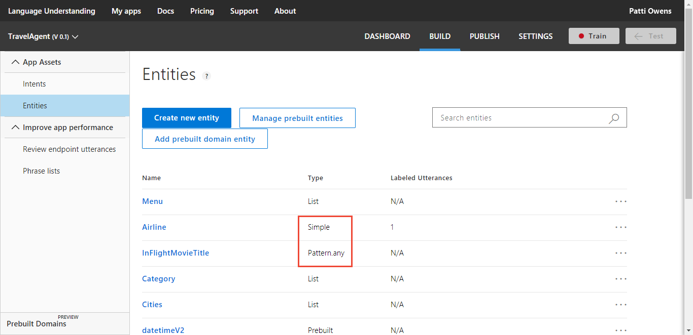
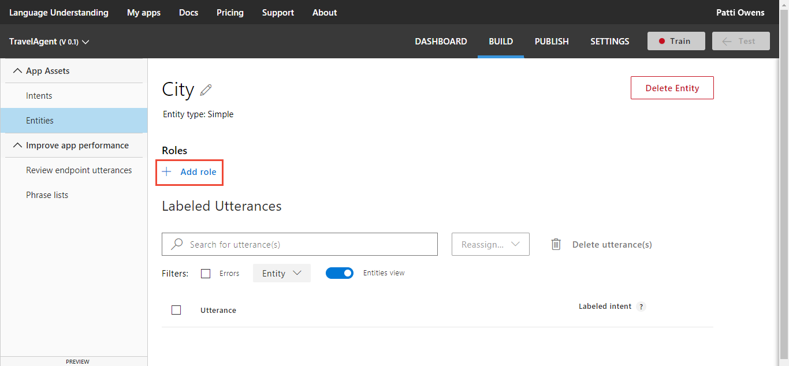

# Manage entities
After you identify your app's [intents](luis-concept-intent.md), you need to [label example utterances](luis-concept-utterance.md) with [entities](luis-concept-entity-types.md). Entities are the important pieces of a command or question, and may be essential for your client app to perform its task. 

You can add, edit, or delete entities in your app through the **Entities list** on the **Entities** page. LUIS offers two main types of entities: [prebuilt entities](luis-reference-prebuilt-entities.md), and your own custom entities.

## Add prebuilt entity

1. In your app, select **Entities** from the left navigation.

2. On the **Entities** page, select **Manage prebuilt entities**.

    

3. In **Add or remove prebuilt entities** dialog box, select the **number** and **datetimeV2** prebuilt entities. Then select **Done**.

    


## Add simple entities
A simple entity is a generic entity that describes a single concept. 

1. In your app, select **Entities** from the left navigation, and then select **Create new entity**.

2. In the pop-up dialog box, type `Airline` in the **Entity name** box,  select **Simple** from the **Entity type** list, and then select **Done**.

    

> [!TIP]
> Try the simple entity [quickstart](luis-quickstart-primary-and-secondary-data.md) to learn more.

## Add regular expression entities
A regular expression entity is used to pull out data from the utterance based on a regular expression you provide. 

1. In your app, select **Entities** from the left navigation, and then select **Create new entity**.

2. In the pop-up dialog box, , type `AirFrance Flight` in the **Entity name** box,  select **Regular expression** from the **Entity type** list, enter the regular expression `AFR[0-9]{3,4}`, and then select **Done**. 

    This AirFrance Flight regular expression expects three characters, literally `AFR`, then 3 or 4 digits. The digits can be any number between 0 and 9. The regular expression matches AirFrance flight numbers such as: "AFR101", "ARF1302", and "AFR5006". See [Data Extraction](luis-concept-data-extraction.md) to learn more about extracting the entity from the endpoint JSON query response.

    

> [!TIP]
> Try the regular expression [quickstart](luis-quickstart-intents-regex-entity.md) to learn more.

## Add hierarchical entities
A hierarchical entity is a category of contextually learned entities.

To add hierarchical entities, complete the following steps: 

1. In your app, select **Entities** from the left navigation, and then select **Create new entity**.

2. In the pop-up dialog box, type `Location` in the **Entity name** box, and then select **Hierarchical** from the **Entity type** list.

    

3. Select **Add Child**, and then type "FromLocation" in **Child #1** box. 

4. Select **Add Child**, and then type "ToLocation" in **Child #2** box. 
    >[!NOTE]
    >To delete a child, select the trash bin icon next to it.

5. Select **Done**.

    >[!NOTE]
    >Child entity names must be unique across all entities in a single app. Two different hierarchical entities may not contain child entities with the same name. 

> [!TIP]
> Try the hierarchical [quickstart](luis-quickstart-intent-and-hier-entity.md) to learn more.

## Add composite entities
You can define relationships between several existing entities by creating a composite entity. 

1. In your app, add the prebuilt entity **number**. For instructions, see [Add Prebuilt Entities](#add-prebuilt-entity). 

2. Add the hierarchical entity `Location`, including the subtypes: `origin`, `destination`. For more instructions, see [Add hierarchical entities](#add-hierarchical-entities). 

3. Select **Entities** from the left navigation, and then select **Create new entity**.

3. In the pop-up dialog box, type `TicketsOrder` in the **Entity name** box, and then select **Composite** from the **Entity type** list.

7. Select **Add Child** to add a new child.

8. In **Child #1**, select the entity **number** from the list.

9. In **Child #2**, select the entity **Location::Origin** from the list. 

10. In **Child #3**, select the entity **Location::Destination** from the list. 

11. Select **Done**.

    

    >[!NOTE]
    >To delete a child, select the trash button next to it.

> [!TIP]
> Try the composite [tutorial](luis-tutorial-composite-entity.md) to learn more.

## Add Pattern.any entities
[Pattern.any](luis-concept-entity-types.md) entities are only valid in [patterns](luis-how-to-model-intent-pattern.md). This entity helps LUIS find entities of varying length and word choice. Because this entity is used in a pattern, LUIS knows where the end of the entity is in the utterance.

1. In your app, select **Entities** from the left navigation, and then select **Create new entity**. 

2. In the **Add Entity** dialog box, type `BookTitle` in the **Entity name** box and select **Pattern.any** as the **Entity type**.
 
    

    To use the pattern.any entity, add a [pattern](luis-how-to-model-intent-pattern.md#add-patterns) on the **Patterns** page under **Review endpoint utterances** with the correct curly brace syntax, such as "For **{BookTitle}** who is the author?".

## Add role to entity used in patterns
A role is a named subtype of an entity. It is only available in a [pattern](luis-how-to-model-intent-pattern). LUIS determines a role based on context.

For example, a plane ticket has an *origin city* and a *destination city*, but both are cities. LUIS determines that both are cities and can determine origin and destination cities based on context. 

The syntax for a role is **{Entity:Role}** where the entity name is followed by a colon, then the role name. For example, "Book a ticket from {Location:Origin} to {Location:Destination}".

1. Open your app, and select **Entities** in the app's left panel.

2. On the **Entities** page, select an entity with type of **Simple** or **Pattern.any**. 

    

3. On **Entity** page, select **Add Roles**.

    

4. In the textbox, enter the name of the role. As an example, a plane trip can have an origin and a destination city. The two roles are "Origin" and "Destination".

    

## Add list entities
List entities represent a fixed, closed set (white list) of related words in your system. For a drinks entity, you can have 2 normalized values: water and soda pop. Each normalized name has synonyms. For water, synonyms are H20, gas, flat. For soda pop, synonyms are fruit, cola, ginger. You don't have to know all the values when you create the entity. You can add more after reviewing real user utterances with synonyms.

|Normalized name|Synonyms|
|--|--|
|Water|H20, gas, flat|
|Soda pop|Fruit, cola, ginger|

1. Open your app, and select **Entities** in the app's left panel.

2. On the **Entities** page, select **Create new entity**.

3. In the **Add Entity** dialog box, type `Drinks` in the **Entity name** box and select **List** as the **Entity type**. Select **Done**.
 
    
  
4.  The list entity page allows you to add normalized names. In the **Values** textbox, enter an item for the list, such as `Water` for the drinks list. 

    

5. To the right of the normalized value **water**, enter synonyms `h20`, `flat`, and `gas`.

    

6. If you want more normalized items for the list, select **Recommend**.

    

7. Select an item in the recommended list to add it as a normalized value or select **Add all** to add all the items. 

    

> [!TIP]
> Try the list entity [quickstart](luis-quickstart-intent-and-list-entity.md) to learn more.

## Import list entity values
You can import values into an existing list entity.

 1. On the list entity page, select **Import Lists**.

 2. In **Import New Entries** dialog box, select **Choose File** and select the JSON file that includes the list.

    

    >[!NOTE]
    >LUIS imports files with the extension ".json" only.

 3. To learn about the supported list syntax in JSON, select **Learn about supported list syntax** to expand the dialog and display an example of allowed syntax. To collapse the dialog and hide syntax, select the link title again.

 4. Select **Done**.

    An example of valid json for a **Colors** list entity is shown in the following JSON-formatted code:

    ```
    [
        {
            "canonicalForm": "Blue",
            "list": [
                "navy",
                "royal",
                "baby"
            ]
        },
        {
            "canonicalForm": "Green",
            "list": [
                "kelly",
                "forest",
                "avacado"
            ]
        }
    ]  
    ```

## Edit entity name
1. On the **Entities** list page, select the entity in the list. This action takes you to the **Entity** page.

2. On the **Entity** page, you edit the entity name by selecting the edit icon next to the entity name. The entity type is not editable. 

## Delete entity

On the **Entity** page, select the **Delete Entity** button. Then, select **Ok** in the confirmation message to confirm deletion.
 


>[!NOTE]
>* Deleting a hierarchical entity deletes all its children entities.
>* Deleting a composite entity deletes only the composite and breaks the composite relationship, but doesn't delete the entities forming it.

## Search utterances
You can [search and filter](https://docs.microsoft.com/azure/cognitive-services/LUIS/add-example-utterances#search-in-utterances) utterances. 

## Next steps
Now that you have added intents, utterances and entities, you have a basic LUIS app. Learn how to [add features](Add-Features.md) to improve the app.
 
