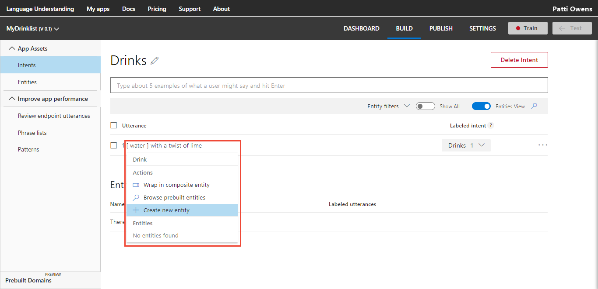
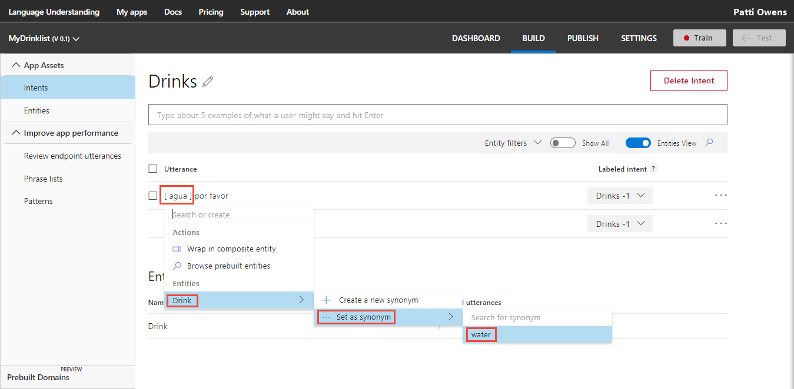

# Add example utterances and label with entities

Utterances are examples of user questions or commands. To teach Language Understanding (LUIS) apps, you need to add [example utterances](luis-concept-utterance.md) to an [intent](luis-concept-intent.md).

Generally, you add an utterance first, and then you create entities and label utterances on the intent page. If you would rather create entities first, see [Add entities](Add-entities.md).

The following example uses the "BookFlight" intent in the TravelAgent app. 

## Add an utterance

1. Open the TravelAgent app by selecting its name on the **My Apps** page. Then select **Intents** in the left panel. 

2. On the **Intents** page, select the intent name **BookFlight** to open the details page.

3. Type `book 2 adult business tickets to Paris tomorrow on Air France` as a new utterance in the text box, and then press Enter. 
 
    >[!NOTE]
    >LUIS converts all utterances to lowercase.

     

Utterances are added to the utterances list for the current intent. 

## Edit an utterance

To edit an utterance, select the three dots (...) icon at the right end of the line for that utterance, and then select **Edit**. 

 


## Reassign utterances
Adding an utterance to an intent means similar utterances should be predicted with that intent as well. You can change the intent of one or more utterances by moving them to another intent. 

To change the intent of a single utterance, and the right end of the utterance's row, select the intent name under the **Labeled intent** column.


To change the intent of several utterances, select the checkbox to the left of the utterances, and then select **Reassign intent**. Select the correct intent from the list.

 

## Delete utterances

To delete an utterance, select the three dots (...) icon at the right end of the line for that utterance, and then select **Delete**. 


To delete several utterances, select the checkbox to the left of the utterances, and then select **Delete utterances(s)**.


## Add simple entity label
In the following procedure, you create and label custom entities within the following utterance on the intent page:

```
book me 2 adult business tickets to Paris tomorrow on Air France
```

1. Select "Air France" in the utterance to label it as a simple entity.

    > [!NOTE]
    > When selecting words to label them as entities:
    > * For a single word, just select it. 
    > * For a set of two or more words, select at the beginning and then at the end of the set.

2. In the entity drop-down box that appears, you can either select an existing entity or add a new entity. To add a new entity, type its name in the text box, and then select **Create new entity**. To create the simple entity "Airline," type "Airline" in the text box and then select **Done**.
 
    

> [!TIP]
> Try the simple entity [quickstart](luis-quickstart-primary-and-secondary-data.md) to learn more.

## Add hierarchical entity and label

When booking a plane ticket, `Book a ticket from Seattle to Cairo`, you can specify the origin city "Seattle" and the destination city "Cairo". For LUIS to understand both locations based on context, use a hierarchical entity type. 

1. On the Intent page, in the utterance, select "Seattle", then enter the entity name `Location, and then select **Create new entity**.

    

2. In the pop-up dialog box, select hierarchical for **Entity type**, then add `Origin` and `Destination` as children, and then select **Done**.

    

    To learn more about hierarchical entities and how to add them, see [Add entities](Add-entities.md).

3. Return to the utterance on the Intent page. The entity is labeled with the name of the Location entity but the child of Origin is not yet set. Select "Seattle" in the utterance again, then select Location, then select Origin.

    

> [!TIP]
> Try the hierarchical [quickstart](luis-quickstart-intent-and-hier-entity.md) to learn more.

## Add list entity and label

List entities represent a fixed, closed set (white list) of related words in your system. In the utterance, 
`1 water with a twist of lime`, water is an item on a Drink list entity. 

1. In the utterance, 
`1 waters with a twist of lime`,
select **water**, and then create a new entity named "Seat".  

    

2. In the **What type of entity do you want to create?** dialog box, add `h20`, `perrier`, and `waters`, and select **Done**. Notice that waters is added because the list synonyms are matched at the token level. In the English culture, that level is at the word level so waters would not be matched to water unless it was in the list. 

    

    This list of drinks has only 1 drink type of water. You can add more drink types by labeling other utterances, or by editing the entity from the **Entities** in the left navigation. Editing the entities gives you the options of entering additional items with corresponding synonyms or importing a list. 

> [!TIP]
> Try the list entity [quickstart](luis-quickstart-intent-and-list-entity.md) to learn more.

## Add synonyms to the list entity 
Add a synonym to the list entity by selecting the word or phrase in the utterance. If you have a Drink list entity, and want to add `agua` as a synonym for water, follow the steps:

1. In the utterance `agua por favor`, select the word "aqua" then select **Drink**, then **Set as synonym**, then **water**.

    

## Wrap entities in composite label
Composite entities are created from **Entities**. You can't create a composite entity from the Intent page. Once the composite entity is created, you can wrap the entities in an utterance on the Intent page. 

Assuming the utterance, `book 2 tickets from Seattle to Cairo`, a composite utterance can return entity information of the count of tickets (2), the origin (Seattle), and destination (Cairo) locations in a single parent entity. 

Follow these [steps](Add-entities.md#add-prebuilt-entity) to add the **number** prebuilt entity. After the entity is created, the `2` in the utterance is blue, indicating it is a labeled entity. Prebuilt entities are labeled by LUIS. 

Follow these [steps](#add-hierarchical-entity-and-label) to create a **Location** hierarchical entity. Label the origin and destination locations in the example utterance. 

1. To wrap the individual entities into a composite, select the first word in the utterance that represents the entities of the composite entity. In the example utterance, `book 2 tickets from Seattle to Cairo`, the first entity is the number 2. Select "number" (representing 2).

2. Select **Wrap composite entity** from the drop-down list. The green line, indicating the composite entity, is now under the blue "number". 

3. Select the last word of the composite entity. In the utterance of this example, select "Location::Destination" (representing Cairo).

    

4. Select the composite entity name from the drop-down list. For this example, that is **TicketOrder**.

    When you wrap the entities correctly, a green line is under the entire phrase.


> [!TIP]
> Try the composite [tutorial](luis-tutorial-composite-entity.md) to learn more.

## Remove entity labels from utterances
You can remove machine-learned entity labels from an utterance on the Intent page. If the entity is not machine-learned, it can't be removed from an utterance. If you need to remove the entity from the utterance, you need to delete the entity from the entire app. 

To remove a machine-learned entity label from an utterance, select the entity in the utterance. Then select **Remove Label** in the entity drop-down box that appears.

 

## Add prebuilt entity label
If you add the prebuilt entities to your LUIS app, you don't need to label utterances with these entities. To learn more about prebuilt entities and how to add them, see [Add entities](Add-entities.md#add-prebuilt-entity).

## Add regular expression entity label
If you add the regular expression entities to your LUIS app, you don't need to label utterances with these entities. To learn more about regular expression entities and how to add them, see [Add entities](Add-entities.md#add-regular-expression-entities).

## Add pattern.any entity label
If you add the pattern.any entities to your LUIS app, you don't need to label utterances with these entities. To learn more about pattern.any entities and how to add them, see [Add entities](Add-entities.md#add-patternany-entity-label).

## Search in utterances
You can search for utterances that contain text (words or phrases). For example, you might notice an error that involves a particular word, and you want to find all examples that include that particular word. 

Type the word or phrase in the search box at the top right corner of the utterances list, and press Enter. The utterances list updates, to display only the utterances that include your search text. 

To cancel the search and restore your full list of utterances, delete the search text you've typed.

## Prediction discrepancy errors
An utterance in an intent might have a discrepancy between the selected intent and the prediction score. LUIS indicates this discrepancy with a red box around the score. 

 

## Filter by intent prediction discrepancy errors
To filter the utterance list to only utterances with an intent prediction discrepancy, toggle from **Show All** to **Errors only** in the toolbar. 

## Filter by entity type
Use the **Entity filters** drop-down om the toolbar to filter the utterances by entity. To remove the filter, select the blue filter box with that word or phrase under the toolbar.  

 

## Switch to token view
Toggle **Tokens View** to view the tokens instead of the entity type names. On the keyboard, you can also use **Control+E** to toggle the view. 


## Next steps

After labeling utterances in your intents, you can now create a [composite entity](Add-entities.md).
