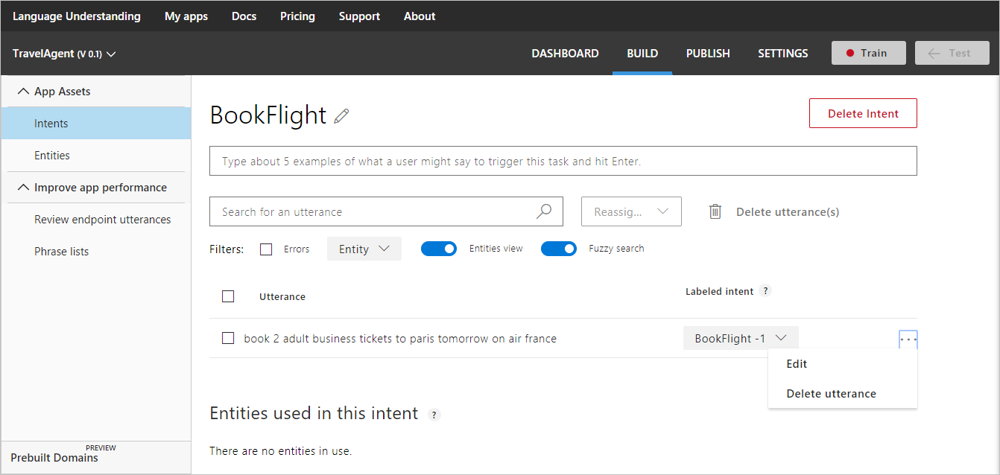
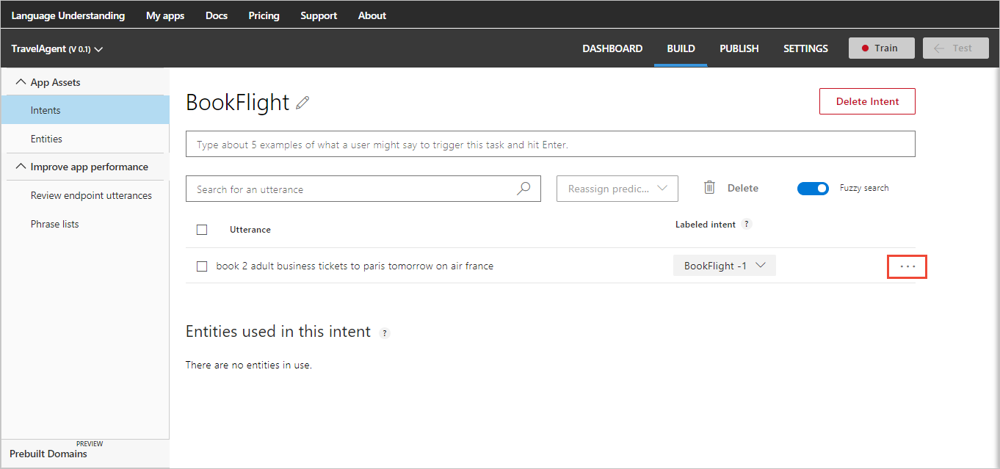
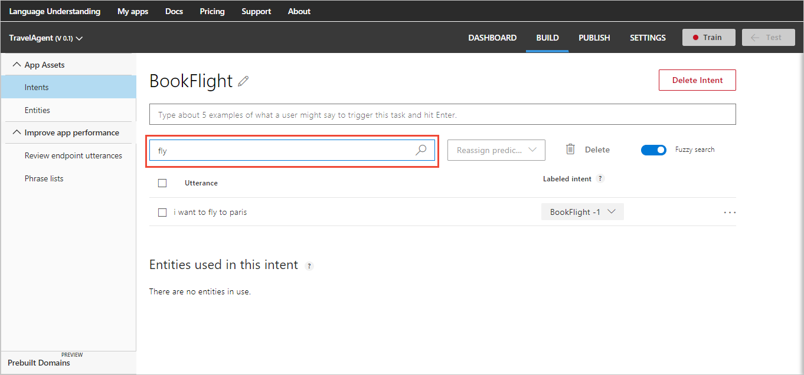

# Example utterances

Utterances are examples of user questions or commands. A variety of [example utterances](luis-concept-utterance.md) need to be added to an [intent](luis-concept-intent.md) to teach LUIS.

You can create entities and label utterances on the intent page after an utterance is added. If you would rather create entities first, see [Add entities](Add-entities.md).

In the following example, use the "BookFlight" intent in the TravelAgent app. 

## Add an utterance

1. Open the TravelAgent app by clicking its name on **My Apps** page, and then click **Intents** in the left panel. 

2. On the **Intents** page, click the intent name "BookFlight" to open the details page, shown in the following image:

     

3. Type `book 2 adult business tickets to Paris tomorrow on Air France` as a new utterance in the text box, and then press Enter. 
 
    >[!NOTE]
    >LUIS converts all utterances to lower case.

     

Utterances are added to the utterances list for the current intent. 

## Edit an utterance

To edit an utterance, select the three dots (...) icon at the right end of the line for that utterance then select **Edit**. 

 

## Delete an utterance

To delete an utterance, select the three dots (...) icon at the right end of the line for that utterance then select **Delete utterance**. 


## Reassign an utterance
Adding an utterance to an intent means that it is labeled under that intent. You can change the intent label of one or more utterances by moving them to another intent. To change the intent label, select the utterances, click **Reassign predicted intent**, and then select the intent where you want to move them.

 


## Add prebuilt entity label

If you add the prebuilt entities to your LUIS app, you don't need to label utterances with these entities. To learn more about prebuilt entities and how to add them, see [Add entities](Add-entities.md).

## Add simple entity label
In the following procedure, you create and label custom entities within the following utterance on the intent page:

```
book me 2 adult business tickets to Paris tomorrow on Air France
```

1. Select "Air France" in the utterance to label it as a simple entity.

    > [!NOTE]
    > When selecting words to label them as entities:
    > * For a single word, just click it. 
    > * For a set of two or more words, click at the beginning and then at the end of the set.

2. In the entity drop-down box that appears, you can either click an existing entity to select it, or add a new entity by typing its name in the text box and clicking **Create new entity**. To create the simple entity "Airline," type "Airline" in the text box and then click **Create new entity**.
 
    
 
    > [!NOTE]
    > This method is used to create a simple entity on the intent page as part of labeling utterances. Composite entity children must be created from the **Entities** page before labeling an utterance with that entity. For more instructions, see [Add entities](Add-entities.md). 

A dialog pops up allowing you to choose which type of entity. For the entity "Airline," keep the entity type of "Simple" and click **Done.**

## Add hierarchical entity and label

The city "Paris" can be either a ToLocation or a FromLocation when booking a plane ticket. In order for LUIS to understand both entity types, this step builds a hierarchical entity. 

1. Select "Paris" in the same utterance, then create entity "Location". "Location" is a hierarchical entity containing "ToLocation" and "FromLocation" simple entity types.

    

    The text "Paris" is now labeled as a top-level hierarchical entity. 

2. Once the hierarchical entity is created, click "Paris" and change the entity from "Location" to "ToLocation" entity.

    

    To learn more about hierarchical entities and how to add them, see [Add entities](Add-entities.md).

## Add list entity and label

1. Select "business," then create entity "Seat". "Seat" is a list entity containing exact-match words "First", "Business" and "Economy" as list items. 

    

2. Click **Done**.

## Remove custom entity label

In order to remove your own custom entity label from an utterance, click the entity in the utterance and click **Remove label** in the entity drop-down box that appears.

 

## Search in utterances

Searching allows you to find utterances that contain text (words/phrases). For example, sometimes you notice an error that involves a particular word, and may want to find all the examples including it. 

Type the search text in the search box at the top right corner of the utterances list and press Enter. The utterances list is updated to display only the utterances including your search text. 

For example, in the following image, only the utterances that contain the search word "fly" are displayed. 



To cancel the search and restore your full list of utterances, delete the search text you've typed.

## Next steps

After labeling utterances in your intents, now your next task is to create a [composite entity](Add-entities.md).