# Add example utterances

Utterances are sentences representing examples of user queries or commands that your application is expected to receive and interpret. You need to add example utterances for each intent in your app. LUIS learns from these utterances and your app is able to generalise and understand similar contexts. By constantly adding more utterances and labeling them, you are enhancing your application’s language learning experience. 

For each intent, add example utterances that trigger this intent and include as many utterance variations as you expect users to say. The more relevant & diverse examples you add to the intent, the better intent prediction you’ll get from your app. For example, the utterance “book me a flight to Paris” may have variations such as “Reserve me a flight to Paris”, "book me a ticket to Paris", "Get me a ticket to Paris”, "Fly me to Paris", and "Take me on a flight to Paris".

Utterances are added to an intent on the **Utterances** tab of the intent page. The following steps describe how to add example utterances to an intent (e.g. "BookFlight" intent in the TravelAgent app). 

**To add utterance:**

1. Open the TravelAgent app by clicking its name on **My Apps** page, and then click **Intents** in the left panel. 

2. On the **Intents** page, click the intent name "BookFlight" to open its details page, with **Utterances** as the current tab, like the screen below.

     

3. Type “book me 2 adult business tickets to Paris tomorrow on Air France” as a new utterance in the text box, and then press Enter. Note that LUIS converts all utterances to lower case.

    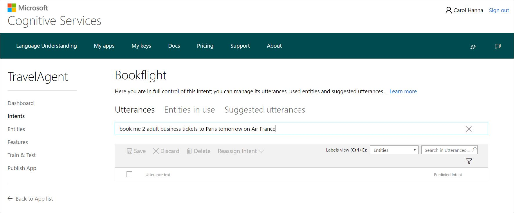 

4. Repeat the previous step to add more example utterances. 
5.	Click **Save** to save the added utterances in the utterances list.

Utterances are added to the utterances list in the current intent. To delete one or more utterances from the list, select them and click **Delete**.

## Label utterances
After adding utterances, your next step is to label them. Utterances are labeled in terms of intents and entities. 
### Intent label
Adding an utterance in an intent page means that it is labeled under this intent. That's how an utterance gets an intent label. You can change the intent label of one or more utterances by moving them to another intent. To do this, select the utterances, click **Reassign Intent**, and then select the intent where you want to move them. 
### Entity label
There are different types of entities; custom entities and prebuilt entities. You need to label custom entities only, **because prebuilt entities are detected and labeled automatically by your app.** 

For example, in the utterance "book me 2 adult business tickets to Paris tomorrow on Air France" that you've just added to "Bookflight" intent in TravelAgent app, before you start labeling entities in this utterance, if you have already added number and datetime as prebuilt entities, you'll notice that "2" and "tomorrow" were automatically detected as prebuilt entities, where "2" is labeled as "number" and "tomorrow" as "datetime". This will look like the following screenshot.

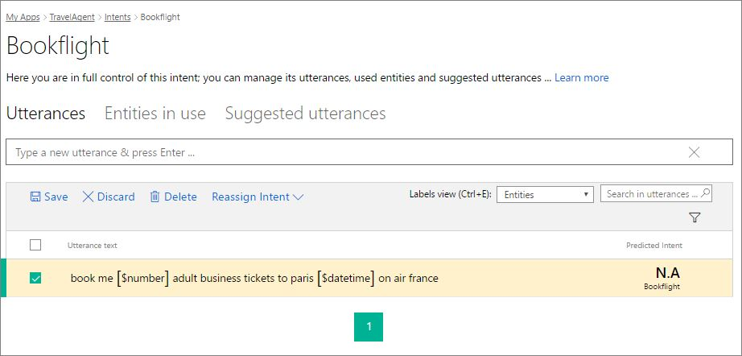

To Learn more about prebuilt entities and how to add them, see [Add entities](Add-entities.md).

In the following procedure, we'll label custom entities (simple, hierarchical and composite entities) in the utterance "book me 2 adult business tickets to Paris tomorrow on Air France".

1. Select "Air France" in the utterance mentioned above to label it as entity.

    >[!NOTE]
    >When selecting words to label them as entities:
    >* For a single word, just click it. 
    >* For a set of two or more words, click at the beginning and then at the end of the set.

2. In the entity drop-down box that appears, you can either click an existing entity (if available) to select it, or add a new entity by typing its name in the text box and clicking **Create entity**. Now, we'll create the simple entity "Airline". Type "Airline" in the text box and then click **Create entity**.
 
    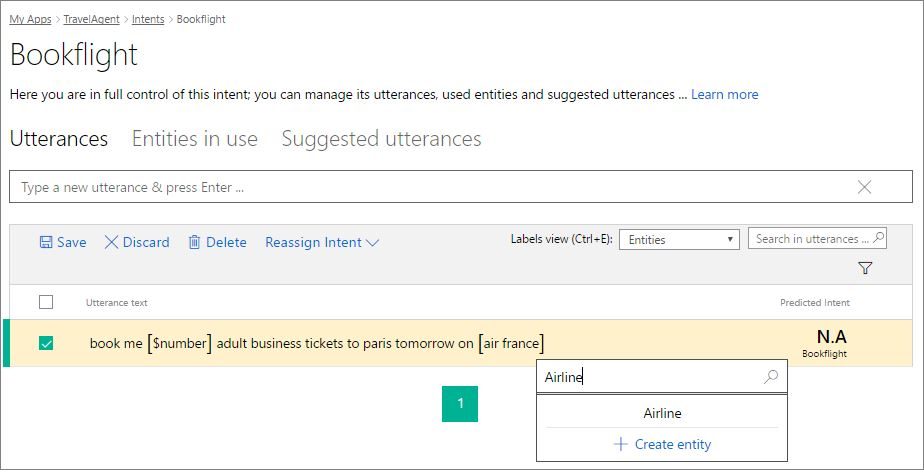
 
    >[!NOTE]
    >This way is used to create a simple entity on the spot (while labeling utterances). More complicated entities (e.g. hierarchical and composite) can only be created from the **Entities** page. For more instructions, see [Add entities](Add-entities.md). 

3. Click "Paris" in the same utterance, then click "ToLocation" in the entity drop-down box as the entity label. "ToLocation" is a hierarchical entity that must be added on the **Entities** page. To learn more about hierarchical entities and how to add them, see [Add entities](Add-entities.md).

    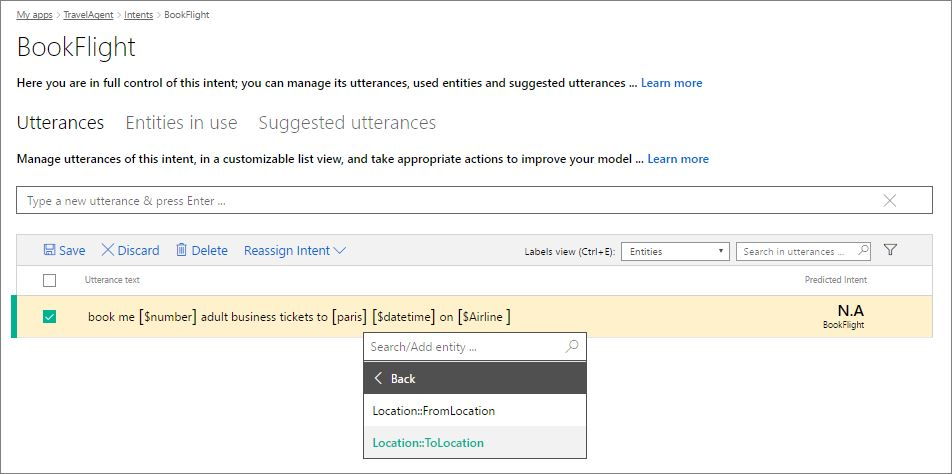

4. Click "2" (labeled as "number") and then click **Remove label** in the drop-down box. We remove this label as we do not want "2" to be interpreted individually, but to be part in a composite entity that we're going to label now.

5. Select the phrase "2 adult business" by clicking at the beginning and at the end of the phrase, then click "TicketsOrder" in the drop-down box. "TicketsOrder" is a composite entity that must be added on the **Entities** page. To learn more about composite entities and how to add them, see [Add entities](Add-entities.md). 

    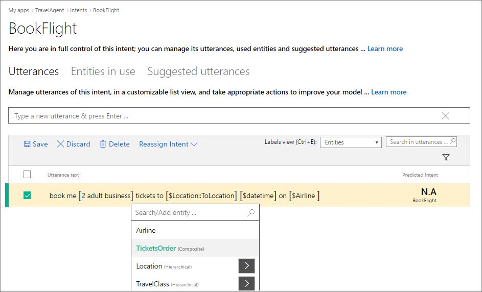

5. Click **Save**.

**To remove an entity label:**

* Click the entity you want to remove its label and click **Remove label** in the entity drop-down box that appears. Then, click **Save** to save this change.

## Search in utterances
Searching allows you to find utterances that contain a specific text (words/phrases). For example, sometimes you will notice an error that involves a particular word, and may want to find all the examples including it. 

**To search in utterances:**

* Type the search text in the search box at the top right corner of the utterances list and press Enter. The utterances list will be updated to display only the utterances including your search text. For example, in the following screenshot, only the utterances which contain the search word "reserve" is displayed. 

    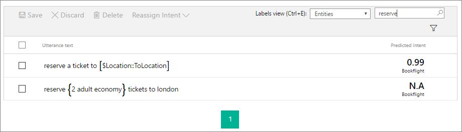

To cancel the search and restore your full list of utterances, delete the search text you've just typed.

 
## Filter utterances
When you have a large number of utterances, it is useful to filter utterances in order to limit their view based on one or more filtering criteria. 

You can apply one or more filters on utterances, as needed. These are the available filters that you can use:

- **Selected:** displays only the currently selected utterances.
- **Changed:** displays only utterances which contain unsaved changes. 
- **Errors:** displays only utterances which contain errors.
- **Entity:** displays only utterances that contain a specific entity. 

>[!NOTE]
>Utterances which contain unsaved changes are highlighted in light yellow. You can click **Save** to save changes or **Discard** to discard changes.

**To apply filter(s):**

1. Click the filter button 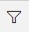, at the top right corner of the utterances list, to display all filters.
2. Click on the filter(s) that you want to apply on utterances. For the **Entity** filter, select the entity by which you want to filter utterances. 

    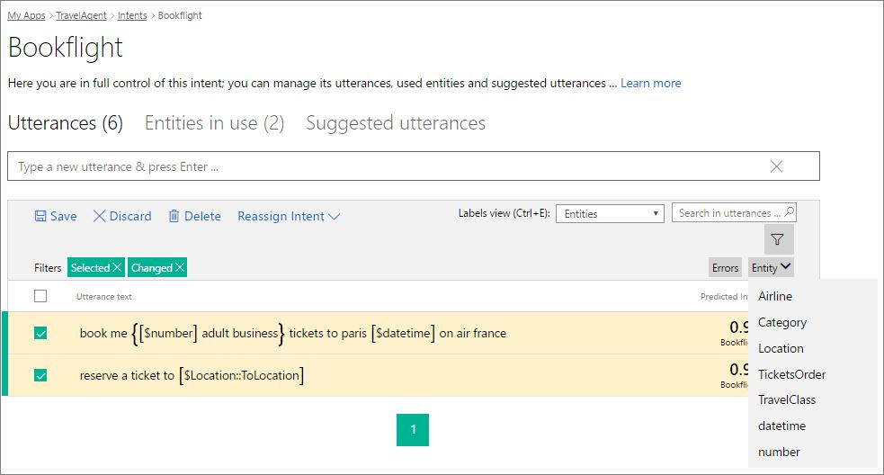

The applied filters appear as green buttons at the top left corner of the utterances list. 

* To clear an applied filter, click its button at the top left corner.
* To clear all applied filters, click all their corresponding buttons, or just click the filter button .

## Choose labels view in utterances
You can control how you see the words labeled as entities in the utterances by selecting one of the available views for labeled entities.  At the top of the utterances list, select a view from the **Labels view** list. These are the available views:

 * **Entities:** Shows entity-labeled words in tagged format (entity labels), enclosed in square brackets, with only composite entities displayed as normal text between curly brackets. 
  
    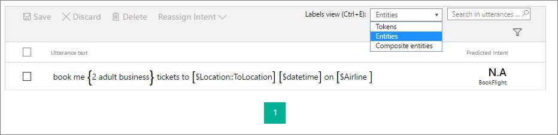
  
 * **Tokens:** Shows all entity-labeled words in text format (normal text), enclosed in square brackets except composite entities in curly brackets. 
 
    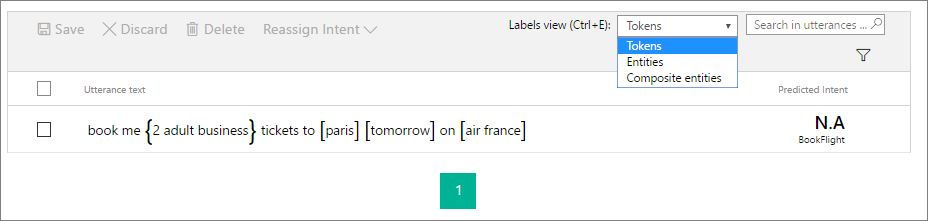
 
 * **Composite entities:** Shows only the words labeled as composite entities in tagged format (entity labels), enclosed in curly brackets.
   
    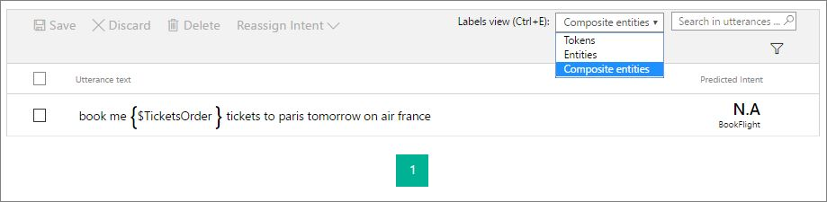

You can press <kbd>Ctrl+E</kbd> to quickly switch between views. 
