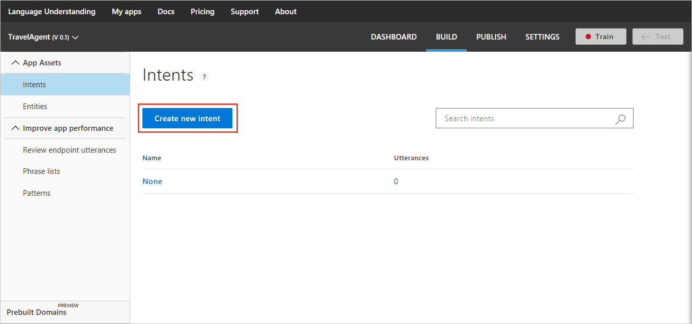
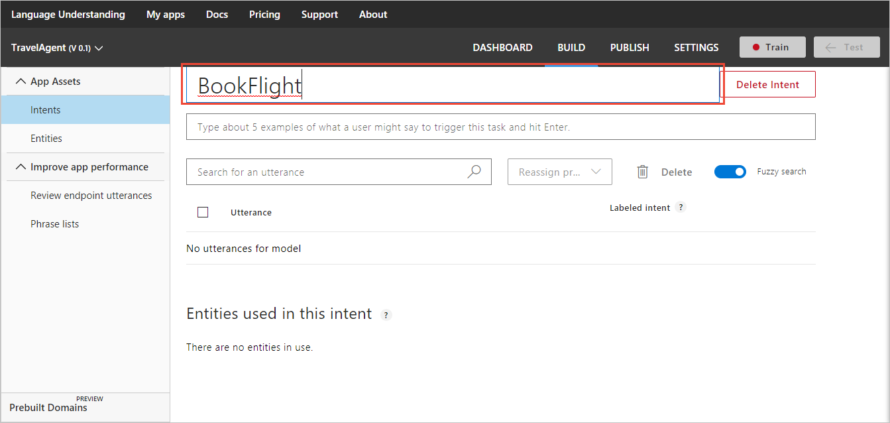
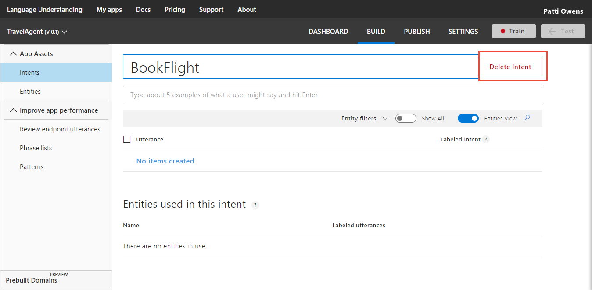
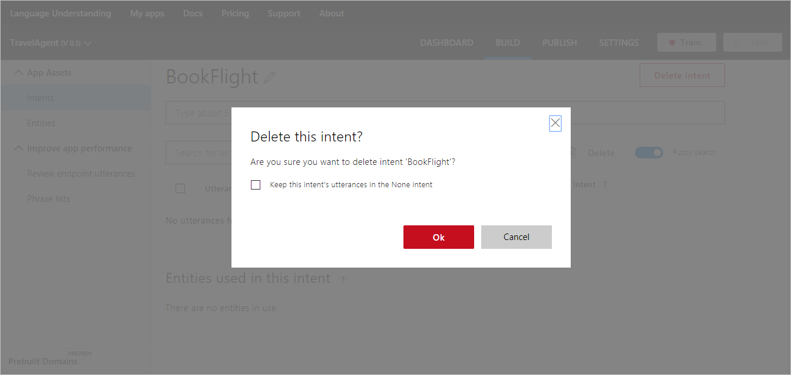
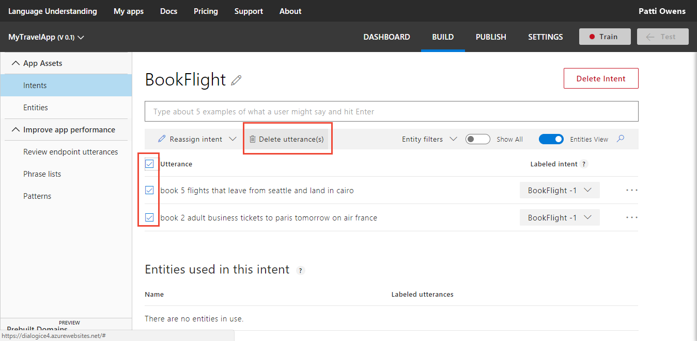

# Manage intents 
Add [intents](luis-concept-intent.md) to your LUIS app to identify groups of questions or commands that have the same intentions. 

You add and manage your intents from the **Intents** page, available from **Intents** in LUIS's left panel. 

The following procedure demonstrates how to add the "Bookflight" intent in the TravelAgent app.

## Add intent

1. Open your app (for example, TravelAgent) by clicking its name on **My Apps** page, and then click **Intents** in the left panel. 
2. On the **Intents** page, click **Create new intent**.

    
3. In the **Create new intent** dialog box, type the intent name "BookFlight" and click **Done**.

    

    On the intent details page of the newly added intent, [add utterances](#add-an-utterance-on-intent-page).

## Rename intent

1. On the **Intent** page, click the Rename icon  next to the intent name. 

2. On the **Intent** page, the current intent name is shown in a dialog box. Edit the intent name and press enter. The new name is saved and displayed on the intent page.

    

## Delete intent
 
1. On the **Intent** page, click the **Delete Intent** button next to the right of the intent name. 

    

2. Click the "Ok" button on the confirmation dialog box.

<!--
    TBD: waiting for confirmation about which delete dialog is going to be in //BUILD

    
-->

## Add an utterance on intent page

On the intent page, enter a relevant utterance you expect from your users, such as `book 2 adult business tickets to Paris tomorrow on Air France` in the text box below the intent name, and then press Enter. 
 
>[!NOTE]
>LUIS converts all utterances to lowercase.

 

Utterances are added to the utterances list for the current intent. 

## Create a pattern from an utterance
See [Add pattern from existing utterance on intent or entity page](luis-how-to-model-intent-pattern.md#add-pattern-from-existing-utterance-on-intent-or-entity-page).

## Edit an utterance on intent page

To edit an utterance, select the three dots (...) icon at the right end of the line for that utterance, and then select **Edit**. Modify the text then press Enter on the keyboard.

 

## Reassign utterances on intent page
You can change the intent of one or more utterances by reassigning them to another intent. 

To reassign a single utterance to a different intent, at the right end of the utterance's row, select the correct intent name under the **Labeled intent** column. The utterance is removed from the current intent's utterance list. 

To change the intent of several utterances, select the checkboxes to the left of the utterances, and then select **Reassign intent**. Select the correct intent from the list.

 

## Delete utterances on intent page

To delete an utterance, select the three dots (...) icon at the right end of the line for that utterance, and then select **Delete**. The utterance is removed from the list and the LUIS app.

To delete several utterances:

1. Select the checkboxes to the left of the utterances, and then select **Delete utterances(s)**. 

    

2. Select **Done** in the **Delete utterances?** pop-up dialog.

## Search in utterances on intent page
In an intent, you can search for utterances that contain text (words or phrases). For example, you might notice an error that involves a particular word, and you want to find all examples that include that particular word. 

1. Select the magnifying glass icon in the toolbar.

    

2. A search textbox appears. Type the word or phrase in the search box at the top right corner of the utterances list. The utterances list updates, to display only the utterances that include your search text. 

    

    To cancel the search and restore your full list of utterances, delete the search text you've typed. To close the search textbox, select the magnifying glass icon in the toolbar again.

## Prediction discrepancy errors on intent page
An utterance in an intent might have a discrepancy between the selected intent and the prediction score. LUIS indicates this discrepancy with a red box around the score. 

 

## Filter by intent prediction discrepancy errors on intent page
To filter the utterance list to only utterances with an intent prediction discrepancy, toggle from **Show All** to **Errors only** in the toolbar. 

## Filter by entity type on intent page
Use the **Entity filters** drop-down on the toolbar to filter the utterances by entity. 

 

To remove the filter, select the blue filter box with that word or phrase under the toolbar.  
<!-- TBD: waiting for ux fix - bug in ux of prebuit entity number -- when filtering by it, it doesn't show the list -->

## Switch to token view on intent page
Toggle **Tokens View** to view the tokens instead of the entity type names. On the keyboard, you can also use **Control+E** to toggle the view. 

## Train your app after changing model with intents
After you add, edit, or remove intents, [train](luis-how-to-train.md) and [publish](PublishApp.md) your app for your changes to affect endpoint queries. 

## Next steps

After adding intents to your app, your next task is to start adding [example utterances](Add-example-utterances.md) for the intents you've added. 
