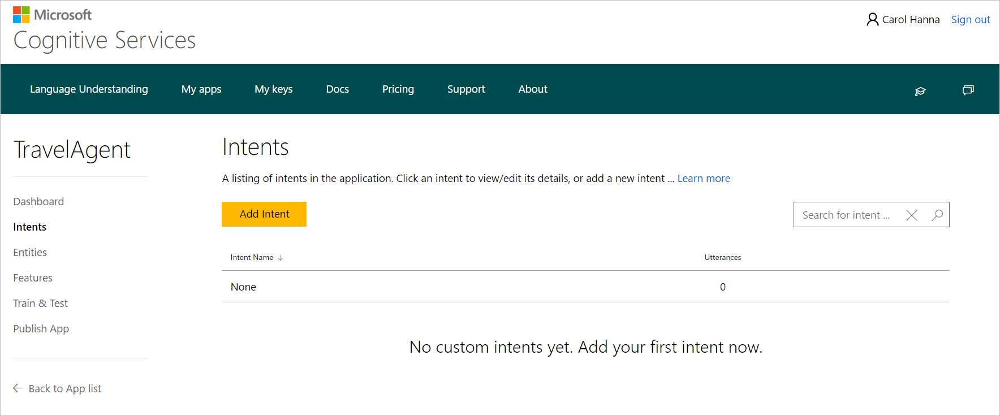
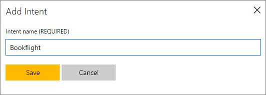
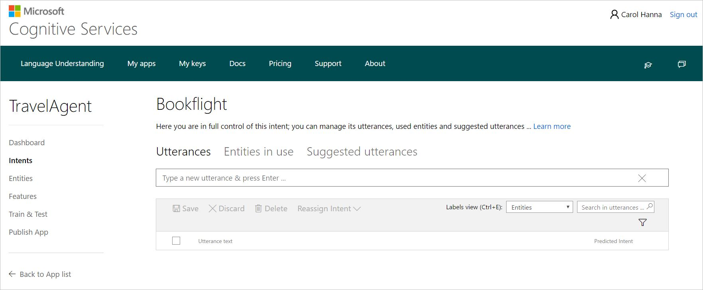
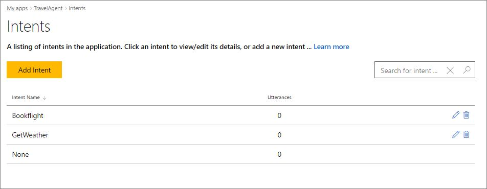
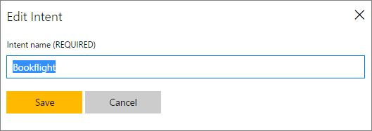

# Add Intents 
Intents are the intentions or desired actions conveyed through the utterances (sentences). Intents match user requests with the actions that should be taken by your app. So, you must add intents to help your app understand user requests and react to them properly. 

All applications come with the predefined intent, **"None"**. You should teach it to recognize user statements that are irrelevant to the app, for example if a user says "Get me a great cookie recipe" in a TravelAgent app.

You can add up to 80 intents in a single LUIS app. You add and manage your intents from the **Intents** page that is accessed by clicking **Intents** in your application's left panel. 

In the following procedure, we'll start adding the "Bookflight" intent in the TravelAgent app as an example to explain the steps of adding an intent.

**To add intent:**

1. Open your app (e.g. TravelAgent) by clicking its name on **My Apps** page, and then click **Intents** in the left panel. 
2. On the **Intents** page, click **Add intent**.

    
3. In the **Add Intent** dialog box, type the intent name "BookFlight" and click **Save**.

    

This will take you directly to the intent details page of the newly added intent "Bookflight", like the screenshot below, in order to add utterances for this intent. For instructions on adding utterances, see [Add example utterances](Add-example-utterances.md).

## Manage your intents
You can view a list of all your intents and manage them on the **Intents** page, where you can add new intents, rename and delete existing ones or access intent details for editing. 

**To rename an intent:**

1. On the **Intents** page, click the Rename icon  next to the intent you want to rename. 

2. In the **Edit Intent** dialog box, edit the intent name and click **Save**.

    

**To delete an intent:**
 
* On the **Intents** page, click the trash bin icon  next to the intent you want to delete.

**To access intent details for editing:**

* On the **Intents** page, click the intent name which you want to access its details.

After adding intents to your app, now your next task is to start adding example utterances for the intents you've added. For instructions, see [Add example utterances](Add-example-utterances.md).
