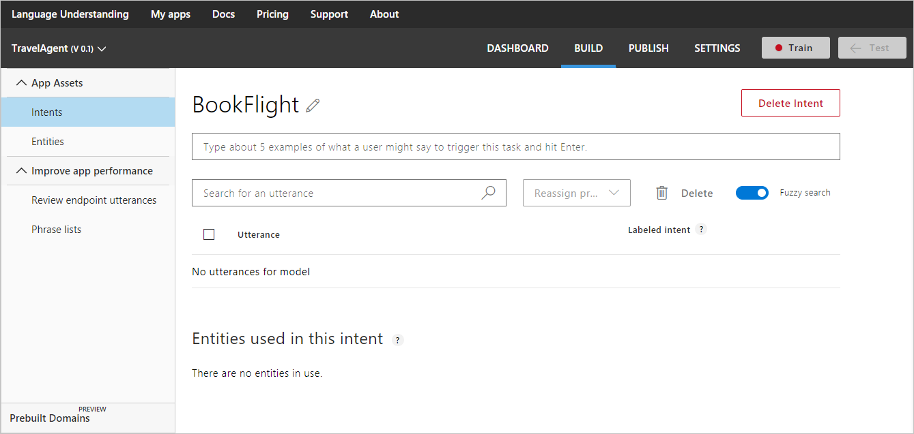

# Manage intents 
Add [intents](luis-concept-intent.md) to your LUIS app to identify groups of questions or commands that have the same intentions. 

You add and manage your intents from the **Intents** page, available from **Intents** in LUIS's left panel. 

The following procedure demonstrates how to add the "Bookflight" intent in the TravelAgent app.

## Add intent

1. Open your app (for example, TravelAgent) by clicking its name on **My Apps** page, and then click **Intents** in the left panel. 
2. On the **Intents** page, click **Create new intent**.

    
3. In the **Create new intent** dialog box, type the intent name "BookFlight" and click **Done**.

    

On the intent details page of the newly added intent "Bookflight", you add utterances for this intent. For instructions on adding utterances, see [Add example utterances](Add-example-utterances.md).

## Rename intent

1. On the **Intent** page, click the Rename icon  next to the intent name. 

2. On the **Intent** page, the current intent name is shown in a dialog box. Edit the intent name and press enter. The new name is saved and displayed on the intent page.

    

## Delete intent
 
1. On the **Intent** page, click the **Delete Intent** button next to the right of the intent name. 

    

2. Click the "Ok" button on the confirmation dialog box.

    

## Next steps

After adding intents to your app, your next task is to start adding [example utterances](Add-example-utterances.md) for the intents you've added. 
