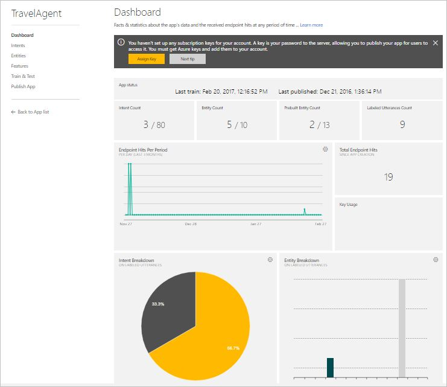
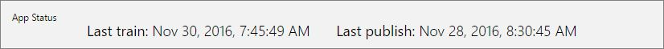
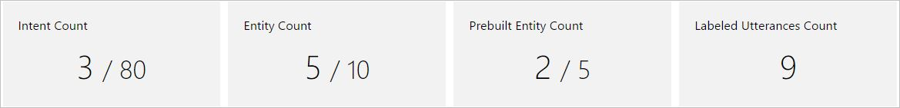
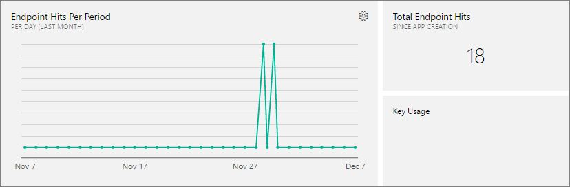
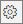
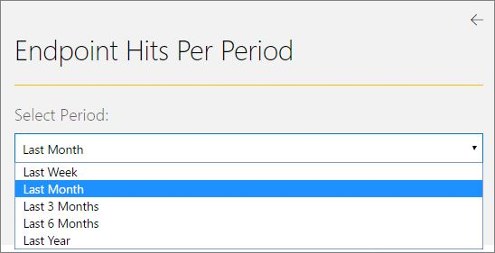
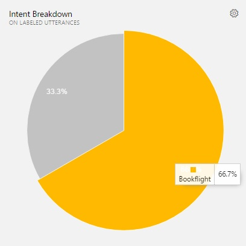
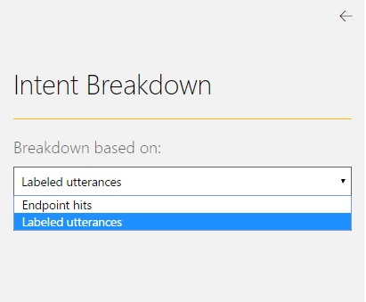
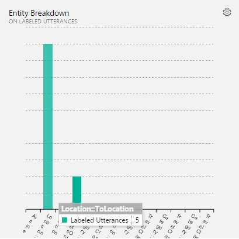
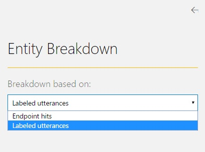

# Application Dashboard
The app dashboard is a visualized reporting tool which enables you to monitor your app at a single glance. The **Dashboard** is the main page that is displayed when you open an app by clicking the application name on **My Apps** page. Also, you can access the **Dashboard** page from inside your app by clicking **Dashboard** in the application's left panel. 

The **Dashboard** page gives you an overview of the app and displays significant data compiled from multiple app pages. Some data are analyzed and visualized by graphs and charts to help you get more insight into the app. The dashboard incorporates the latest updates in the app up to the moment and reflects any model changes. The screenshot below shows the **Dashboard** page.

At the top of the **Dashboard** page, a contextual notification bar constantly displays notifications to update you on the required or recommended actions appropriate for the current state of your app. It also provides useful tips and alerts as needed. Below is a detailed description of the data reported on the **Dashboard** page.
 
  
## App Status
The dashboard displays the application's training and publishing status, including the date and time when the app was last trained and published.  

## Model Data Statistics
The dashboard displays the total numbers of intents, entities & labeled utterances existing in the app. 

## Endpoint Hits
The dashboard displays the total endpoint hits received to the app and enables you to display hits within a period that you specify.

 
### Total endpoint hits
The total number of endpoint hits received to your app since app creation up to the current date.

### Endpoint hits per period
The number of hits received within a past period, displayed per day. A visualized line chart shows the period span from the calculated start date up to the current date (end date). The points between the start and end dates represent the days falling in this period. Hover your mouse pointer over each point to see the hits count in each day within the period. The screenshot below shows the line chart.
 

To select a period to view its hits on the chart:
 
1. Click **Additional Settings**  to access the periods list. You can select periods ranging from one week up to one year beforehand. 

    

2. Select a period from the list and then click the back arrow  to display its hits on the chart.

### Key usage
The number of hits consumed from the application's subscription key. For more details about subscription keys, see [Manage your keys](manage-keys.md). 
  
## Intent Breakdown
The dashboard displays a breakdown of intents based on labeled utterances or endpoint hits. It visualizes the distribution of intents across labeled utterances/endpoint hits, so that you can see the relative importance of each intent in the app. The intent breakdown is visualized by a pie chart with the slices representing intents. When you hover your mouse pointer over a slice, you'll see the intent name and the percentage it represents of the total count of labeled utterances/endpoint hits. 

To control whether the breakdown is based on labeled utterances or endpoint hits:

1. Click **Additional Settings**  to access the list as in the screenshot below.

    
2. Select a value from the list and then click the back arrow  to display the chart accordingly.

## Entity Breakdown
The dashboard displays a breakdown of entities based on labeled utterances or endpoint hits. It visualizes the distribution of entities across labeled utterances/endpoint hits, showing the usage of each entity in labeled utterances/endpoint hits compared to the other entities. The entity breakdown is visualized by a column chart where entities are displayed along the horizontal axis while their count in labeled utterances/endpoint hits along the vertical axis. When you hover your mouse pointer over a rectangular bar, you'll see the entity name and its count (number of occurrences) in labeled utterances/endpoint hits. 

To control whether the breakdown is based on labeled utterances or endpoint hits:

1. Click **Additional Settings**  to access the list as in the screenshot below.

    
2. Select a value from the list and then click the back arrow  to display the chart accordingly.
