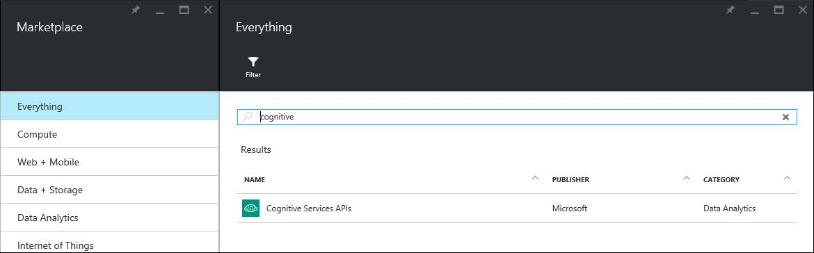
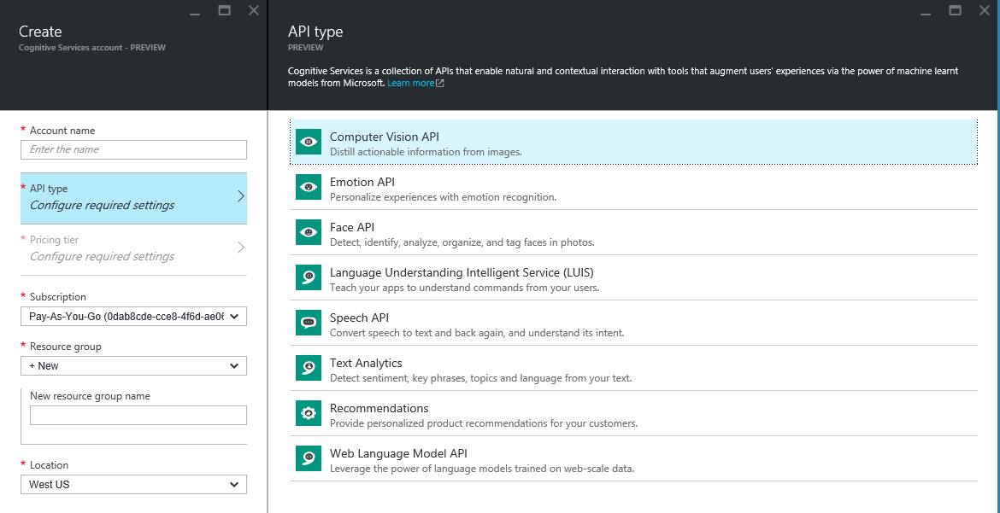
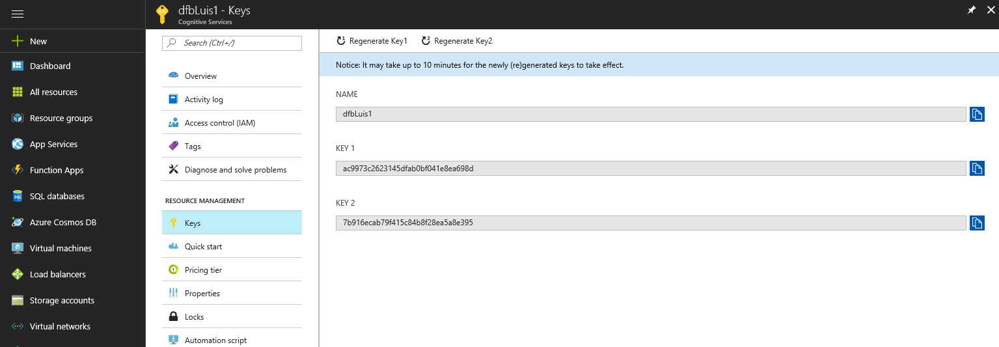

#Creating Subscription Keys Via Azure

For unlimited traffic to your HTTP endpoint, you must create a metered key for your account on LUIS. Metered keys provide unlimited traffic to your endpoint following a payment plan. To create your key, follow these steps: 

1. Sign in to the **[Microsoft Azure Portal](https://ms.portal.azure.com/)** 
2. Click the green **+** sign in the upper left-hand panel and search for “Cognitive Services” in the marketplace, then click on **Cognitive Services APIs** and follow the **create experience** to create an API account you are interested in. 

 

  3.Choose the API you are interested in by clicking on the **API Type** to create a subscription. In this case, choose the **Language Understanding Intelligent Service (LUIS)** option. Configure the subscription with settings including account name, pricing tiers, etc. 

 

  4.Once you have created the API account, you can view the keys generated in the **Settings->Keys** blade. These can be tested in your existing application or by following the LUIS documentation to create a new application. 

When you have created your key, you can add it to your account via the application settings/configuration dialog, found in any application. 
