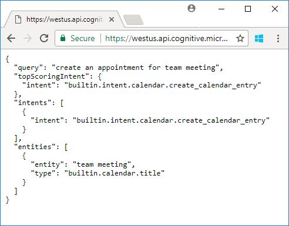

# Cortana Prebuilt App

> [!IMPORTANT]
> We recommend that you use the [prebuilt domains](./luis-how-to-use-prebuilt-domains.md), instead of the Cortana prebuilt app. 
> For example, instead of **builtin.intent.calendar.create_calendar_entry**, use **Calendar.Add** from the **Calendar** prebuilt domain.
> The prebuilt domains provide these advantages: 
> * They provide packages of prebuilt and pretrained intents and entities that are designed to work well with each other. You can integrate a prebuilt domain directly into your app. For example, if you're building a fitness tracker, you can add the **Fitness** domain and have an entire set of intents and entities for tracking fitness activities, including intents for tracking weight and meal planning, remaining time or distance, and saving fitness activity notes.
> * The prebuilt domain intents are customizable. For example, if you want to provide reviews of hotels, you can train and customize the **Places.GetReviews** intent from the **Places** domain to recognize requests for hotel reviews.
> * The prebuilt domains are extensible. For example, if you want to use the **Places** prebuilt domain in a bot that searches for restaurants, and need an intent for getting the type of cuisine, you can build and train a **Places.GetCuisine** intent.

In addition to allowing you to build your own applications, LUIS also provides intents and entities from the Microsoft Cortana personal assistant as a prebuilt app. This LUIS app is an "as-is" application. The intents and entities in this application cannot be edited or integrated into other LUIS apps. If you’d like your client to have access to both this prebuilt application and your own LUIS application, then your client has to reference both LUIS apps.

The pre-built personal assistant app is available in these cultures (locales): English, French, Italian, Spanish, and Chinese.

## Get the endpoint for the Cortana prebuilt app

You can access the Cortana prebuilt app using the following endpoints. 
| Language | Endpoint|
|--------| ------------------|
| English| https://westus.api.cognitive.microsoft.com/luis/v2.0/apps/c413b2ef-382c-45bd-8ff0-f76d60e2a821|
|    Chinese| https://westus.api.cognitive.microsoft.com/luis/v2.0/apps/c27c4af7-d44a-436f-a081-841bb834fa29|
|    French| https://westus.api.cognitive.microsoft.com/luis/v2.0/apps/0355ead1-2d08-4955-ab95-e263766e8392|
|    Spanish| https://westus.api.cognitive.microsoft.com/luis/v2.0/apps/cb2675e5-fbea-4f8b-8951-f071e9fc7b38|
|    Italian| https://westus.api.cognitive.microsoft.com/luis/v2.0/apps/30a0fddc-36f4-4488-b022-03de084c1633|


> [!NOTE]
> The endpoint URLs are also available from the [apps - Get personal assistant applications](https://westus.dev.cognitive.microsoft.com/docs/services/5890b47c39e2bb17b84a55ff/operations/5890b47c39e2bb052c5b9c32) API.

## Try out the personal assistant app
To call the endpoint, you can append your subscription key argument and query string to the endpoint. 

For example, if the utterance you want to interpret is "create an appointment for team meeting", then you can append that utterance to the endpoint URL. 

```
https://westus.api.cognitive.microsoft.com/luis/v2.0/apps/c413b2ef-382c-45bd-8ff0-f76d60e2a821?subscription-key={YOUR-SUBSCRIPTION-KEY}&q=create an appointment for team meeting
```

You can paste the URL into a web browser, and substitute your subscription key for the `{YOUR-SUBSCRIPTION-KEY}` field.

In the browser you can see that the Cortana prebuilt app identifies `builtin.intent.calendar.create_calendar_entry` as the intent, and `builtin.calendar.title` as the entity type, and for the utterance `create an appointment for team meeting`.



## Next steps
> [!div class="nextstepaction"]
> [Cortana prebuilt app reference](./luis-reference-cortana-prebuilt.md)

