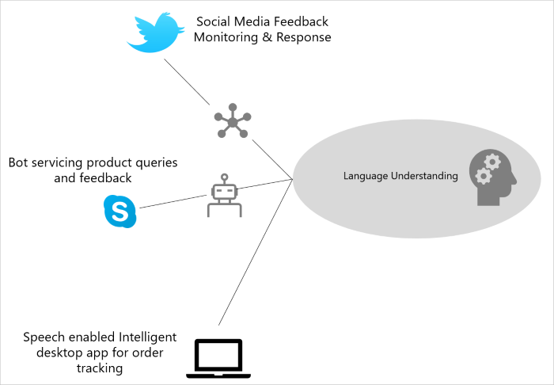

# What is Language Understanding (LUIS)?
Language Understanding (LUIS) is a cloud-based service that applies custom machine-learning to a user's conversational, natural language text to predict overall meaning, and pull out relevant, detailed information. 

A client application for LUIS can be any conversational application that communicates with a user in natural language to complete a task. Examples of client applications include social media apps, chatbots, and speech-enabled desktop applications.  



## What is a LUIS app?
A LUIS app contains a domain-specific natural language model you design. You can start your LUIS app with a prebuilt domain model, build your own, or blend pieces of a prebuilt domain with your own custom information.

[Prebuilt domain models](luis-how-to-use-prebuilt-domains.md) include all these pieces for you and are a great way to start using LUIS quickly.

The LUIS app also contains integration settings, [collaborators](luis-concept-collaborator.md), and [versions](luis-concept-version.md).

## Using a LUIS app
<a name="Accessing-LUIS"></a>
Once your LUIS app is published, your client application sends utterances to the LUIS [endpoint API][endpoint-apis] and receives the prediction results as JSON responses.

In the following diagram, first your client chatbot sends user text of what a person wants in their own words to LUIS in an HTTP request. Second, LUIS applies your learned model to the natural language to make sense of the user input and returns a JavaScript Object Notation (JSON) format response. Third, your client chatbot uses the JSON response to fulfill the user's requests. 


### Example of JSON endpoint response

The JSON endpoint response, at a minimum contains the query utterance, and the top scoring intent. 

```JSON
{
  "query": "I want to call my HR rep.",
  "topScoringIntent": {
    "intent": "HRContact",
    "score": 0.921233
  },
  "entities": [
    {
      "entity": "call",
      "type": "Contact Type",
      "startIndex": 10,
      "endIndex": 13,
      "score": 0.7615982
    }
  ]
}
```

<a name="Key-LUIS-concepts"></a>
<a name="what-is-a-luis-model"></a>
## What is a natural language model?
A model begins with a list of general user intentions, called _intents_, such as "Book Flight" or "Contact Help Desk." You provide user's example text, called _example utterances_ for the intents. Then mark significant words or phrases in the utterance, called _entities_.


A model includes:

* **[intents](#intents)**: categories of user intentions (intended action or result)
* **[entities](#entities)**: specific types of data in utterances such as number, email, or name
* **[example utterances](#example-utterances)**: example text a user enters in the client application

### Intents 
An [intent](luis-how-to-add-intents.md), short for _intention_, is a purpose or goal expressed in a user's utterance, such as booking a flight, paying a bill, or finding a news article. You create an intent for each action. A LUIS travel app may define an intent named "BookFlight." Your client application can use the top scoring intent to trigger an action. For example, when "BookFlight" intent is returned from LUIS, your client application could trigger an API call to an external service for booking a plane ticket.

### Entities
An [entity](luis-how-to-add-entities.md) represents detailed information found within the utterance that is relevant to the user's request. For example, in the utterance "Book a ticket to Paris",  a single ticket is requested, and "Paris" is a location. Two entities are found "a ticket" indicating a single ticket and "Paris" indicating the destination. 

After LUIS returns the entities found in the user’s utterance, the client application can use the list of entities as parameters to trigger an action. For example, booking a flight requires entities like the travel destination, date, and airline.

LUIS provides several ways to identify and categorize entities.

* **Prebuilt Entities** LUIS has many prebuilt domain models including intents, utterances, and [prebuilt entities](luis-prebuilt-entities.md). You can use the prebuilt entities without having to use the intents and utterances of the prebuilt model. The prebuilt entities save you time.

* **Custom Entities** LUIS gives you several ways to identify your own custom [entities](luis-concept-entity-types.md) including machine-learned entities, specific or literal entities, and a combination of machine-learned and literal.

### Example utterances
An example [utterance](luis-how-to-add-example-utterances.md) is text input from the user that the client application needs to understand. It may be a sentence, like "Book a ticket to Paris", or a fragment of a sentence, like "Booking" or "Paris flight." Utterances aren't always well-formed, and there can be many utterance variations for a particular intent. Add 10 to 20 example utterances to each intent and mark entities in every utterance.

|Example user utterance|Intent|Entities|
|-----------|-----------|-----------|
|"Book a flight to __Seattle__?"|BookFlight|Seattle|
|"When does your store __open__?"|StoreHoursAndLocation|open|
|"Schedule a meeting at __1pm__ with __Bob__ in Distribution"|ScheduleMeeting|1pm, Bob|

## Improve prediction accuracy
After your LUIS app is published and receives real user utterances, LUIS provides several methods to improve prediction accuracy: [active learning](#active-learning) of endpoint utterances, [phrase lists](#phrase-lists) for domain word inclusion, and [patterns](#patterns) to reduce the number of utterances needed.

### Active learning
In the [active learning](luis-how-to-review-endoint-utt.md) process, LUIS allows you to adapt your LUIS app to real-world utterances by selecting utterances it received at the endpoint for your review. You can accept or correct the endpoint prediction, retrain, and republish. LUIS learns quickly with this iterative process, taking the minimum amount of your time and effort. 

### Phrase lists 
LUIS provides [phrases lists](luis-concept-feature.md) so you can indicate important words or phrases to your model domain. LUIS uses these lists to add additional significance to those words and phrases that would otherwise not be found in the model.

### Patterns 
Patterns allow you to simplify an intent's utterance collection into common [templates](luis-concept-patterns.md) of word choice and word order. This allows LUIS to learn quicker by needing fewer example utterances for the intents. Patterns are a hybrid system of regular expressions and machine-learned expressions. 

<a name="using-luis"></a>

## Authoring and accessing LUIS
Build your LUIS app from the LUIS website or programmatically with the [authoring](https://aka.ms/luis-authoring-apis) APIs, or use both depending on the authoring need. Access your published LUIS app by the query [endpoint](https://aka.ms/luis-endpoint-apis). 

LUIS provides three websites around the world, depending on your authoring region. The authoring region determines the Azure region where you can publish your LUIS app.
<!--
|Authoring region|Publishing region(s)|
|--|--|
|[www.luis.ai](https://www.luis.ai)|**U.S.**<br>West US<br>West US 2<br>East US<br>East US 2<br>South Central US<br>West Central US<br><br>**Asia**<br>Southeast Asia<br>East Asia<br><br>**South America**<br>Brazil South |
|[au.luis.ai](https://au.luis.ai)|Australia East|
|[eu.luis.ai](https://eu.luis.ai)|West Europe<br>North Europe|
-->

Learn [more](luis-reference-regions.md) about authoring and publishing regions.

## What technologies work with LUIS?
Several Microsoft technologies work with LUIS:

* [Bing Spell Check API](../bing-spell-check/proof-text.md) provides text correction before prediction. 
* [Bot Framework][bot-framework] allows a chatbot to talk with a user via text input. Select [3.x](https://github.com/Microsoft/BotBuilder) or [4.x](https://github.com/Microsoft/botbuilder-dotnet) SDK for a complete bot experience.
* [QnA Maker][qnamaker] allows several types of text to combine into a question and answer knowledge base.
* [Speech](../Speech/home.md) converts spoken language requests into text. Once converted to text, LUIS processes the requests. See [Speech SDK](https://aka.ms/csspeech) for more information.
* [Text Analytics](../text-analytics/overview.md) provides sentiment analysis and key phrase data extraction.

## Next steps
Create a new LUIS app with a [prebuilt](luis-get-started-create-app.md) or [custom](luis-quickstart-intents-only.md) domain.

<!-- Reference-style links -->
[bot-framework]: https://docs.microsoft.com/bot-framework/
[flow]: https://docs.microsoft.com/connectors/luis/
[authoring-apis]: https://aka.ms/luis-authoring-api
[endpoint-apis]: https://aka.ms/luis-endpoint-apis
[qnamaker]: https://qnamaker.ai/