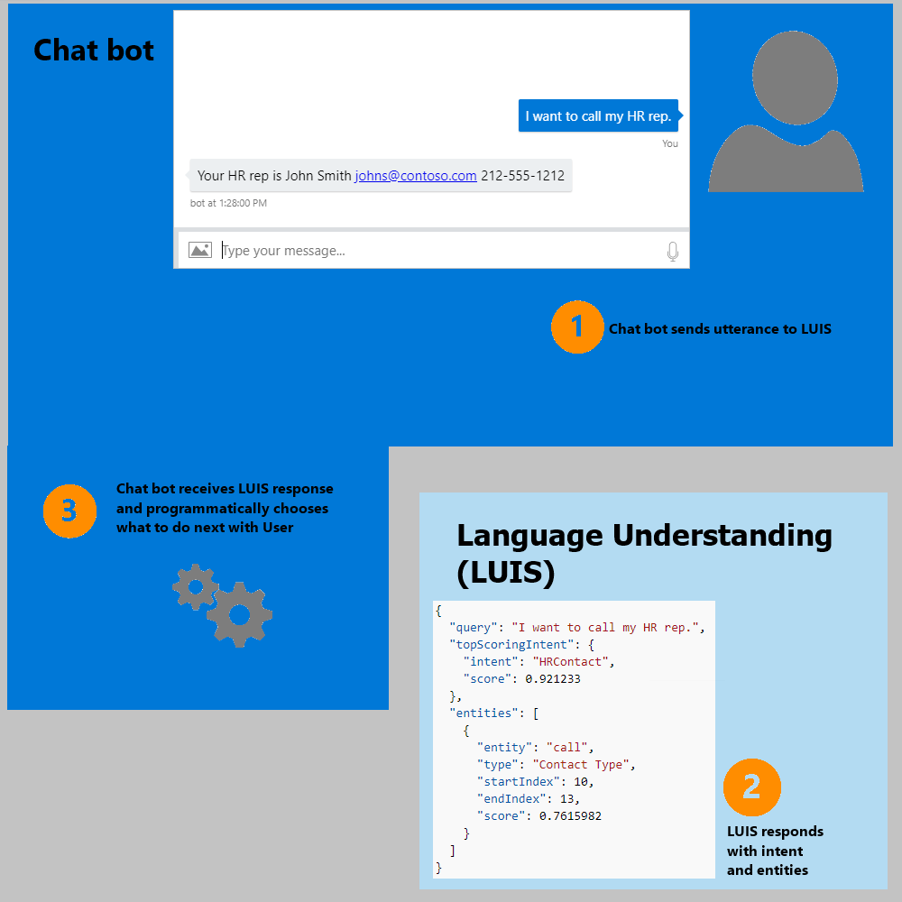

# Learn about Language Understanding Intelligent Service (LUIS)

One of the key problems in human-computer interactions is the ability of the computer to understand what a person wants. Language Understanding Intelligent Service (LUIS) enables developers to build smart applications that can understand human language and react accordingly to user requests. LUIS uses the power of machine learning to solve the difficult problem of extracting meaning from natural language input, so that your application doesn't have to. Any client application that converses with users, like a dialog system or a chat bot, can pass user input to a LUIS app and receive results that provide natural language understanding. 

## What is a LUIS app?

A LUIS app is a place for a developer to define a custom language model. The output of a LUIS app is a web service with an HTTP endpoint that you reference from your client application to add natural language understanding to it. A LUIS app takes a user utterance and extracts intents and entities that correspond to activities in the client application’s logic. Your client application can then take appropriate action based on the user intentions that LUIS recognizes.



## Key concepts

* **What is an utterance?** An utterance is the textual input from the user, that your app needs to interpret. It may be a sentence, like "Book me a ticket to Paris", or a fragment of a sentence, like "Booking" or "Paris flight." Utterances aren't always well-formed, and there can be many utterance variations for a particular intent. See [Add example utterances][add-example-utterances] for information on training a LUIS app to understand user utterances.
* **What are intents?** Intents are like verbs in a sentence. An intent represents actions the user wants to perform. It is a purpose or goal expressed in a user's input, such as booking a flight, paying a bill, or finding a news article. You define a set of named intents that correspond to actions users want to take in your application. A travel app may define an intent named "BookFlight", that LUIS extracts from the utterance "Book me a ticket to Paris".
* **What are entities?** If intents are verbs, then entities are nouns. An entity represents an instance of a class of object that is relevant to a user’s intent. In the utterance "Book me a ticket to Paris", "Paris" is an entity of type location. By recognizing the entities that are mentioned in the user’s input, LUIS helps you choose the specific actions to take to fulfill an intent. See [Entities in LUIS](luis-concept-entity-types.md) for more detail on the types of entities that LUIS provides.

## Plan your LUIS app
Before you start creating it in the LUIS web interface, plan your LUIS app by preparing an outline or schema to describe intents and entities in your application. Generally, you create an intent to trigger an action in a client application or bot and create an entity to model some parameters required to execute an action. For example, a "BookFlight" intent could trigger an API call to an external service for booking a plane ticket, which requires entities like the travel destination, date, and airline. See [Plan your app](Plan-your-app.md) for examples and guidance on how to choose intents and entities to reflect the functions and relationships in an app. 

## Build and train a LUIS app
Once you have determined which intents and entities you want your app to recognize, you can start adding them to your LUIS app. See [create a new LUIS app](LUIS-get-started-create-app.md), for a quick walkthrough of creating a LUIS app.<!-- that you can monitor using the [Dashboard](App-Dashboard.md)-->
For more detail about the steps in configuring your LUIS app, see the following articles:
1.	[Add intents](Add-intents.md)
2.  [Add utterances](Add-example-utterances.md)
3.	[Add entities](Add-entities.md)
4.  [Improve performance using features](Add-Features.md)
5.	[Train and test](Train-Test.md)
6.  [Use active learning](label-suggested-utterances.md)
7.	[Publish](PublishApp.md)

You can also watch a basic [video tutorial](https://www.youtube.com/watch?v=jWeLajon9M8&index=4&list=PLD7HFcN7LXRdHkFBFu4stPPeWJcQ0VFLx) on these steps.

## Improve performance using active learning
Once your application is deployed and traffic starts to flow into the system, LUIS uses active learning to improve itself. In the active learning process, LUIS identifies the utterances that it is relatively unsure of, and asks you to label them according to intent and entities. This process has tremendous advantages. LUIS knows what it is unsure of, and asks for your help in the cases that lead to the maximum improvement in system performance. LUIS learns quicker, and takes the minimum amount of your time and effort. This is active machine learning at its best. See [Label suggested utterances][label-suggested-utterances] for an explanation of how to implement active learning using the LUIS web interface.

## Configure LUIS programmatically
LUIS offers a set of programmatic REST APIs that can be used by developers to automate the application creation process. These APIs allow you to author, train, and publish your application.

* [LUIS Programmatic API](https://westus.dev.cognitive.microsoft.com/docs/services/5890b47c39e2bb17b84a55ff/operations/5890b47c39e2bb052c5b9c2f).

## Integrate LUIS with a bot
It's easy to use a LUIS app from a bot built using the [Bot Framework](https://docs.microsoft.com/bot-framework/), which provides the Bot Builder SDK for Node.js or .NET. You simply reference the LUIS app as shown in the following examples:

#### Node.js 
```javascript
// Add a global LUIS recognizer to your bot using the endpoint URL of your LUIS app
var model = 'https://westus.api.cognitive.microsoft.com/luis/v2.0/apps/2c2afc3e-5f39-4b6f-b8ad-c47ce1b98d8a?subscription-key=9823b65a8c9045f8bce7fee87a5e1fbc';
bot.recognizer(new builder.LuisRecognizer(model));
```

#### C#
```cs
    // The LuisModel attribute specifies your LUIS app ID and your LUIS subscription key
    [LuisModel("2c2afc3e-5f39-4b6f-b8ad-c47ce1b98d8a", "9823b65a8c9045f8bce7fee87a5e1fbc")]
    [Serializable]
    public class TravelGuidDialog : LuisDialog<object>
    {
      // ...
```

The Bot Builder SDK provides classes that automatically handle the intents and entities returned from the LUIS app. For code that demonstrate how to use these classes, see the following samples:

*	[LUIS demo bot (C#)](https://github.com/Microsoft/BotBuilder-Samples/tree/master/CSharp/intelligence-LUIS)
*	[LUIS demo bot (Node.js)](https://github.com/Microsoft/BotBuilder-Samples/tree/master/Node/intelligence-LUIS) 


## Integrate LUIS with Speech
Your LUIS endpoints work seamlessly with Microsoft Cognitive Service's speech recognition service. In the C# SDK for Microsoft Cognitive Services Speech API, you can add the LUIS application ID and LUIS subscription key, and the speech recognition result is sent for interpretation. 

See [Microsoft Cognitive Services Speech API Overview](../Speech/Home.md).

<!-- Reference-style links -->
[add-example-utterances]: https://docs.microsoft.com/azure/cognitive-services/luis/add-example-utterances
[pre-built-entities]: https://docs.microsoft.com/azure/cognitive-services/luis/pre-builtentities
[label-suggested-utterances]: label-suggested-utterances.md

<!-- this link not working 5/8 -->
[cs-speech-service]: https://www.microsoft.com/cognitive-services/speech-api