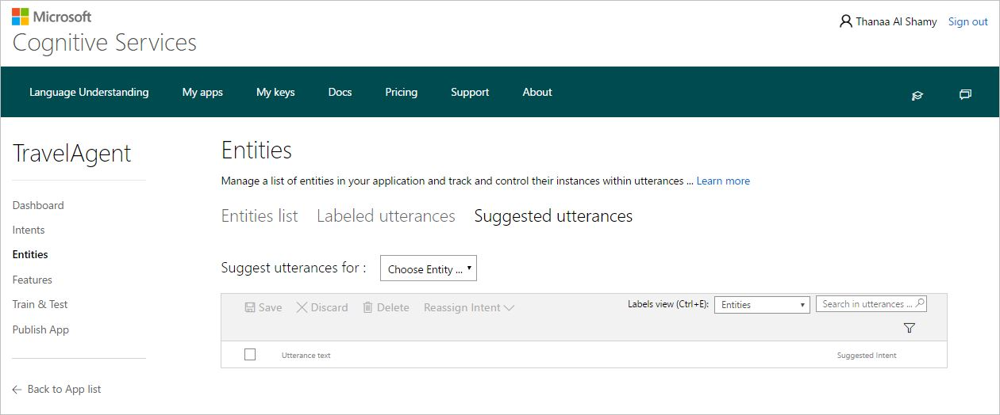
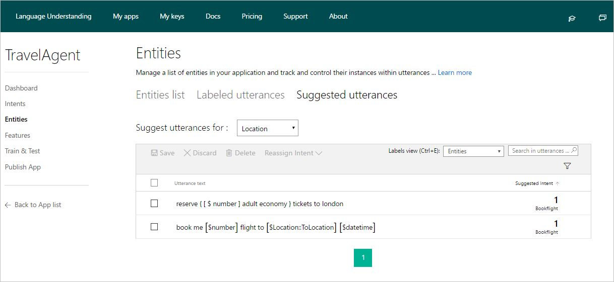
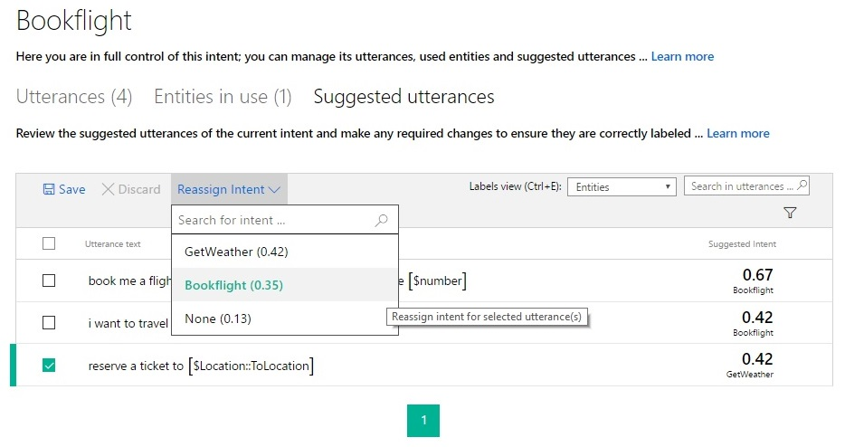
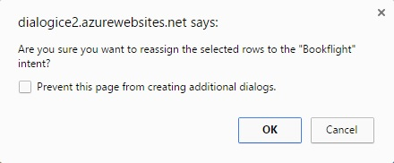
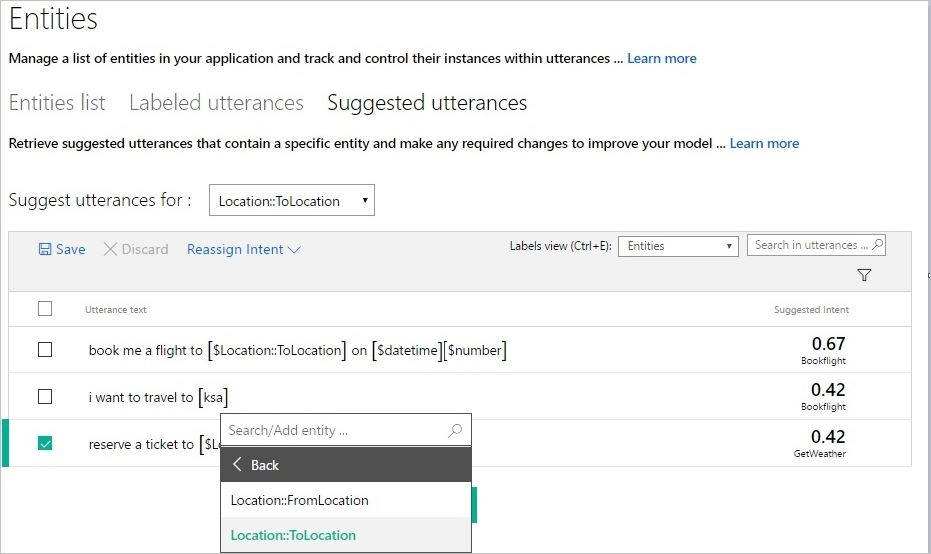
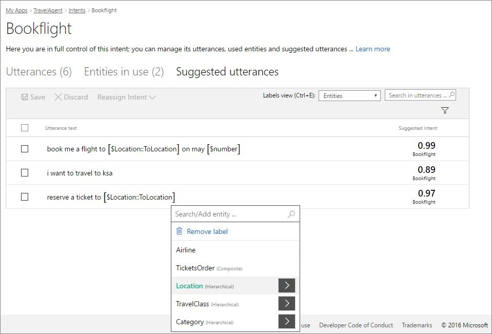

# Label Suggested Utterances
## Suggested utterances demonstrate active machine learning 
The breakthrough feature of LUIS is active learning. Once your application is deployed and traffic starts to flow into the system, LUIS uses active learning to improve itself. In the active learning process, LUIS examines all the utterances that have been sent to it, and calls to your attention the ones that it would like you to label. LUIS identifies the utterances that it is relatively unsure of and asks you to label them. Suggested utterances are the utterances that your LUIS app suggests for labeling. If you label these utterances, this will give your application the biggest boost in performance.

## View suggested utterances
Suggested utterances are taken from end-user queries on the application’s HTTP endpoint. If your app is not published or has not received hits yet, you will not have any suggested utterances. Also, you will not get suggested utterances for an intent/entity if no endpoint hits are received on this intent/entity. 

You can view suggested utterances per intent or entity, under the **Suggested Utterances** tab on the intent page or on the **Entities** page.

**To view suggested utterances per intent:**

1. Open your app (e.g. TravelAgent) by clicking its name on **My Apps** page, and then click **Intents** on the app's left panel.
2. On the **Intents** page, click the intent you want to view its suggested utterances (e.g. "Bookflight").
3. On the "Bookflight" intent page, click **Suggested Utterances**. The list of suggested utterances will be displayed. This will look like the following screenshot.

    

**To view suggested utterances per entity:**

1. Open your app (e.g. TravelAgent) by clicking its name on **My Apps** page, and then click **Entities** on the app's left panel.
2. On the **Entities** page, click **Suggested Utterances**. 

    
3. Choose the entity you want to view its suggested utterances. The list of suggested utterances will be displayed. This will look like the following screenshot.

    

Suggested utterances per intent/entity are listed under the **Suggested Utterances** tab. For each suggested utterance, the most likely intent and its score (according to your app's prediction) are displayed. To sort the suggested utterances based on their prediction score, in ascending or descending order, you can click the **Suggested Intent** column header.

To control how you see the words classified as entities in suggested utterances, select a view from the **Labels View** list at the top of the suggested utterances list. You can also press <kbd>Ctrl+E</kbd>to quickly switch between views. These are the available views:

 * **Tokens:** show entity-classified words in text format.
 * **Entities:** show entity-classified words in a tagged format (entity labels enclosed in square brackets). This is the default view.
 * **Composite entities:** show the words classified as composite entities in their entity labels.

To filter suggested utterances, click the filter button  to display all filters, and then click the filter(s) that you want to apply. For the **Entity** filter, select the entity by which you want to filter the suggested utterances.

## Label suggested utterances
After reviewing the utterances and their predictions, you are advised to take action to label them. You can accept the prediction if it is correct and save the utterance as is, or make any required changes to ensure they are correctly labeled. For example, you can change the intent of a suggested utterance (reassign intent), label unlabeled entities, correct mis-labeled ones or even remove their labels.

The following are the possible cases you may have, along with the actions you can take in each case in order to label the suggested utterances (using examples from the TravelAgent app):

 * If the predicted intent is correct and entities are correctly detected and labeled, then just select the utterance and click **Save** without making any changes to accept and save the utterance.
 
 * If the predicted intent is incorrect, you need to change it. For example, in the screenshot below note that the predicted intent in the last suggested utterance "reserve a ticket to London" is "GetWeather", which is incorrect. Click **Reassign Intent** and choose the correct intent "Bookflight" from the list. 
 
    

    You will get a confirmation message. Click **OK** to confirm this action, and then click **Save** to save your changes.

    

 * If a phrase is unlabeled, click it and select an entity label from the list. For example, "KSA" in the screenshot below is unlabeled. Click it and select "To Location" as its entity label and then click **Save**.
 
    
 * If an entity is mislabeled, click it and then you can either select the correct label or click **Remove Label** to remove its label. Then, click **Save**.
 
    
