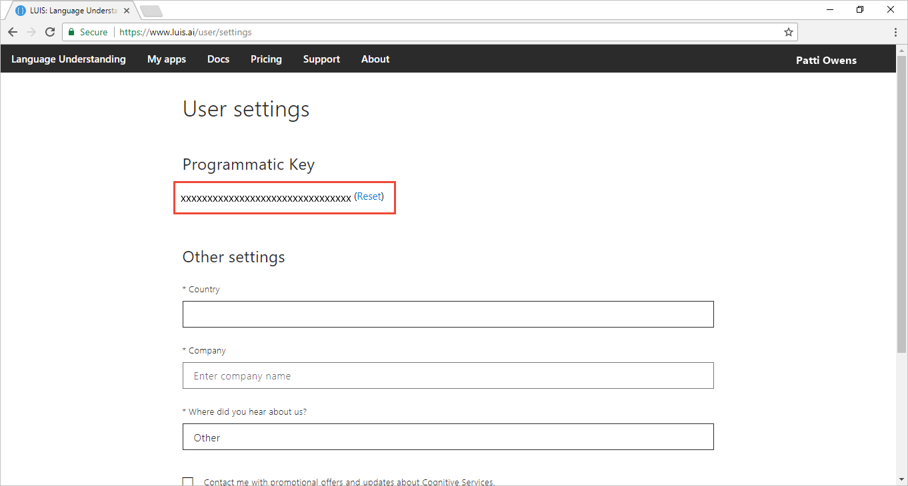

# Manage your LUIS keys
A key allows you to author and publish your LUIS app, or query your endpoint. LUIS has two different types of keys: [authoring](#programmatic-key) and [endpoint](#endpoint-key) keys. 

|Key|Purpose|
|--|--|
|[Authoring key](#programmatic-key)|Authoring|
|[Endpoint key](#endpoint-key)| Querying|

It is important to author LUIS apps in [regions](luis-reference-regions.md#publishing-regions) where you also want to publish and query.

## Authoring key

An authoring key, also known as a starter key, is created automatically when you create a LUIS account and it is free. You have one authoring key across all your LUIS apps for each authoring [region](luis-reference-regions.md). The authoring key is provided to author your LUIS app or to test endpoint queries. 

To find the authoring Key, log in to [LUIS][LUIS] and click on the account name in the upper-right navigation bar to open **Account Settings**.

When you want to make **production endpoint queries**, create an Azure [LUIS subscription](https://azure.microsoft.com/pricing/details/cognitive-services/language-understanding-intelligent-services/). 

> [!CAUTION]
> For convenience, many of the samples use the Authoring key since it provides a few endpoint calls in its [quota](luis-boundaries.md#key-limits).  

## Endpoint Key
 When you need **production endpoint queries**, create an [Azure LUIS key](https://azure.microsoft.com/pricing/details/cognitive-services/language-understanding-intelligent-services/). This key allows a quota of endpoint hits based on the usage plan you specified when creating the key. See [Cognitive Services Pricing](https://azure.microsoft.com/pricing/details/cognitive-services/language-understanding-intelligent-services/?v=17.23h) for pricing information.

An endpoint key is directly tied to an Azure LUIS subscription key. The endpoint key can be used for all your LUIS apps or for specific LUIS apps. When you publish each LUIS app, you set the endpoint key. Part of this process is choosing the Azure LUIS subscription.  

Do not use the endpoint key for authoring LUIS apps.

## API usage of Ocp-Apim-Subscription-Key
The LUIS APIs use the header, `Ocp-Apim-Subscription-Key`, in both the [authoring](https://aka.ms/luis-authoring-apis) and [endpoint](https://aka.ms/luis-endpoint-apis) APIs. The header name does not change based on which set of APIs you are using. 

Use the authoring key for authoring APIs. You can't pass the endpoint key for authoring APIs. If you do, you get a 401 error - access denied due to invalid subscription key. 

## Key limits
See [Key Limits](luis-boundaries.md#key-limits) and [Azure Regions](luis-reference-regions.md). The authoring key is free and used for authoring. The LUIS subscription key has a free tier but must be created by you and associated with your LUIS app on the **Publish** page. It can't be used for authoring, but only endpoint queries.

Publishing regions are different from authoring regions. Make sure you create an app in the authoring region corresponding to the publishing region you want.

## Key limit errors
If you exceed your per second quota, you receive an HTTP 429 error. If you exceed your per month quota, you receive an HTTP 403 error. 

## Assign endpoint key
On the **Publish app** page, there is already a key in the **Resources and Keys** table. This is the authoring (starter) key. 

1. Create a LUIS key on the [Azure portal](https://portal.azure.com). For further instructions, see [Creating a subscription key using Azure](AzureIbizaSubscription.md).
 
2. In order to add the LUIS key created in the previous step, click the **Add Key** button to open the **Assign a key to your app** dialog. 

    
3. Select a Tenant in the dialog. 
 
    > [!Note]
    > In Azure, a tenant represents the Azure Active Directory ID of the client or organization associated with a service. If you previously signed up for an Azure subscription with your individual Microsoft Account, you already have a tenant! When you log in to the Azure portal, you are automatically logged in to [your default tenant](https://docs.microsoft.com/azure/active-directory/develop/active-directory-howto-tenant). You are free to use this tenant but you may want to create an Organizational administrator account.

4. Choose the Azure subscription associated with the Azure LUIS key you want to add.

5. Select the Azure LUIS account. The region of the account is displayed in parentheses. 

    

<!-- content moved to luis-reference-regions.md, need replacement links-->

## Publishing regions
Learn more about publishing [regions](luis-reference-regions.md) including publishing in [Europe](luis-reference-regions.md#publishing-to-europe), and [Australia](luis-reference-regions.md#publishing-to-australia). Publishing regions are different from authoring regions. Make sure you create an app in the authoring region corresponding to the publishing region you want.

## Unassign key

* In the **Resources and Keys list**, click the trash bin icon next to the entity you want to unassign. Then, click **OK** in the confirmation message to confirm deletion.
 
    

> [!NOTE]
> Unassigning the LUIS key does not delete it from your Azure subscription.

## Next steps

Use your key to publish your app in the **Publish app** page. For instructions on publishing, see [Publish app](PublishApp.md).

[LUIS]: luis-reference-regions.md