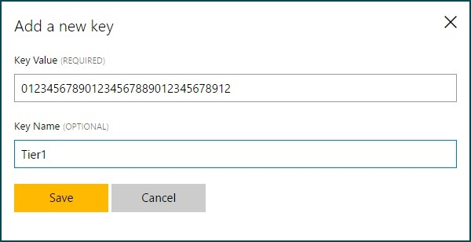
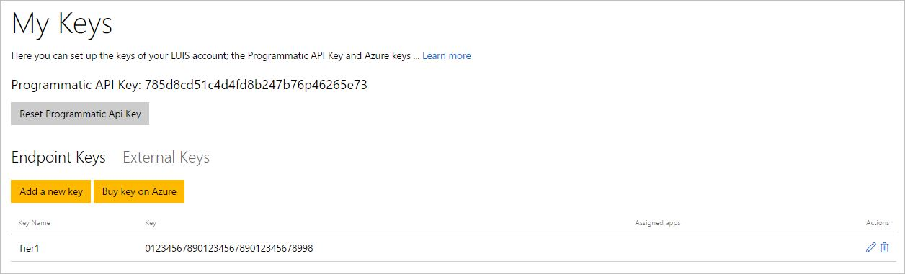
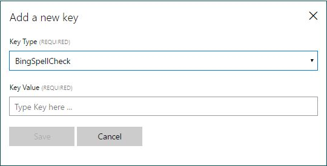
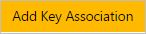

# Manage your keys
A key is your passport to the server allowing you to publish your app to be used by end users. LUIS has three different types of keys:

* **Programmatic API Key:** Created automatically for LUIS account and it's free. It enables you to author and edit your application using the LUIS Programmatic APIs. 
[Click here for a complete API Reference](https://westus.dev.cognitive.microsoft.com/docs/services/5890b47c39e2bb17b84a55ff/operations/5890b47c39e2bb052c5b9c2f).

* **Endpoint Key(s):** You need to buy it from the Microsoft Azure portal. It is essential for publishing your app and accessing your HTTP endpoint. This key reflects your quota of endpoint hits based on the usage plan you specified while creating the key. See [Cognitive Services Pricing](https://azure.microsoft.com/pricing/details/cognitive-services/language-understanding-intelligent-services/?v=17.23h) for pricing information.

* **External Key(s):** You need to buy an external key only if you want to use any external services with LUIS.
 
The process of creating and using endpoint and external keys involves the following tasks in the same order:

 1. Create a key on the Azure portal.
 
 2. Add the key to your LUIS account (on the **My Keys** page). 
 3. Assign the key to your app on the **Publish** page. 

## Regions and keys

The region to which you publish your LUIS app must correspond to the region or location you specify in the Azure portal when you create a key. To publish a LUIS app to more than one region, you need at least one key per region. LUIS apps created on https://www.luis.ai can be published to endpoints in the following regions:

 Azure region   |   Endpoint URL format   |   
------|------|
West US     |   https://westus.api.cognitive.microsoft.com/luis/v2.0/apps/YOUR-APP-ID?subscription-key=YOUR-SUBSCRIPTION-KEY  |
East US     |   https://eastus.api.cognitive.microsoft.com/luis/v2.0/apps/YOUR-APP-ID?subscription-key=YOUR-SUBSCRIPTION-KEY   |
West Central US     |   https://westcentralus.api.cognitive.microsoft.com/luis/v2.0/apps/YOUR-APP-ID?subscription-key=YOUR-SUBSCRIPTION-KEY   |
Southeast Asia     |   https://southeastasia.api.cognitive.microsoft.com/luis/v2.0/apps/YOUR-APP-ID?subscription-key=YOUR-SUBSCRIPTION-KEY   |

To publish to the European regions, you can create LUIS apps at https://eu.luis.ai.  

> [!NOTE]
> LUIS apps created at [https://eu.luis.ai](https://eu.luis.ai) don't automatically migrate to [https://www.luis.ai](https://www.luis.ai). You will need to export and then import the LUIS app in order to migrate it.

 Azure region   |   Endpoint URL format   |   
------|------|
West Europe     | https://westeurope.api.cognitive.microsoft.com/luis/v2.0/apps/*YOUR-APP-ID*?subscription-key=*YOUR-SUBSCRIPTION-KEY* |

## Reset your Programmatic API key
You can reset your Programmatic API key to get a new one generated for your account.

**To reset a Programmatic API key:**

1. Click **My Keys** on LUIS top navigation bar to access **My Keys** page.

    
2. At the top of **My Keys** page, you can see your current Programmatic API key. Click **Reset Programmatic API Key**. The new key will be generated replacing the existing one.

## Create and use endpoint keys for your apps
You can create as many endpoint keys as you need for your LUIS apps on Azure portal. These keys will be used for publishing your apps to the Web.

**To create an endpoint key on Azure portal:**

1.  Click **My Keys** on LUIS top navigation bar to access **My Keys** page.

2. On **My Keys** page, **Endpoint Keys** tab, click **Buy Key on Azure**. This will take you directly to Microsoft Azure portal. You can create one or more keys per account by subscribing to one or more subscription tiers. 
3. For further instructions, see [Creating a subscription key using Azure](AzureIbizaSubscription.md).

**To add the endpoint key to your LUIS account:**

1. On **My Keys** page, **Endpoint Keys** tab, click **Add a new key**.
 
    
2. Copy the key you created in Azure portal in the previous procedure and paste it in the **Key Value** text box. 
3. You can optionally type a name for the key in **Key Name**, for example "Tier1" , and then click **Save**. The key will be added to the keys list.

    

In the list of added keys, you can edit a key name, or delete a key (if no longer needed). To do this, click the edit  or delete button  corresponding to that key in the list.

**To assign the endpoint key to your app:**

1. Access the **Publish** page by clicking **Publish App** on the left panel.

2. From the **Endpoint Key** list, select the key that you want to assign to the app. 

    >[!NOTE]
    >Whenever you assign a key to the app, an updated endpoint URL will be generated. Remember to use the updated endpoint URL in your code.

## Create and use external keys
External keys are the keys required for any external services that you want to use with your LUIS app to enhance the language understanding experience. One of these services, which is currently available, is [Bing Spell Check](https://www.microsoft.com/cognitive-services/bing-spell-check-api/documentation). It can be used with LUIS to detect and correct any spelling mistakes in end-user queries submitted to your application's endpoint.

**To create and add an external key to your LUIS account:**

1. On **My Keys** page, **External Keys**, click **Add a new key**. The following dialog box appears.

    
2. From the **Key Type** list, select "BingSpellCheck".
3. Copy the key you created on Azure and paste it in **Key Value**, and then click **Save**. The key will be added to the keys list.

**To assign the external key to your app:**

1. Access the **Publish** page by clicking **Publish App** on the left panel.
2. Click **Add Key Association** .

3. Select Bing Spell Check as the key type from the **Key Type** list, and select from the **Key Value** list the external key that you want to assign to the app. 
