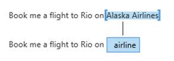
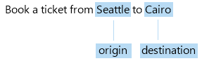
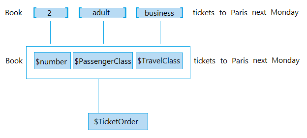
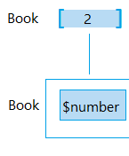
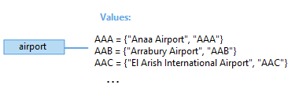

# Plan your LUIS app

It is important to plan your app before you start creating it in LUIS. Prepare an outline or schema of the possible intents and entities that are relevant to the domain-specific topic of your application.  

## Identify your domain
A LUIS apps is usually centered around a domain-specific topic.  For example, you may have an travel app that performs booking of tickets, flights, hotels, and rental cars. Another app may provide content related to exercising, tracking fitness efforts and setting goals. 

> [!TIP]
> LUIS offers [prebuilt domains](luis-how-to-use-prebuilt-domains.md) for many common scenarios.
> Check to see if you can use a prebuilt domain as a starting point for your app.

## Identify your intents
You should think about the [intents](luis-concept-intent.md) that are important to your application’s task. Let's take the example of a travel app, with functions to book a flight and check the weather at the user's destination. You can define the "BookFlight" and "GetWeather" intents for these actions. In a more complex app with more functions, you will have more intents, and you should define them carefully so as to not be too specific. For example, "BookFlight" and "BookHotel" may need to be separate intents, but "BookInternationalFlight" and "BookDomesticFlight" may be too similar.

> [!NOTE]
> It is a best practice to use only as many intents as you need to perform the functions of your app. If you define too many intents, it becomes harder for LUIS to classify utterances correctly. If you define too few, they may be so general as to be overlapping.

## Identify your entities
To book a flight, you need some information like the destination, date, airline, ticket category and travel class. You can add these as [entities](luis-concept-entity-types.md) because they are important for accomplishing an intent. 

When you determine which entities to use in your app, keep in mind that there are different types of entities for capturing relationships between types of objects. [Entities in LUIS](luis-concept-entity-types.md) provides more detail about the different types.

### Simple entity
A simple entity describes a single concept.

### Hierarchical entity
 A hierarchical entity represents a category and its members. 

### Composite entity
A composite entity is made up of other entities that form parts of a whole. 

### Prebuilt entity
LUIS provides [prebuilt entities](Pre-builtEntities.md) for common types like `Number`, which you can use for the number of tickets in a ticket order.

### List entity 
A list entity is an explicitly specified list of values. Each value consists of one or more synonyms. In a travel app you might choose to create a list entity to represent airport names.

<!-- With a planned outline of intents and entities, you can start creating your application in LUIS and define these intents and entities.-->

## Next steps
* See [Create your first Language Understanding Intelligent Services (LUIS) app][luis-get-started-create-app] for a quick walkthrough of how to create a LUIS app.

[luis-get-started-create-app]: luis-get-started-create-app.md