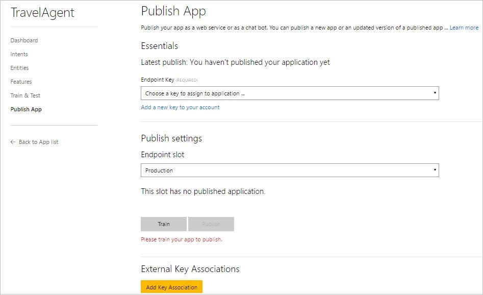
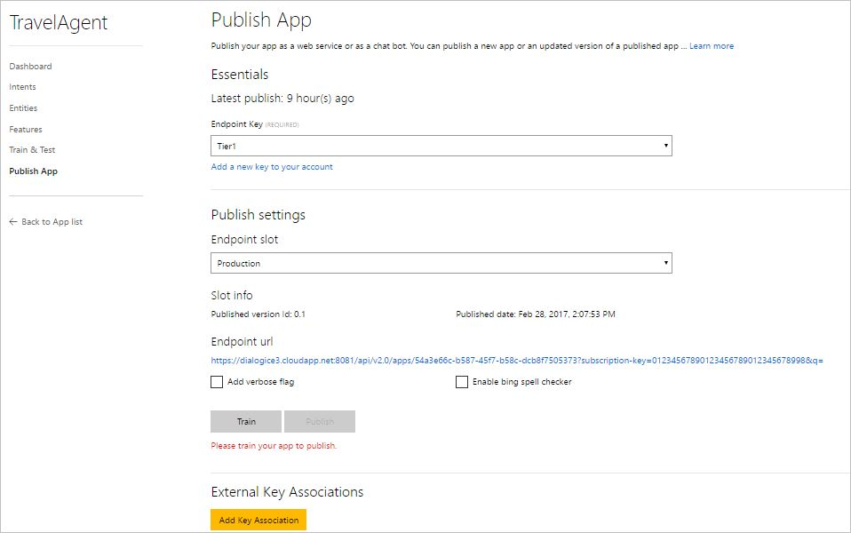
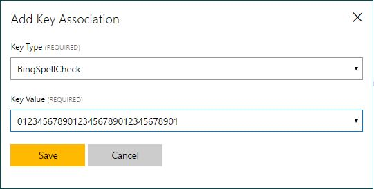
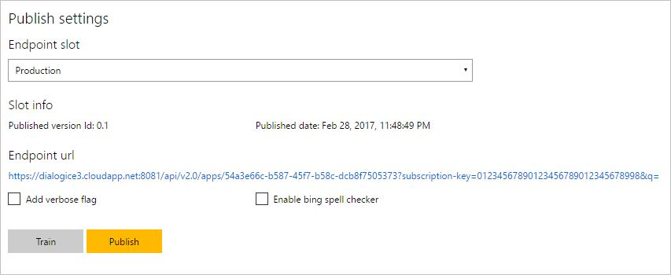
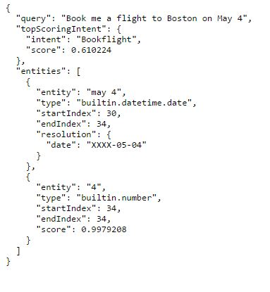

# Publish your app
When you finish building and testing your app, you can publish it as a web service on Azure and get an HTTP endpoint that you can use from your client application. 

It is optional but recommended to test your app before publishing it. For instructions, see [Train and test your app](Train-Test.md).

You can either publish your app directly to the **Production Slot** where end users can access and use your model, or you can publish to a **Staging Slot** where you can iteratively test your app to validate changes before publishing to the production slot. 

## Publish your app to an HTTP endpoint:

1. Open your app (for example, TravelAgent) by clicking its name on **My Apps** page, and then click **Publish App** in the left panel to access the **Publish App** page. The screenshot below shows the Publish page as it appears if you haven't published your app yet.

    
 
    If you have previously published this app, this page looks like the following screenshot: 
 
    
2. From the **Endpoint Key** list, select an existing endpoint key to assign to the app, or click **Add a new key to your account** to add a new one. For more information on how to create and add endpoint keys to your account, see [Manage your keys](Manage-Keys.md). For pricing information, see [Cognitive Services Pricing](https://azure.microsoft.com/pricing/details/cognitive-services/language-understanding-intelligent-services/?v=17.23h).
3. Choose whether to publish to the **Production** or to **Staging** slot by selecting the corresponding value from the **Endpoint Slot** list. 
4. If you will use an external service with your LUIS app (for example, Bing Spell Check):
    - Click **Add Key Association** to assign the external service key to the app by selecting the key type and key value in the following dialog box.
    - Click **Enable Bing Spell Checker** check box. 
    
        
5. If you want the JSON response of your published app to include all intents defined in your app and their prediction scores, click **Add Verbose Flag** checkbox. Otherwise, it will include only the top scoring intent.
6. Click **Train** if the app wasn't trained already.  

7. Click **Publish**. The endpoint URL of your published app is displayed. 

    

    >[!NOTE]
    >If the **Publish** button is disabled, then either your app does not have an assigned an endpoint key, or you have not trained your app yet.

If you want to test your published endpoint in a browser using the generated URL, you can click the URL to open it in your browser, then set the URL parameter "&q" to your test query (for example: "&q=Book me a flight to Boston on May 4"), and then press Enter. You will get the JSON response of your HTTP endpoint. 

## Next steps

To test how your published app works, you can access the test console by clicking **Train & Test** in the left panel. For instructions on how to test your app using the test console, see [Train and test your app](Train-Test.md).
