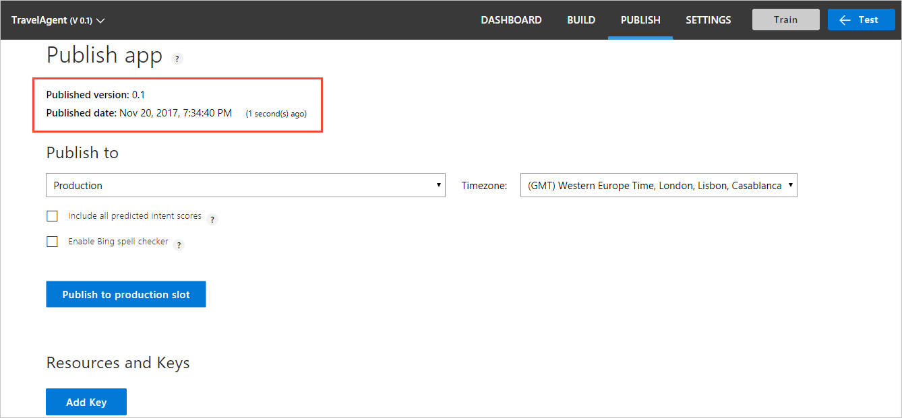
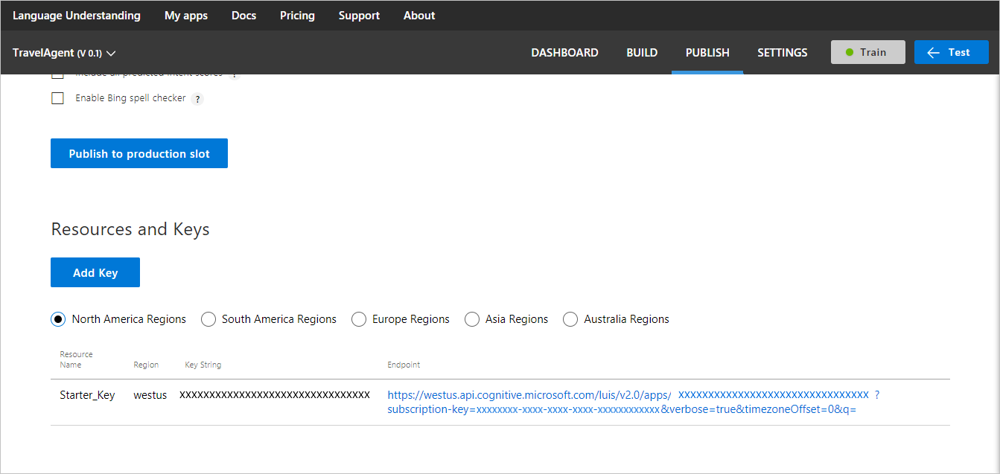

# Publish your app
When you finish building and testing your LUIS app, you can publish it as a web service on Azure and get an HTTP endpoint that can be integrated into any client or backend code. 

> [!TIP]
> You can optionally test your app before publishing it. For instructions, see [Train and test your app](Train-Test.md).

You can either publish your app directly to the **Production Slot** where end users can access and use your model, or you can publish to a **Staging Slot** for working through trials and tests to validate changes before publishing to the production slot. 

## Publish your app to an HTTP endpoint

1. Open your app by clicking its name on the **My Apps** page, and then click **Publish App** in the left panel. The following screenshot shows the **Publish App** page if you haven't published your app yet.

    
 
    If you have previously published this app, this page looks like the following screenshot: 
 
    
2. If you want to use a key other than the Starter key, click **Change** next to the **Assigned endpoint key** label. This action opens a dialog that allows you to select an existing endpoint key to assign to the app. For more information on how to create and add endpoint keys to your LUIS app, see [Manage your keys](Manage-Keys.md).
3. Choose whether to publish to **Production** or to **Staging** by selecting from the **Endpoint Slot** list. 
4. If you want to enable Bing Spell Check, click the **Enable Bing Spell Checker** check box. 

    >[!NOTE]
    >For a limited time, the option to enable Bing Spell Check is included with your LUIS subscription. However, you need to add `spellCheck=true` to the URL when you call the LUIS app endpoint to turn on spell checking. Checking the **Enable Bing Spell Checker** check box appends `spellCheck=true` to the URL that displays in the **Publish app** page when publish is complete. 

5. If you want the JSON response of your published app to include all intents defined in your app and their prediction scores, click **Add Verbose Flag** checkbox. Otherwise, it includes only the top scoring intent.
6. If the app has not been trained, click **Train**.  

7. Click **Publish**. The endpoint URL of your published app is displayed. 

    >[!NOTE]
    >If the **Publish** button is disabled, then either your app does not have an assigned an endpoint key, or you have not trained your app yet.

    

    > [!TIP]
    > The endpoint URL corresponds to the Azure region associated with the endpoint key. For more information, see [Regions and keys](./Manage-Keys.md#regions-and-keys).

## Test your published endpoint in a browser
If you want to test your published endpoint in a browser using the generated URL, click the URL to open it in your browser, then set the URL parameter "&q" to your test query. For example, append `&q=Book me a flight to Boston on May 4` to your URL, and then press Enter. The browser displays the JSON response of your HTTP endpoint. 

## Next steps

* See [Manage keys](./Manage-Keys.md) to add keys to your LUIS app, and learn about how keys map to regions.
* See [Train and test your app](Train-Test.md) for instructions on how to test your published app in the test console.
