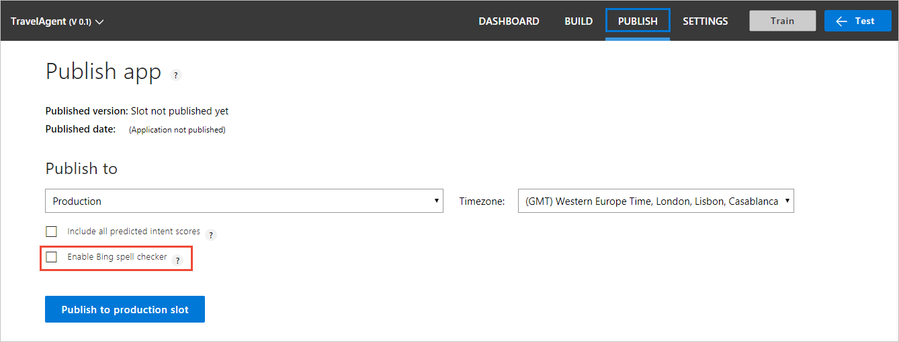
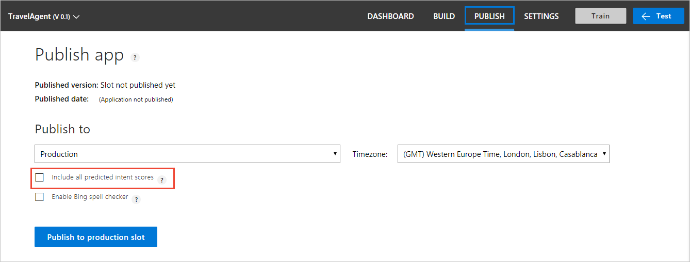

# Publish your trained app
When you finish building and testing your LUIS app, you publish it on Azure. After the app is published, the Publish page shows all associated HTTP [endpoints](luis-glossary.md#endpoint). These endpoints, per [region](luis-reference-regions.md) and per [key](Manage-Keys.md), are then integrated into any client, chat bot, or backend application. 

You can optionally [test](train-test.md) your app before publishing it. 

You can publish your app to the **Staging slow** or the **Production Slot**. 

## Include all intent scores with prediction response
The **Include all predicted intent scores** checkbox allows the endpoint query response to include the prediction score for each utterance for each intent. This allows your chat bot or LUIS-calling application to make a programming decision based on the scores of the returned intents. Generally the top two intents are the most interesting. The intents and their scores are also included the endpoint logs. You can [export](create-new-app.md#export-app) those logs and analyze the scores. 

```
{
  "query": "book a flight to Cairo",
  "topScoringIntent": {
    "intent": "None",
    "score": 0.5223427
  },
  "intents": [
    {
      "intent": "None",
      "score": 0.5223427
    },
    {
      "intent": "BookFlight",
      "score": 0.372391433
    }
  ],
  "entities": []
}
```

The checkbox is useful if you are copying the endpoint URLs from the publish page. If you are constructing your own URLs for your LUIS-calling application, make sure the **verbose=true** parameter is added to the endpoint URL querystring. 

## Enable Bing spell checker to correct utterances 
The **Enable Bing spell checker** checkbox allows LUIS to correct misspelled words before prediction. This requires you to create a **[Bing Spell Check key](https://azure.microsoft.com/try/cognitive-services/?api=spellcheck-api)**. Once the key is created, two querystring parameters are added to the endpoint URL on the publish page. 

If you are constructing your own URLs for your LUIS-calling application, make sure the **spellCheck=true** querystring parameter and the **bing-spell-check-subscription-key={YOUR_BING_KEY_HERE}**. Replace the `{YOUR_BING_KEY_HERE}` with your Bing spell checker key.

```JSON
{
  "query": "Book a flite to London?",
  "alteredQuery": "Book a flight to London?",
  "topScoringIntent": {
    "intent": "BookFlight",
    "score": 0.780123
  },
  "entities": []
}
```

## Enable Sentiment Analysis
The **Enable Sentiment Analysis** checkbox allows LUIS to integrate with [Text Analytics](https://azure.microsoft.com/services/cognitive-services/text-analytics/) to provide sentiment and key phrase analysis. You do not have to provide a Text Analytics key and there is no billing charge for this service to your Azure account. Once you check this setting, it is persistent. 

Sentiment data is a score between 1 and 0 indicating the positive (closer to 1) or negative (closer to 0) sentiment of the data.

<!-- TBD: verify JSON-->
```JSON
{
    "score": 0.9999237060546875,
    "id": "1"
}
```

<!-- TBD: verify JSON-->
```JSON
"keyPhrases": [
    "places",
    "beautiful views",
    "favorite trail"
]
```

## Publish your trained app to an HTTP endpoint

1. Open your app by clicking its name on the **My Apps** page, and then click **Publish** in the top panel. The following image shows the **Publish app** page before you publish your app.

    
 
    When you publish an app, this page looks like the following image: 
 
    

2. The first time you publish, the **Publish app** page shows your starter key. If you want to use a key other than the key shown, click the **Add Key** button. This action opens a dialog that allows you to select an existing endpoint key to assign to the app. For more information on how to create and add endpoint keys to your LUIS app, see [Manage your keys](Manage-Keys.md).

3. Choose whether to publish to **Production** or to **Staging** by selecting from the drop-down menu under **Publish to**. 

4. If you want to enable Bing Spell Check, click the **Enable Bing Spell Checker** check box.

    

    This checkbox changes your endpoint URL to include the two name/value pairs associated with the Bing Spell Checker: **spellCheck=true** and **bing-spell-check-subscription-key={YOUR_BING_KEY_HERE}**. If you call the LUIS endpoint from a bot or other application, you need to change the endpoint URL there as well.

    |Endpoint Url with Bing Spell Check enabled|
    |--|
    |https://{region}.api.cognitive.microsoft.com/luis/v2.0/apps/{appID}?subscription-key={LUISKey}&verbose=true&timezoneOffset=0&q={query}**&spellCheck=true&bing-spell-check-subscription-key={YOUR_BING_KEY_HERE}**|

5. If you want the JSON response of your published app to include all intents defined in your app and their prediction scores, click **Include all predicted intent scores** checkbox to append a `verbose=true` parameter to the end-point URL. Otherwise, it includes only the top scoring intent.

    

6. Click **Publish to production slot** if you have selected the **Production** option under **Publish to**. Click **Publish to staging slot** if you have selected **Staging**. When the publish succeeds, use the displayed endpoint URL to access your LUIS app. 

    >[!NOTE]
    >If the **Publish** button is disabled, then either your app does not have an assigned endpoint key, or you have not trained your app yet.

    

The endpoint URL corresponds to the Azure region associated with the endpoint key. To see endpoints and keys associated with other regions, use the radio buttons to switch regions. Each row in the **Resources and Keys** table lists Azure resources associated with your account and the endpoint keys associated with that resource.


## Test your published endpoint in a browser
You can test your published endpoint in a browser using the generated URL. To open this URL in your browser, set the URL parameter "&q" to your test query. For example, append `&q=Book me a flight to Boston on May 4` to your URL, and then press Enter. The browser displays the JSON response of your HTTP endpoint. 


## Next steps

* See [Manage keys](./Manage-Keys.md) to add keys to your LUIS app, and learn about how keys map to regions.
* See [Train and test your app](Train-Test.md) for instructions on how to test your published app in the test console.
