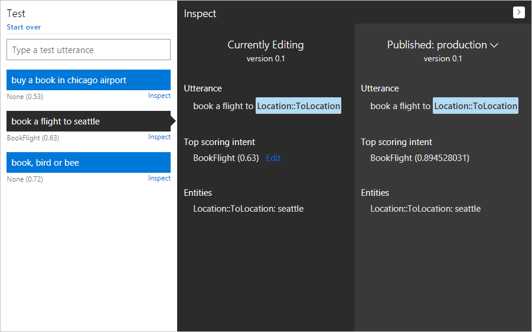
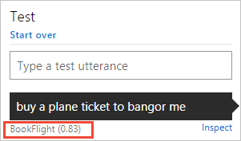
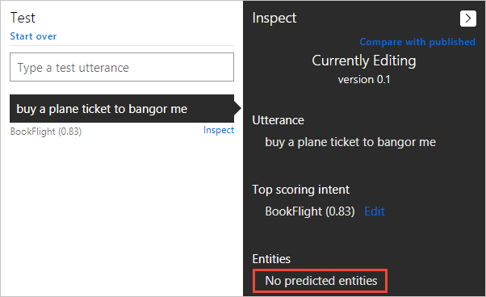
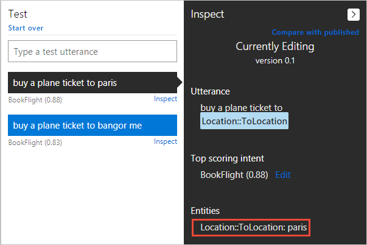
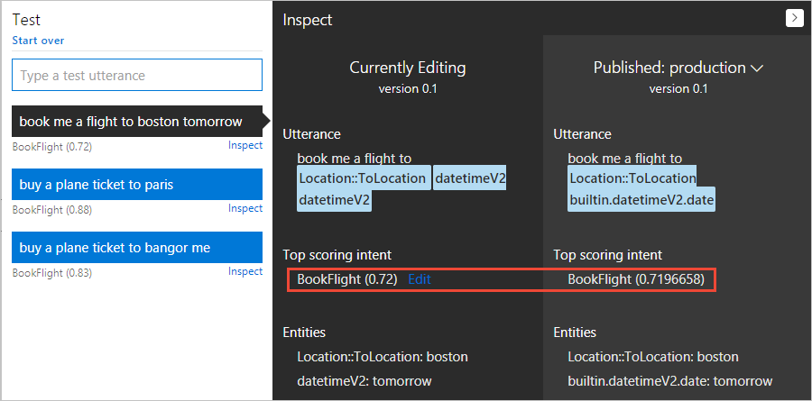

# Train and test your app

Training is the process of teaching your LUIS app by example to improve its language understanding. You train your LUIS app after you make updates by adding, editing, labeling, or deleting entities, intents, or utterances. When you train a LUIS app, LUIS generalizes from the examples you have labeled, and learns to recognize the relevant intents and entities. This learning allows LUIS to improve classification accuracy in the future. 

Training and testing is an iterative process. After you train your LUIS app, you test it with sample utterances to see if the intents and entities are recognized correctly. If not, make updates to the LUIS app, train, and test again. 

Typically, before retraining, you should [relabel any utterances](#relabel-utterances-and-retrain) in which LUIS failed to identify the expected intents and entities. You can find the utterances to relabel using the following procedures:
 
  * **Interactive testing**: The [interactive testing pane](#interactive-testing) lets you type in an utterance and displays the intents and entities that your LUIS app detects.
  * **Review user utterances in LUIS.ai**: Relabeling [utterances](./Label-Suggested-Utterances.md) that LUIS identifies for you.
  * **Review user utterances from log**: LUIS provides a [log of utterances](./luis-resources-faq.md#how-do-i-download-a-log-of-user-utterances) from users that have been passed to the LUIS app endpoint. This log includes the intents and entities you can review to see if they've been correctly identified.
  

In addition to relabeling utterances, you may also add new utterances, edit the intent or entity types, and [add features](./Add-Features.md) to your LUIS app to improve performance. 

## Train your app
To start the iterative process of training, you first need to train your LUIS app at least once. 

1. Access your app by clicking its name on **My Apps** page. 

2. In your app, click **Train** in the top panel. 

    

3. When training is complete, a green notification bar appears at the top of the browser.

    

<!-- The following note refers to what might cause the error message "Training failed: FewLabels for model: <ModelName>" -->

>[!NOTE]
>If you have one or more intents in your app that do not contain example utterances, you cannot train your app. Add utterances for all your intents. For more information, see [Add example utterances](Add-example-utterances.md).

## Test your app
[LUIS.ai](http://www.luis.ai) provides two types of testing: interactive testing and batch testing.

## Access the Test page

1. Access your app  by clicking its name on **My Apps** page, 
2. Click **Test** in your application's top panel to access the **Test** slide-out page.


## Interactive Testing
Interactive testing enables you to test both the current and published versions of your app and compare their results in one screen. 
 
The **Test** slide-out page displays a single test section by default. The second panel is the inspection panel.



* The **test panel** allows you to type the test utterance in the text box and press Enter to submit it to your LUIS app and view LUIS model results. 

* The **inspection panel** allows you to inspect LUIS results, change the top scoring intent, and compare to the published model. The top identified entity is also shown.

>[!NOTE]
>You can compare the trained but not yet published model against the published model. Be aware any testing against the published model will be deducted from your Azure subscription quota balance. 

In an interactive test, you submit individual test utterances and view the LUIS score for each utterance separately. 

>[!TIP]
>To close the **Test** panel, click the **Test** button again.

## Relabel utterances and retrain
When you perform interactive testing, you may find that LUIS doesn't detect the intent or entities the way you expect for some utterances. The following steps walk you through relabeling an utterance and retraining.

### Relabel an utterance to retrain intents and entities
1. Import the sample LUIS app <a href="https://aka.ms/luis-travel-agent-01" target="_blank">Travel Agent - Sample 1</a>. This LUIS app has only a few sample utterances and provides a starting point for training. It has the following intents:
 * BookFlight
 * Weather.GetForecast
 * None 

2. Click on the **Train** button in the top bar to train the new app.

3. On the **Test** panel, type in `buy a plane ticket to bangor me` and press Enter. Instead of the `BookFlight` intent, the test results show `Weather.GetForecast`.

    

3. You need to teach LUIS that `buy a plane ticket to bangor me` should be mapped to the `BookFlight` intent. You teach LUIS about an utterance's intent by adding the utterance to the correct intent. Go to the **Intents** page, click the **BookFlight** intent, type "buy a plane ticket to bangor me" into the text box, and press Enter. 

4. Click on the **Train** button in the top bar to train the new app to retry LUIS with this new utterance.

5. Go back to the **Test** panel and type `book a flight to bangor` in the text box and click enter. 

    

   > [!NOTE]
   > In this step you choose an utterance that's similar to the one you labeled, but **not** exactly the same. This similarity helps to test your LUIS app's ability to generalize.

6. Now the intent should be correctly detected as `BookFlight`. However, `bangor` isn't detected as a location yet.

    

7. You need to teach LUIS that `bangor me` in the utterance `buy a plane ticket to bangor me` should be mapped to the `Location` entity for Bangor, Maine. Go to the **Intents** page, click the **BookFlight** intent, and find `buy a plane ticket to bangor me` in the list of utterances. Click on the words `bangor me` and choose the **Location** entity from the entity list. Select **Location::ToLocation** hierarchical entity from the drop-down list.
 
    

8. Click on the **Train** button in the top bar to train the new app to retry LUIS with this new entity for that utterance.

9. After training succeeds, click **Test**, type `buy a plane ticket to paris` in the text box and click enter. Now the location entity is correctly detected.



> [!NOTE]
> In this step you choose an utterance that's similar to the one you labeled, but not exactly the same. This similarity helps to test your LUIS app's ability to generalize.

### Perform interactive testing on current and published models
In this section, you publish the existing model, change the model, then test an utterance to compare the published versus non-published model results.

1. Close the **Test** panel by clicking on the **Test** button in the top bar. 

2. On the **Publish** page, publish your model. 

3. Click on the **Test** button to reopen the test panel.

4. Type "book me a flight to Boston tomorrow" as your test utterance and press Enter. The LUIS results of the test utterance in both the current and published models are shown in the following image: 

    

If you are interactive testing on both trained and published models together, an entity may have a different prediction in each model.

>[!NOTE]
>About the interactive testing console:
 >- You can type as many test utterances as you want in the test panel; only one utterance at a time.
 >- The inspection panel shows the result of the latest utterance. 
 >- To review the result of a previous utterance, just click it in the test panel and its result displayed on the right. 
 >- To clear all the entered test utterances and their results from the test console, click **Start over** on the top left corner of the test panel. 


## Batch Testing
Batch testing enables you to run a comprehensive test on your current trained model to measure its performance in language understanding. In batch testing, you submit a large number of test utterances collectively in a batch file, known as a *dataset*. The dataset file should be written in JSON format and contains a maximum of 1000 utterances. All you need to do is to import this file to your app and run it to perform the test. Your LUIS app will return the result, enabling you to access detailed analysis of all utterances included in the batch.

You can import up to 10 dataset files to a single LUIS app. It is recommended that the utterances included in the dataset should be different from the example utterances you previously added while building your app. 
 
The following procedures will guide you on how to import a dataset file, run a batch test on your current trained app using the imported dataset, and finally to access the test results in a detailed visualized view.

### Import a dataset file

1. Click **Test** in the top bar, click **Batch Testing Panel**.

    

2. Click **Import dataset**. The **Import dataset** dialog box appears. Click **Choose File** and locate the JSON file containing the utterances to test.

    

3. In **Dataset name**, type a name for your dataset file. An example of the JSON in the batch file follows:

    ```JSON
[
    {
        "text": "go to paris",
        "intent": "BookFlight",
        "entities": [
            {
                "entityName": "location",
                "startPos": 6,
                "endPos": 10
            }
        ]
    },
    {
        "text": "drive me home",
        "intent": "None",
        "entities": []
    },
    {
        "text": "book me a flight to paris",
        "intent": "BookFlight",
        "entities": [
            {
                "entity": "Location::ToLocation",
                "startPos": 20,
                "endPos": 24
            }
        ]
    },
    {
        "text": "book a flight from seattle to hong kong",
        "intent": "BookFlight",
        "entities": [
            {
                "entity": "Location::FromLocation",
                "startPos": 19,
                "endPos": 25
            },
            {
                "entity": "Location::ToLocation",
                "startPos": 30,
                "endPos": 38
            }
        ]
    }
]
    ```

4. Click **Done**. The dataset file will be added.

5. To export, rename, delete or download the imported dataset, you can use the three dots (...) at the end of the data set row. 

    

### Run a batch test on your trained app

- Click **Test** next to the dataset you've just imported. Soon, the test result of the dataset will be displayed.

    

    In the above screenshot:
 
    - **Status** of the dataset shows whether or not the dataset result contains errors. In the above example, an error sign is displayed indicating that there are errors in one or more utterances. If the test result contains no errors, a green sign will be displayed instead. 
    - **Utterance Count** is the total number of utterances included in the dataset file.
    - **Last Test Date** is the date of the latest test run for this dataset. 
    - **Last Test Success** displays the percentage of correct predictions resulting from the test.

### Access test result details in a visualized view
 
1. Click the **See results** link that appears as a result of running the test. A scatter graph known as a error matrix is displayed. The data points represent the utterances in the dataset. Green points indicate correct prediction and red ones indicate incorrect prediction. 

     

    >[!NOTE]
    >The filtering panel on the right side of the screen displays a list of all intents and entities in the app, with a green point for intents/entities which were predicted correctly in all dataset utterances, and a red one for those with errors. Also, for each intent/entity, you can see the number of correct predictions out of the total utterances. 
  
2. To filter the view by a specific intent/entity, click on your target intent/entity in the filtering panel. The data points and their distribution will be updated according to your selection. 
 
     

    >[!NOTE]
    >Hovering over a data point shows the certainty score of its prediction.
 
    The graph contains 4 sections representing the possible cases of your application's prediction:

    - **True Positive (TP):** The data points in this section represent utterances in which your app correctly predicted the existence of the target intent/entity. 
    - **True Negative (TN):** The data points in this section represent utterances in which your app correctly predicted the absence of the target intent/entity.
    - **False Positive (FP):** The data points in this section represent utterances in which your app incorrectly predicted the existence of the target intent/entity.
    - **False Negative (FN):** The data points in this section represent utterances in which your app incorrectly predicted the absence of the target intent/entity.

    This means that data points on the **False Positive** & **False Negative** sections indicate errors, which should be investigated. On the other hand, if all data points are on the **True Positive** and **True Negative** sections, then your application's performance is perfect on this dataset.
 
3. Click a data point to retrieve its corresponding utterance in the utterances table at the bottom of the page. To display all utterances in a section, click the section title.
  
A batch test helps you view the performance of each intent and entity in your current trained model on a specific set of utterances. This helps you take appropriate actions, when required, to improve performance, such as adding more example utterances to an intent if your app frequently fails to identify it.

## Next steps

If testing indicates that your LUIS app doesn't recognize the correct intents and entities, you can work to improve your LUIS app's performance by labeling more utterances or adding features. 

* [Label suggested utterances with LUIS](Label-Suggested-Utterances.md) 
* [Use features to improve your LUIS app's performance](Add-Features.md) 

