# Train and test your app

## Train to teach your app
You should continuously work on your application to refine it and improve its language understanding. Whenever you make updates by adding, editing or deleting entities, intents or utterances in your current model, you’ll need to train your app before testing and publishing. When you "train" a model, LUIS generalizes from the examples you have labeled, and builds model to recognize the relevant intents and entities in the future, thus improving its classification accuracy. 

**To train your current model:**

1. Access your app (e.g. TravelAgent) by clicking its name on **My Apps** page. 

2. In your app, click **Train & Test** in the left panel. 
3. On the **Test App** page, click **Train Application** to train the current model on the latest updates.

    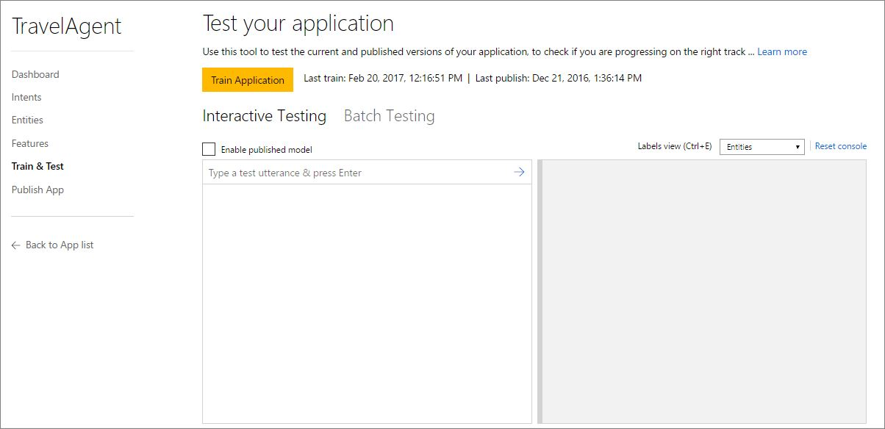

    >[!NOTE]
    >If you have one or more intents in your app which do not contain example utterances, you'll not be able to train your app until you add utterances for all your intents. For more information, see [Add example utterances](Add-example-utterances.md).

## Test your app
LUIS provides two types of testing; interactive testing and batch testing. You can use any of them by using the corresponding tab on the **Test App** page.

**To access the Test App page:**

1. Access your app (e.g. TravelAgent) by clicking its name on **My Apps** page, 
2. Click **Train & Test** in your application's left panel to access the **Test App** page. 

- If you haven't already trained your current model on recent updates, then your test page will look like this screenshot:

    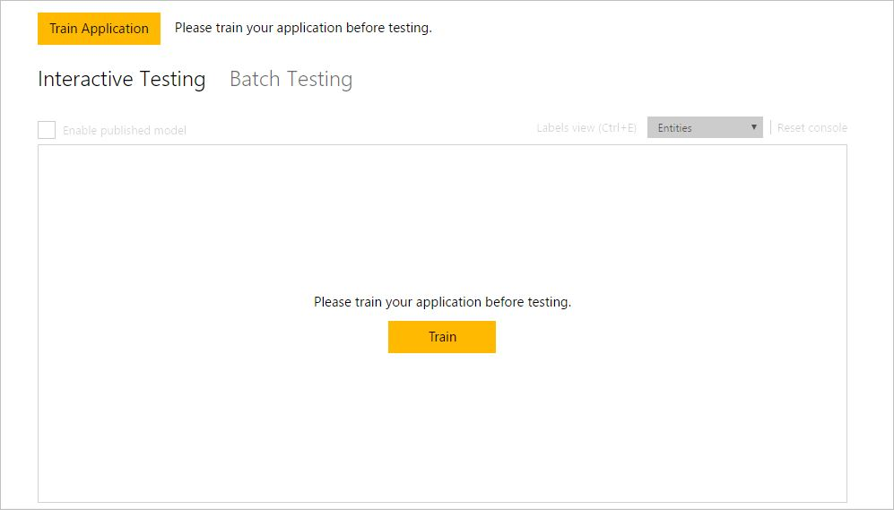
- If your model is trained, your test page will look like this screenshot:

    

 
### Interactive Testing
Interactive testing enables you to test both the current and published versions of your app and compare their results in one screen. Interactive testing runs by default on the current trained model only. For a published model, interactive testing is disabled and needs your action to enable it, because it is counted in hits and will be deducted from your key balance. 

The **Interactive Testing** tab is divided into two sections (as in the screenshot):

* **The test view**, on the left side of the screen, where you can type the test utterance in the text box and press Enter to submit it to your app. 

* **The result view**, on the right side of the screen, where your LUIS app returns the test result; i.e. the predicted interpretation of the utterance. 

In an interactive test, you submit individual test utterances and view the returned result for each utterance separately. 

**To perform interactive testing on the current model:**

- On the **Test App** page, **Interactive Testing** tab, type "book me a flight to Boston tomorrow" as your test utterance in the text box and press Enter. You'll get the following result:

    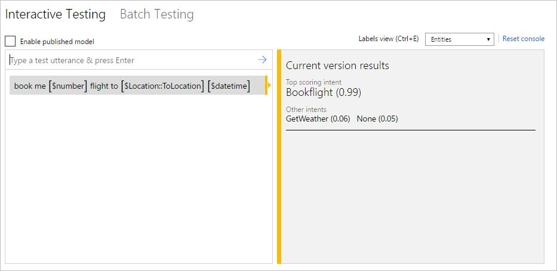

 The testing result includes the top scoring intent identified in the utterance, with its certainty score, as well as other intents existing in your model with their certainty scores. The identified entities will also be displayed within the utterance and you can control their view by selecting your preferred view from the **Labels view** list at the top of the test console.

**To perform interactive testing on current and published models:**

1. On the **Test App** page, **Interactive Testing** tab, click **Enable published model** check box and then click **Yes** in the following confirmation message:

    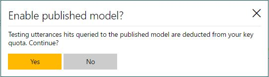

    >[!NOTE] 
    >If you do not have a published version of your application, the **Enable published model** check box will be disabled. 

2. Type "book me a flight to Boston tomorrow" as your test utterance and press Enter. The result view on the right side will be split horizontally into two parts (as in the following screenshot) to display results of the test utterance in both the current and published models. 

    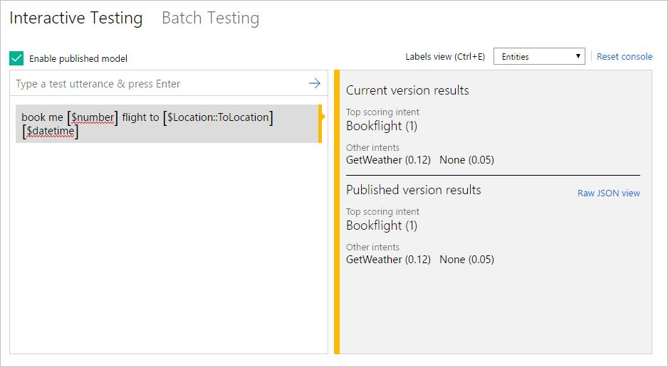
3. To view the test result of your published app in JSON format, click **Raw JSON view**. This will look like the following screenshot.

    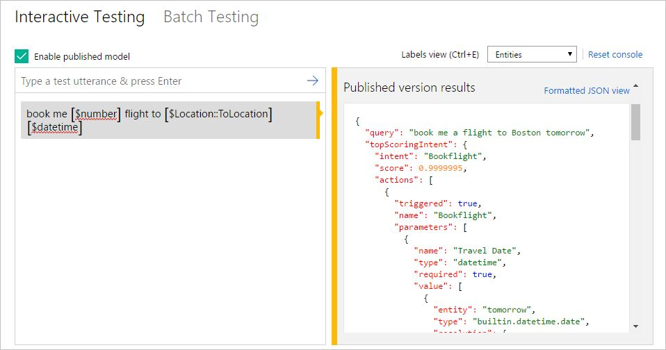

In case of interactive testing on both trained and published models together, an entity may have a different prediction in each model. In the test result, this entity will be distinguished by a red underline. If you hover over the underlined entity, you can view the entity prediction in both trained and published models.

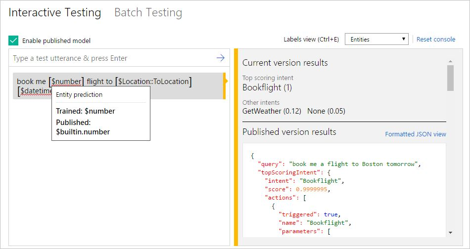

>[!NOTE]
>About the interactive testing console:
 >- You can type as many test utterances as you want in the test view; only one utterance at a time.
 >- The result view shows the result of the latest utterance. 
 >- To review the result of a previous utterance, just click it in the test view and its result will be displayed on the right. 
 >- To clear all the entered test utterances and their results from the test console, click **Reset Console** on the top right corner of the console. 

### Batch Testing
Batch testing enables you to run a comprehensive test on your current trained model to measure its performance in language understanding. In batch testing, you submit a large number of test utterances collectively in a batch file, known as "dataset". The dataset file should be written in JSON format and contains a maximum of 1000 utterances. All you need to do is to import this file to your app and run it to perform the test. Your LUIS app will return the result, enabling you to access detailed analysis of all utterances included in the batch.

You can import up to 10 dataset files to a single LUIS app. It is recommended that the utterances included in the dataset should be different from the example utterances you previously added while building your app. 
 
The following procedures will guide you on how to import a dataset file, run a batch test on your current trained app using the imported dataset, and finally to access the test results in a detailed visualized view.

**To import a dataset file:**

1. On the **Test App** page, click **Batch Testing**, and then click **Import dataset**. The **Import dataset** dialog box appears.

    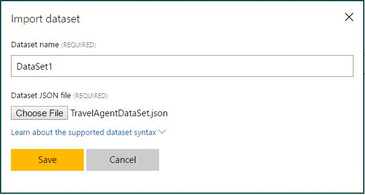

2. In **Dataset name**, type a name for your dataset file (For example "DataSet1").

3. To learn more about the supported syntax for dataset files to be imported, click **learn about the supported dataset syntax link**. The **Import dataset** dialog box will be expanded displaying the allowed syntax. To collapse the dialog and hide syntax, just click the link again.

    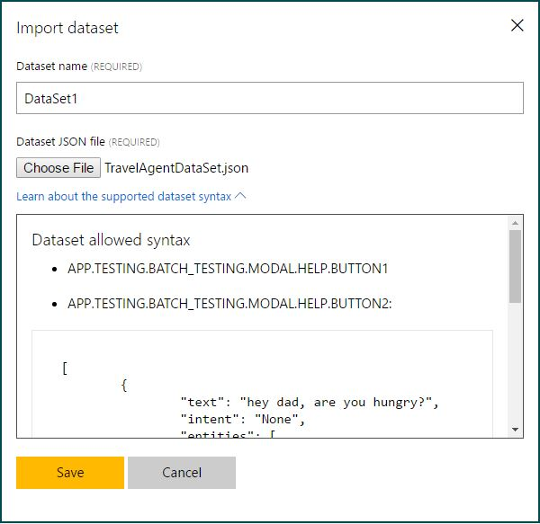

4. Click **Choose File** to choose the dataset file you want to import, and then click **Save**. The dataset file will be added.

    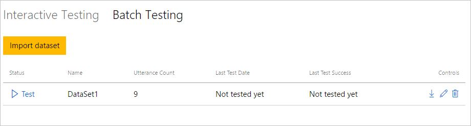

5. To rename, delete or download the imported dataset, you can use these buttons respectively: **Rename Dataset** , **Delete Dataset**  and **Download Dataset JSON** .

**To run a batch test on your trained app:**

- Click **Test** next to the dataset you've just imported. Soon, the test result of the dataset will be displayed.

    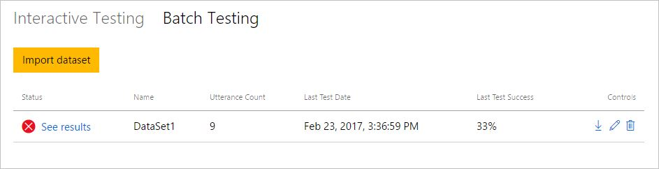

    In the above screenshot:
 
    - **Status** of the dataset shows whether or not the dataset result contains errors. In the above example, an error sign is displayed indicating that there are errors in one or more utterances. If the test result contains no errors, a green sign will be displayed instead. 
    - **Utterance Count** is the total number of utterances included in the dataset file.
    - **Last Test Date** is the date of the latest test run for this dataset. 
    - **Last Test Success** displays the percentage of correct predictions resulting from the test.

**To access test result details in a visualized view:**
 
1. Click the **See results** link that appears as a result of running the test (see the above screenshot). A scatter graph (confusion matrix) is displayed, where the data points represent the utterances in the dataset. Green points indicate correct prediction and red ones indicate incorrect prediction. 

    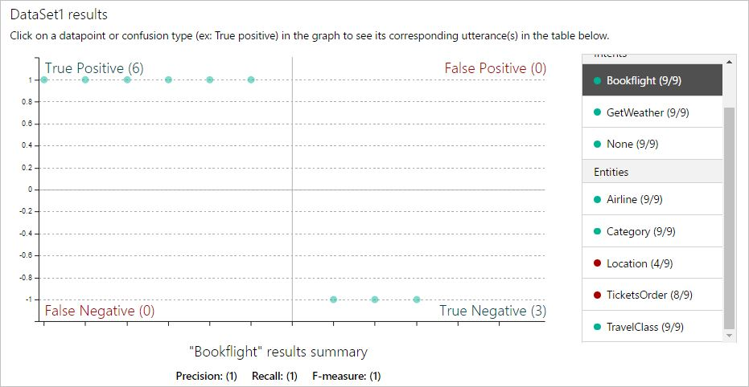 

    >[!NOTE]
    >The filtering panel on the right side of the screen displays a list of all intents and entities in the app, with a green point for intents/entities which were predicted correctly in all dataset utterances, and a red one for those with errors. Also, for each intent/entity, you can see the number of correct predictions out of the total utterances. For example, in the above screenshot, the entity "Location (4/9)" has 4 correct predictions out of 9, so it has 5 errors.
  
2. To filter the view by a specific intent/entity, click on your target intent/entity in the filtering panel. The data points and their distribution will be updated according to your selection. For example, the following screenshot displays results for the "GetWeather" intent.
 
    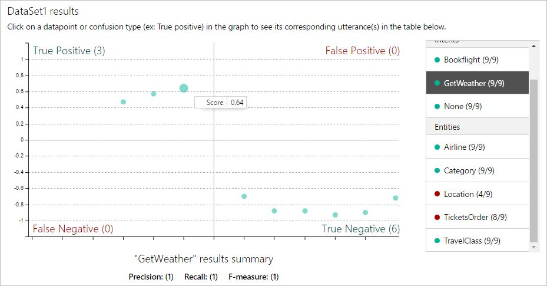 

    >[!NOTE]
    >Hovering over a data point shows the certainty score of its prediction.
 
    The graph contains 4 sections representing the possible cases of your application's prediction:

    - **True Positive (TP):** The data points in this section represent utterances in which your app correctly predicted the existence of the target intent/entity. 
    - **True Negative (TN):** The data points in this section represent utterances in which your app correctly predicted the absence of the target intent/entity.
    - **False Positive (FP):** The data points in this section represent utterances in which your app incorrectly predicted the existence of the target intent/entity.
    - **False Negative (FN):** The data points in this section represent utterances in which your app incorrectly predicted the absence of the target intent/entity.

    This means that data points on the **False Positive** & **False Negative** sections indicate errors, which should be investigated. On the other hand, if all data points are on the **True Positive** and **True Negative** sections, then your application's performance is perfect on this dataset.
 
3. Click a data point to retrieve its corresponding utterance in the utterances table at the bottom of the page. To display all utterances in a section, click the section title (e.g. True Positive, False Negative, ..etc.) 

    For example, the following screenshot shows the results for the "None" intent when one of its data points is clicked, so the utterance "weather forecast for tomorrow" is displayed. This utterance falls under the **True Negative** section as your app correctly predicted that the "None" intent is not present in this utterance. 

     
  
Thus, a batch test helps you view the performance of each intent and entity in your current trained model on a specific set of utterances. This helps you take appropriate actions, when required, to improve performance, such as adding more example utterances to an intent if your app frequently fails to identify it.
