# Train and test your LUIS app

Training is the process of teaching your Language Understanding (LUIS) app to improve its natural language understanding. You train your LUIS app after you make updates by adding, editing, labeling, or deleting entities, intents, or utterances. 

<!--
When you train a LUIS app by example, LUIS generalizes from the examples you have labeled, and it learns to recognize the relevant intents and entities. This teaches LUIS to improve classification accuracy in the future. -->

Training and [testing](luis-concept-test.md) an app is an iterative process. After you train your LUIS app, you test it with sample utterances to see if the intents and entities are recognized correctly. If they're not, make updates to the LUIS app, train, and test again. 

## Train your app
To start the iterative process of training, you first need to train your LUIS app at least once. 

1. Access your app by selecting its name on the **My Apps** page. 

2. In your app, select **Train** in the top panel. 

    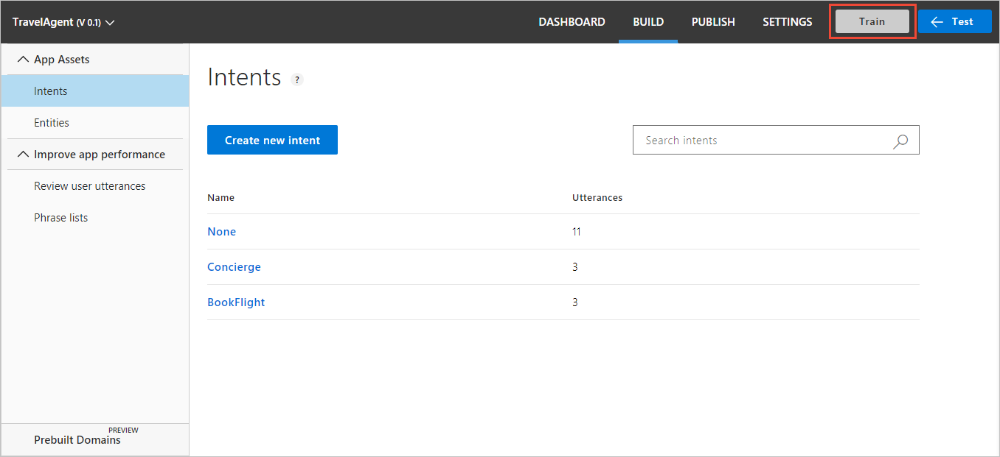

3. When training is complete, a green notification bar appears at the top of the browser.

    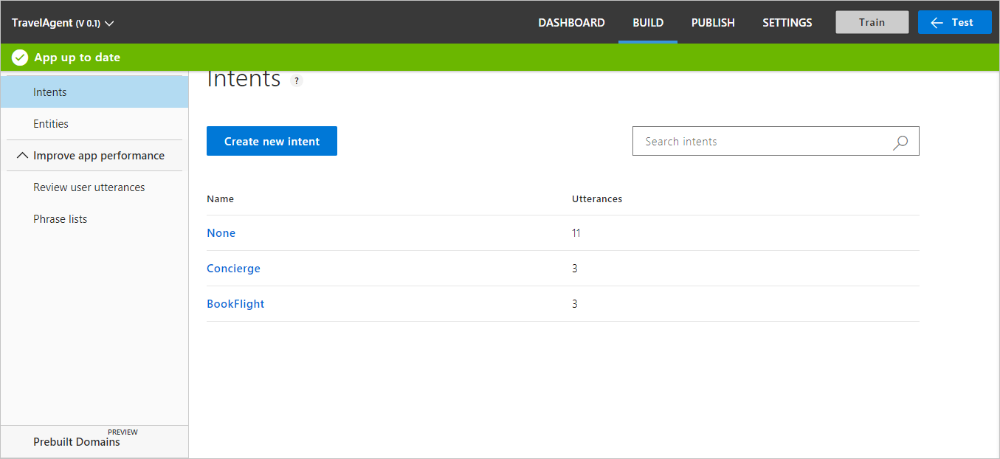

<!-- The following note refers to what might cause the error message "Training failed: FewLabels for model: <ModelName>" -->

>[!NOTE]
>If you have one or more intents in your app that do not contain example utterances, you cannot train your app. Add utterances for all your intents. For more information, see [Add example utterances](Add-example-utterances.md).

<!-- anchors for H2 name changes -->

## Test an utterance

1. Access your app by selecting its name on the **My Apps** page. 
2. To access the **Test panel** slide-out panel, select **Test panel** in your application's top panel.

    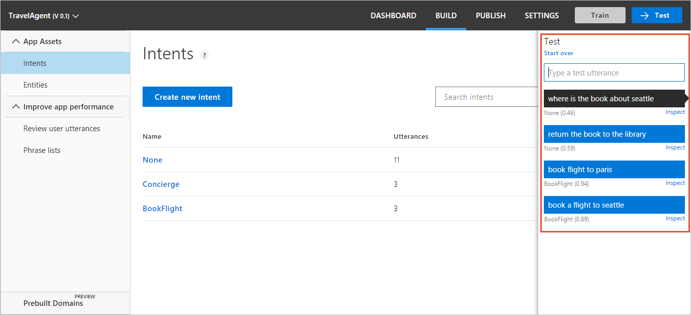
3. Enter an utterance in the text box and select **Enter**. You can type as many test utterances as you want in the **Test panel**, but only one utterance at a time.
4. The utterance and its top intent and score are added to the list of utterances under the text box.

    

## Clear test panel
To clear all the entered test utterances and their results from the test console, select **Start over** at the upper-left corner of the **Test panel**. 

## Close test panel
To close the **Test** panel, select the **Test** button again.

## Inspect score
You inspect details of the test result in the **Inspect** panel. 
 
1. With the **Test** slide-out panel open, select **Inspect** for an utterance you want to compare. 

    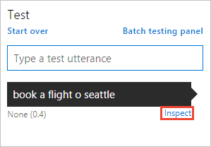

2. The **Inspection panel** appears. The panel includes the top scoring intent as well as any identified entities. The panel shows the result of the selected utterance.

    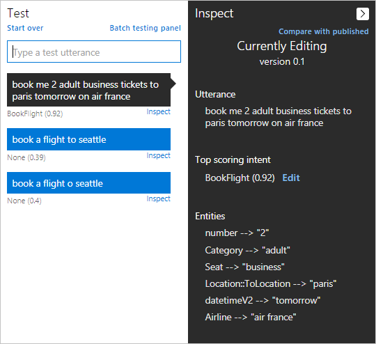

## Correct top scoring intent

1. If the top scoring intent is incorrect, select the **Edit** button.

    

2.  In the drop-down list, select the correct intent for the utterance.

    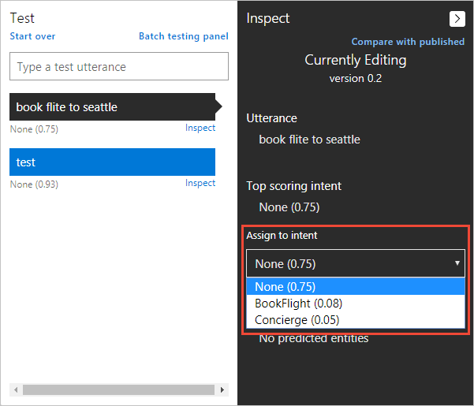

## Compare with published version
You can test the active version of your app with the published [endpoint](luis-glossary.md#endpoint) version. In the **Inspect** panel, select **Compare with published**. Any testing against the published model is deducted from your Azure subscription quota balance. 

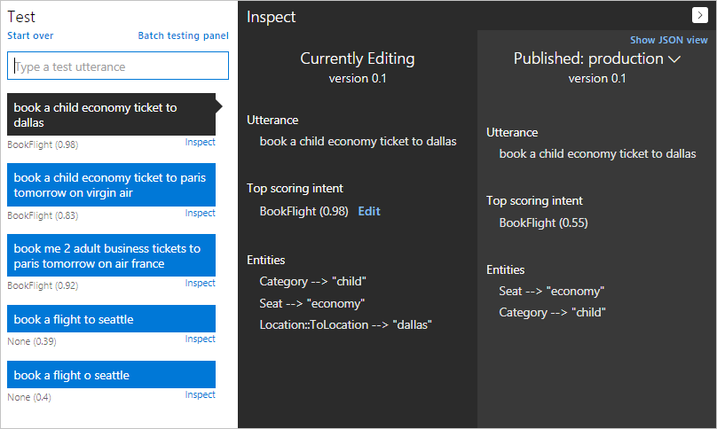

## View endpoint JSON in test panel
You can view the endpoint JSON returned for the comparison by selecting the **Show JSON view**.

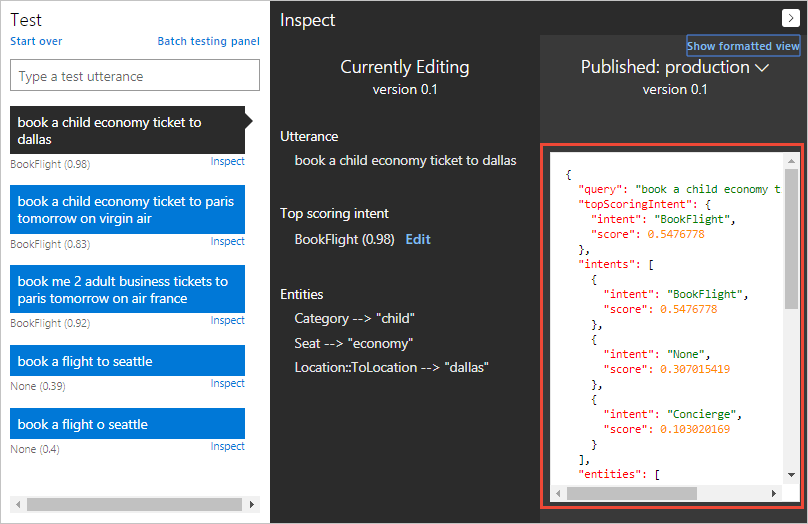

<!--Service name is 'Bing Spell Check v7 API' in the portal-->
## View Bing Spell Check corrections in test panel
You can view the spelling corrections provided by [Bing Spell Check v7](https://azure.microsoft.com/services/cognitive-services/spell-check/) API in the JSON view of the **Published** panel. 

To use this feature, you must have published the app, and have a Bing Spell Check [service key](https://azure.microsoft.com/try/cognitive-services/?api=spellcheck-api). The service key is not stored and needs to be reset for each browser session. 

Use the following steps to use the Bing Spell Check v7 service key. 

1. In the test panel, on the **Published** pane, select **Additional Settings**.

    

2. In the pop-up dialog, enter your **Bing Spell Check** service key. 
    

3. Enter a query with an incorrect spelling such as `book flite to seattle` and select enter. The incorrect spelling of the word `flite` is replaced in the query sent to LUIS and the resulting JSON shows both the original query, as query, and the corrected spelling in the query, as alteredQuery.

    

## Batch testing
Batch testing is a comprehensive test on your current trained model to measure its performance in LUIS. A batch test helps you view the performance of each intent and entity in your current trained model on a specific set of utterances. Use utterances LUIS has not seen before in either the model or the endpoint. This testing helps you take appropriate actions, when required, to improve performance, such as adding more example utterances to an intent if your app frequently fails to identify it.

## JSON file with no duplicates
You submit a batch file of utterances, known as a *dataset*. The dataset is JSON format and contains a maximum of 1,000 labeled **non-duplicate** utterances. Duplicates are considered exact string matches, not matches that are tokenized first. 

|**Rules**|
|--|
|No duplicate utterances|
|No hierarchical entity children|
|1000 utterances or less|

Import this file and run the test. The result is a comparison of the dataset labeled intent and the current model's predicted intent. This difference helps you find utterances that LUIS predicts incorrectly based on its current training. 

You can test 10 dataset files in a single LUIS app. The utterances included in the dataset should be different from the example utterances you previously added while building your app. 
 

## Import a dataset file for batch testing

1. Select **Test** in the top bar, and then select **Batch testing panel**.

    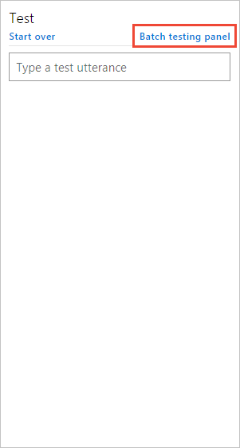

2. Select **Import dataset**. The **Import new dataset** dialog box appears. Select **Choose File** and locate the JSON file that contains *no more than 1,000* utterances to test.

    

    Import errors are reported in a red notification bar at the top of the browser. When an import has errors, no dataset is created. **Common errors** are more than 1,000 utterances or an utterance JSON object that doesn't have an entities property. Every utterance must have an entities property. If the utterance has no entities, the entities property should be an empty array.

3. In the **Dataset Name** field, type a name for your dataset file. The dataset file includes an **array of utterances** including the *labeled intent* and *entities*. An example of the JSON in the batch file follows:

   [!code-json[Valid batch test](~/samples-luis/documentation-samples/batch-testing/travel-agent-1.json)]

4. Select **Done**. The dataset file is added.

## Export, rename, delete, or download dataset
To export, rename, delete, or download the imported dataset, use the three dots (**...**) at the end of the dataset row.

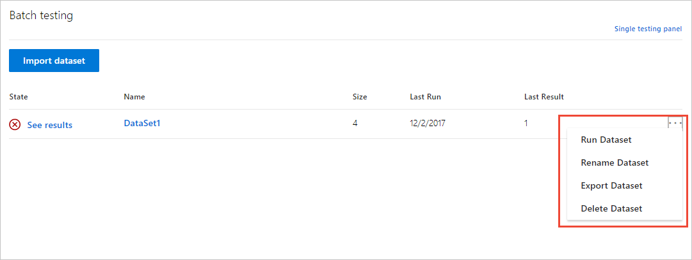

## Run a batch test on your trained app

To run the test, select the dataset name. When the test completes, this row displays the test result of the dataset.

**Successful predictions** are utterances where the intent in the batch file is the same intent predicted in the test.

In the preceding screenshot:
 
 - **State** includes ready to run, erroring results, or successful results. 
 - **Size** is the total number of utterances included in the dataset file.
 - **Last Run** is the date of the latest test run for this dataset. 
 - **Last Result** displays the number of successful predictions in the last test run.

|State|Meaning|
|--|--|
||All utterances are successful.|
||At least one utterance intent did not match the prediction.|
||Test is ready to run.|

## Access batch test result details in a visualized view
 Select the **See results** link that appears after you run the test. A scatter graph known as an error matrix displays. The data points represent the utterances in the dataset. 

Green points indicate correct prediction, and red ones indicate incorrect prediction.

The filtering panel on the right side of the screen displays a list of all intents and entities in the app, with a green point for intents/entities that were predicted correctly in all dataset utterances, and a red point for those items with errors. Also, for each intent/entity, you can see the number of correct predictions out of the total utterances.

 

  
## Filter chart results by intent or entity
To filter the view by a specific intent or entity, select the intent or entity in the right-side filtering panel. The data points and their distribution update in the graph according to your selection. All items in the filtered section also display in more detail below the chart. 
 
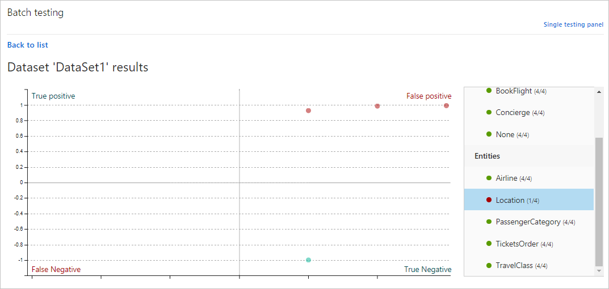 

## Investigate false sections
Data points on the **[False Positive][false-positive]** and **[False Negative][false-negative]** sections indicate errors, which should be investigated. If all data points are on the **[True Positive][true-positive]** and **[True Negative][true-negative]** sections, then your application's performance is perfect on this dataset.

The graph indicates [F-measure][f-measure], [recall][recall], and [precision][precision].  

## View single-point utterance data
In the chart, hover over a data point to see the certainty score of its prediction. Select a data point to retrieve its corresponding utterance in the utterances list at the bottom of the page. 

## False test results
In the four-section chart, select the section name, such as **False Positive** at the top-right of the chart. Below the chart, all utterances in that section display below the chart in a list of incorrect predictions. 

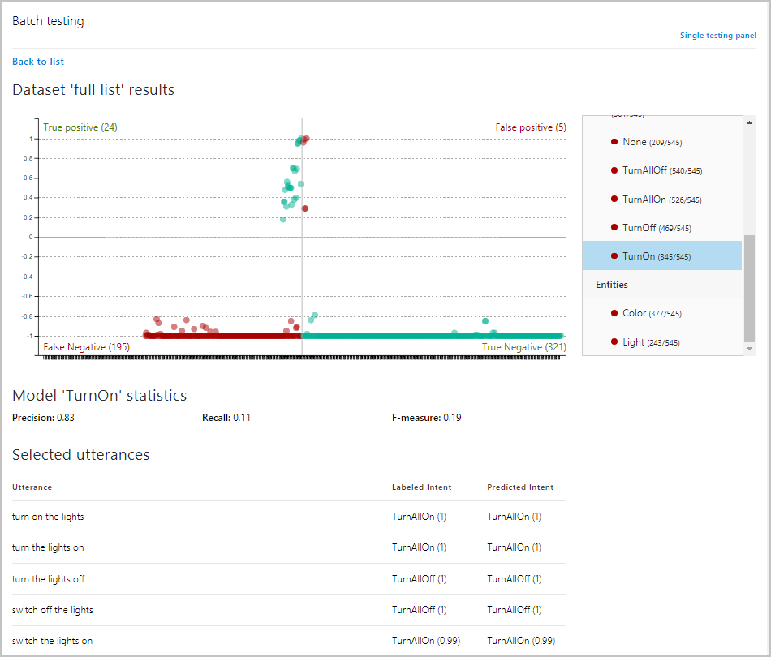

In this preceding image, the utterance `switch on` is labeled with the TurnAllOn intent, but received the prediction of None intent. This is an indication that the TurnAllOn intent needs more example utterances in order to make the expected prediction. 

The two sections of the chart in red indicate utterances that did not match the expected prediction. These indicate utterances which LUIS needs more training. 

The two sections of the chart in greed did match the expected prediction.

## Next steps

If testing indicates that your LUIS app doesn't recognize the correct intents and entities, you can work to improve your LUIS app's performance by labeling more utterances or adding features. 

* [Label suggested utterances with LUIS](Label-Suggested-Utterances.md) 
* [Use features to improve your LUIS app's performance](Add-Features.md) 

[true-positive]:luis-glossary.md#true-positive
[true-negative]:luis-glossary.md#true-negative
[false-positive]:luis-glossary.md#false-positive
[false-negative]:luis-glossary.md#false-negative
[f-measure]:luis-glossary.md#f-measure
[recall]: luis-glossary.md#recall
[precision]: luis-glossary.md#precision

