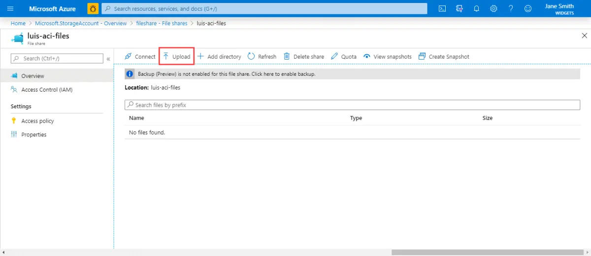

# Deploy the Language Understanding (LUIS) container to Azure Container instances

Learn how to deploy the Cognitive Services [LUIS](luis-container-howto.md) container to Azure [Container instances](https://docs.microsoft.com/azure/container-instances/). This procedure demonstrates the creation of an Anomaly Detector resource. Then we discuss pulling the associated container image. Finally, we highlight the ability to exercise the orchestration of the two from a browser. Using containers can shift the developers' attention away from managing infrastructure to instead focusing on application development.

[!INCLUDE [Prerequisites](../containers/includes/container-prerequisites.md)]

[!INCLUDE [Create LUIS resource](includes/create-luis-resource.md)]

[!INCLUDE [Gathering required parameters](../containers/includes/container-gathering-required-parameters.md)]

## Create an Azure file share

The LUIS container requires a `.gz` model file that is pulled in at runtime. The container must be able to access this model file via a volume mount from the Container instance. For information on creating an Azure file share, see [create a file share](../../storage/files/storage-how-to-create-file-share.md). Take note of the Azure Storage account name, key, and file share name as you'll need them later.

### Export and Upload packaged LUIS app

In order to upload the LUIS model (packaged app) to the Azure file share, you'll need to <a href="luis-container-howto.md#export-packaged-app-from-luis" target="_blank" rel="noopener">export it from the LUIS portal first </a>. From the Azure portal, navigate to the **Overview** page of the storage account resource and select **File shares**. Select the file share name that you recently created, then select the **Upload** button.

> [!div class="mx-imgBorder"]
> 

Upload the LUIS model file.

[!INCLUDE [Create LUIS Container instance resource](../containers/includes/create-container-instances-resource-from-azure-cli.md)]

[!INCLUDE [API documentation](../../../includes/cognitive-services-containers-api-documentation.md)]

[!INCLUDE [Next steps](../containers/includes/containers-next-steps.md)]
