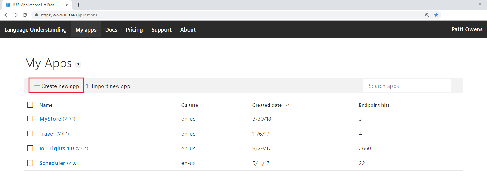
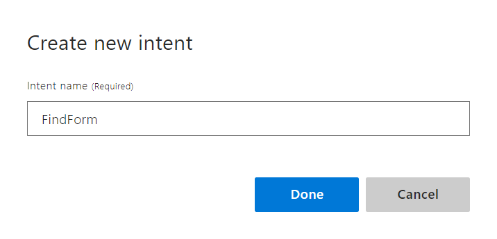

# Quickstart: Create a new app in the LUIS portal

In this quickstart, you create a new app in the [LUIS portal](https://www.luis.ai). Create the basic parts of an app, **intents** and **entities**, then test by providing a sample user utterance in the interactive test panel to get the predicted intent.

Building an app is free; it doesn't require an Azure subscription. When you are ready to deploy your app, then you create an Azure Cognitive Service Resource and assign it to the app. This deployment process is in the [next quickstart](get-started-portal-deploy-app.md).

## Create app 

1. Open the [LUIS portal](https://www.luis.ai) in a browser and sign in. If this is your first-time signing in, you need to create a free LUIS portal user account.

1. Select **Create new app** from the context toolbar.

    [](./media/get-started-portal-build-app/create-app-in-portal.png#lightbox)

1. In the pop-up window, configure the app with the following settings then select **Done**.

    |Setting name| Value | Purpose|
    |--|--|--|
    |Name|`myEnglishApp`|Unique LUIS app name<br>required|
    |Culture|**English**|Language of utterances from users, **en-us**<br>required|
    |Description|`App made with LUIS Portal`|Description of app<br>optional|

    


## Create intent 

After this app is created, the next step is to create intents. Intents are a way to categorize text from users. If you have a human resources app that has two functions: first to help people find and apply for jobs and second to find forms to apply for jobs, these two different _intentions_ align to the following intents:

|Intent|Example text from user<br>known as an _utterance_|
|--|--|
|ApplyForJob|`I want to apply for the new software engineering position in Cairo.`|
|FindForm|`Where is the job transfer form hrf-123456?`|

1. After the app is created, you are on the **Intents** page of the **Build** section. Select **Create new intent**. 

    [](./media/get-started-portal-build-app/create-new-intent-button.png#lightbox)

1. Enter the intent name, `FindForm` and select **Done**.

    

## Add example utterance 

After creating the intent, the next step is to add example utterances. This is text, entered by the user in a chat bot or other client application, that maps the intention of the user's text to a LUIS intent. 

For this example application's `FindForm` intent, example utterances will include the form number, which is important information within the utterance that the client application needs in order to fullfil the user's request. 

Add the following fifteen example utterances to the `FindForm` intent. 

|#|Example utterances|
|--|--|
|1|Looking for hrf-123456|
|2|Where is the human resources form hrf-234591?|
|3|hrf-345623, where is it|
|4|Is it possible to send me hrf-345794|
|5|Do I need hrf-234695 to apply for an internal job?|
|6|Does my manager need to know I'm applying for a job with hrf-234091|
|7|Where do I send hrf-234918? Do I get an email response it was received?|
|8|hrf-234555|
|9|When was hrf-234987 updated?|
|10|Do I use form hrf-876345 to apply for engineering positions|
|11|Was a new version of hrf-765234 submitted for my open req?|
|12|Do I use hrf-234234 for international jobs?|
|13|hrf-234598 spelling mistake|
|14|will hrf-234567 be edited for new requirements|
|15|hrf-123456, hrf-123123, hrf-234567|

These example utterances vary, on purpose, in the following ways:

* utterance length
* punctuation
* word choice
* verb tense (is, was, will be)
* word order

[](./media/get-started-portal-build-app/add-example-utterance.png#lightbox)

## Create regular expression entity 

In order to get the form number returned as part of the runtime prediction response, the form has to be marked as an entity. Since the form number text is highly structured, it can be marked using a regular expression entity. Create the entity with the following steps. 

1. Select **Entities** from the left-navigation menu. 

1. Select **Create new entity** on the Entities page.

1. Enter the name `Human Resources Form Number`, select the **Regex** entity type, and enter the regular expression, `hrf-[0-9]{6}`. This matches the literal characters, `hrf-`, and allows for exactly 6 digits. 

    

1. Select **Done**. 

## Add example utterances to None intent

The **None** intent is the fallback intent and shouldn't be left empty. This intent should have 1 utterance for every 10 in the rest of the intents of the app. 

The **None** intent's example utterances should be outside of your client application domain. 

1. Select **Intents** from the left menu, then select **None** from the Intents list.

1. Add the following example utterances to the intent:

    |None intent example utterances|
    |--|
    |Barking dogs are annoying|
    |Order a pizza for me|
    |Penguins in the ocean|

    For this human resources app, these example utterances are outside the domain. If your human resources domain including, animals, food, or the ocean, then these example utterances should not be used for the **None** intent. 

## Train the app

In the top-right navigation, select **Train** to apply the intent and entity model changes to the current version of the app. 

## Look at the regular expression entity in the example utterances

1. Verify the entity is found in the **FindForm**  intent by selecting **Intents** from the left menu, then select **FindForm** intent. 

    The entity is marked where it appears in the example utterances. If you want to see the original text, instead of the entity name, toggle **Entities View** from the toolbar.

    [](./media/get-started-portal-build-app/all-example-utterances-marked-with-entities.png#lightbox)

## Test your new app with the interactive test pane

Use the interactive **Test** pane in the LUIS portal to validate the entity is extracted from new utterances the app hasn't seen yet.

1. Select **Test** from the top-right menu.

1. Add a new utterance then press Enter:

    ```Is there a form named hrf-234098```

    

    The top predicted intent is correctly **FindForm** with over 90% confidence (0.977) and the **Human Resources Form Number** entity is extracted with a value of hrf-234098. 

## Clean up resources
When you are done with this quickstart and you are not moving on to the next quickstart, select **My apps** from the top navigation menu. Then select the app's left-hand checkbox from the list, and select  **Delete** from the context toolbar above the list. 

[](./media/get-started-portal-build-app/delete-app.png#lightbox)

## Next steps

> [!div class="nextstepaction"]
> [2. Deploy an app](get-started-portal-deploy-app.md)