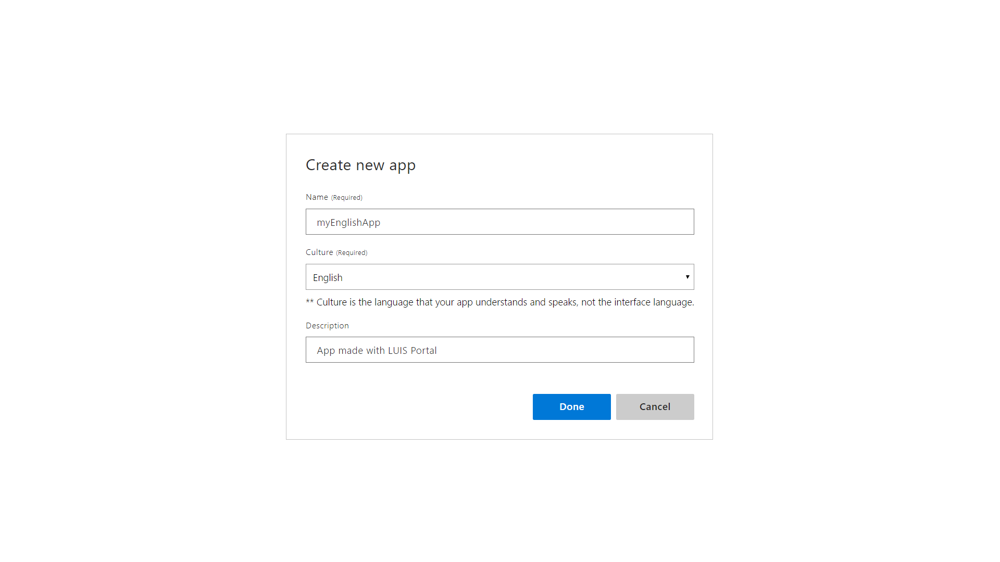
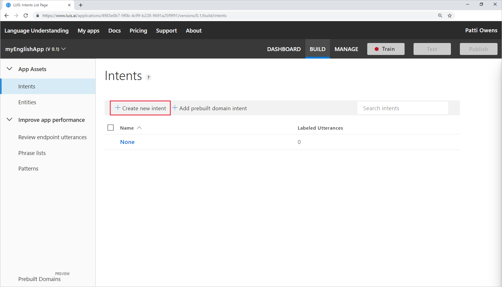
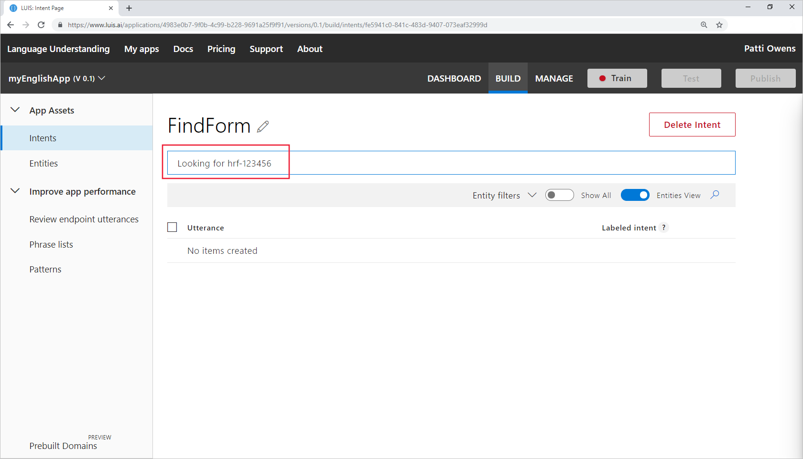
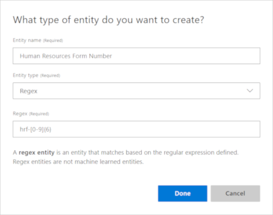
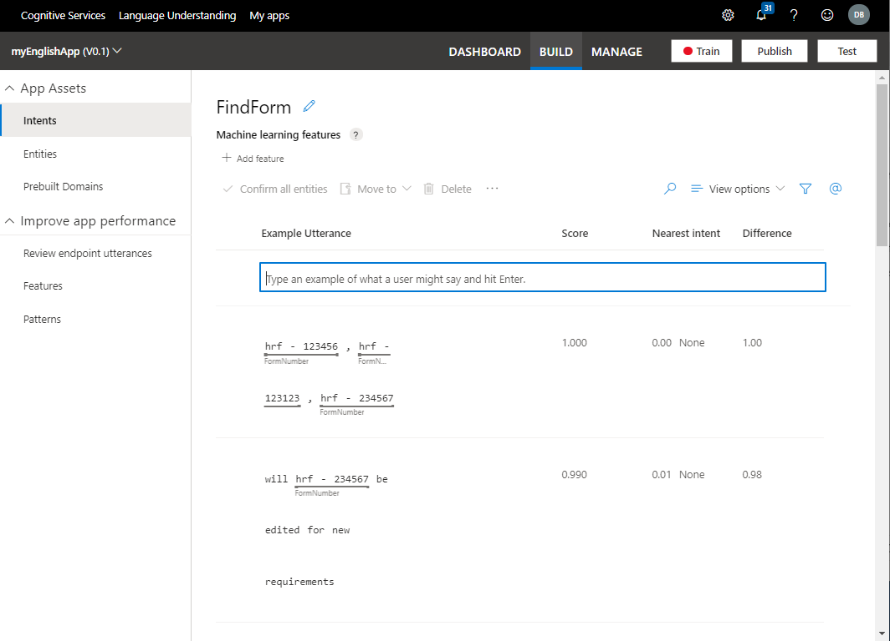
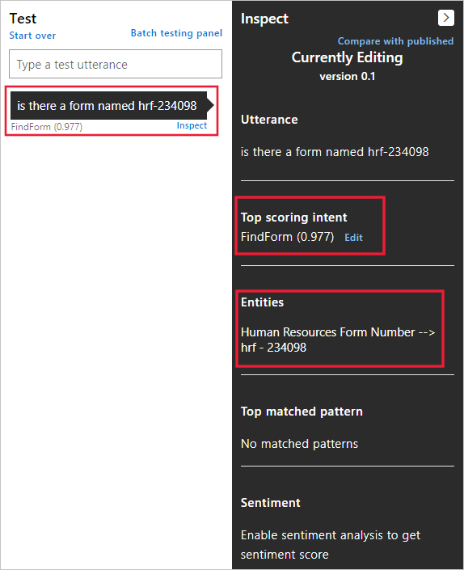

# Quickstart: Create a new app in the LUIS portal

In this quickstart, you build a new app in the LUIS portal. First, create the basic parts of an app, **intents**, and **entities**. Then test the app by providing a sample user utterance in the interactive test panel to get the predicted intent.

[!INCLUDE [Sign in to LUIS](./includes/sign-in-process.md)]

## Create an app

1. Select **+ New app for conversation** from the context toolbar, then select **+ New app for conversation** again.

    > [!div class="mx-imgBorder"]
    > [](./media/create-app-in-portal.png#lightbox)

1. In the pop-up window, configure the app with the following settings and then select **Done**.

   |Setting name| Value | Purpose|
   |--|--|--|
   |Name|`myEnglishApp`|Unique LUIS app name<br>required|
   |Culture|**English**|Language of utterances from users, **en-us**<br>required|
   |Description (Optional)|`App made with LUIS Portal`|Description of app<br>optional|
   |Prediction resource (Optional) |-  |Do not select. LUIS gives you a Starter key to use for free for authoring and 1,000 prediction endpoint requests. |

   

## Create intents

After the LUIS app is created, you need to create intents. Intents are a way to classify text from users. For example, a human resources app might have two functions. To help people:

 1. Find and apply for jobs
 1. Find forms to apply for jobs

The app's two different _intentions_ align to the following intents:

|Intent|Example text from user<br>known as an _utterance_|
|--|--|
|ApplyForJob|`I want to apply for the new software engineering position in Cairo.`|
|FindForm|`Where is the job transfer form hrf-123456?`|

To create intents, complete the following steps:

1. After the app is created, you are on the **Intents** page of the **Build** section. Select **Create**.

   [](./media/get-started-portal-build-app/create-new-intent-button.png#lightbox)

1. Enter the intent name, `FindForm`, and then select **Done**.

## Add an example utterance

You add example utterances after you create intents. Example utterances are text that a user enters in a chat bot or other client application. They map the intention of the user's text to a LUIS intent.

For this example application's `FindForm` intent, example utterances will include the form number. The client application needs the form number to fulfill the user's request, so it's important to include it in the utterance.

> [!div class="mx-imgBorder"]
> [](./media/get-started-portal-build-app/add-example-utterance.png#lightbox)

Add the following 15 example utterances to the `FindForm` intent.

|#|Example utterances|
|--|--|
|1|`Looking for hrf-123456`|
|2|`Where is the human resources form hrf-234591?`|
|3|`hrf-345623, where is it`|
|4|`Is it possible to send me hrf-345794`|
|5|`Do I need hrf-234695 to apply for an internal job?`|
|6|`Does my manager need to know I'm applying for a job with hrf-234091`|
|7|`Where do I send hrf-234918? Do I get an email response it was received?`|
|8|`hrf-234555`|
|9|`When was hrf-234987 updated?`|
|10|`Do I use form hrf-876345 to apply for engineering positions`|
|11|`Was a new version of hrf-765234 submitted for my open req?`|
|12|`Do I use hrf-234234 for international jobs?`|
|13|`hrf-234598 spelling mistake`|
|14|`will hrf-234567 be edited for new requirements`|
|15|`hrf-123456, hrf-123123, hrf-234567`|

By design, these example utterances vary in the following ways:

* utterance length
* [punctuation](luis-reference-application-settings.md#punctuation-normalization)
* word choice
* verb tense (is, was, will be)
* word order


## Create a regular expression entity

To return the form number in the runtime prediction response, the form number must be extracted as an entity. Because the form number text is highly structured, you can use a regular expression entity. Create the regular expression entity with the following steps:

1. Select **Entities** from the menu on the left.

1. Select **Create** on the **Entities** page.

1. Enter the name `FormNumber`, select the **Regex** entity type.

1. Enter the regular expression, `hrf-[0-9]{6}` in the **Regex** field. This entry matches the literal characters, `hrf-`, and allows for exactly six digits, then select **Create**.

    > [!div class="mx-imgBorder"]
    > 


    This entity extracts any text that matches the regular expression in any of the intents.

## Add example utterances to the None intent

The **None** intent is the fallback intent and shouldn't be left empty. This intent should contain one utterance for every 10 example utterances that you've added for the other intents of the app.

The **None** intent's example utterances should be outside of your client application domain.

1. Select **Intents** from the left menu, and then select **None** from the intents list.

1. Add the following example utterances to the intent:

   |None intent example utterances|
   |--|
   |`Barking dogs are annoying`|
   |`Penguins in the ocean`|

   For this app, these example utterances are outside the domain. If your domain includes animals, or the ocean, then you should use different example utterances for the **None** intent.

## Train the app

[!INCLUDE [LUIS How to Train steps](includes/howto-train.md)]

## Look at the regular expression entity in the example utterances

1. Verify the entity is found in the **FindForm**  intent by selecting **Intents** from the left menu. Then select **FindForm** intent.

   The entity is marked where it appears in the example utterances.

   > [!div class="mx-imgBorder"]
   > [](./media/get-started-portal-build-app/all-example-utterances-marked-with-entities.png#lightbox)

## Test your new app with the interactive test pane

Use the interactive **Test** pane in the LUIS portal to validate that the entity is extracted from new utterances the app hasn't seen yet.

1. Select **Test** from the upper-right menu.

1. Add a new utterance and then press Enter:

   ```Is there a form named hrf-234098```

    Select **Inspect** to see entity predictions.

   > [!div class="mx-imgBorder"]
   > 

   The top predicted intent is correctly **FindForm** with over 90% confidence (0.977). The **FormNumber** entity is extracted with a value of hrf-234098.

## Clean up resources

When you're done with this quickstart and aren't moving on to the next quickstart, select **My apps** from the top navigation menu. Then select the app's left check box from the list and select  **Delete** from the context toolbar above the list.

## Next steps

> [!div class="nextstepaction"]
> [2. Deploy an app](get-started-portal-deploy-app.md)
