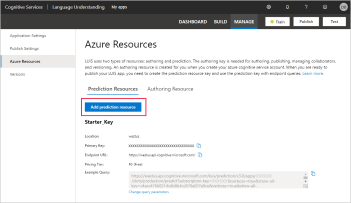
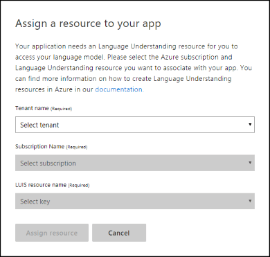
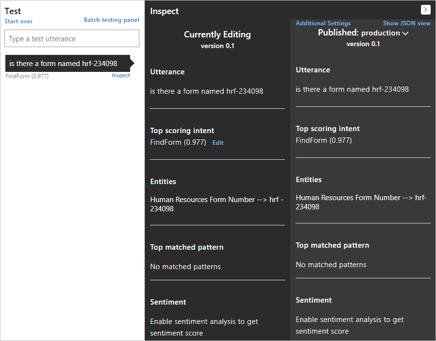

# Quickstart: Deploy an app in the LUIS portal

When your LUIS app is ready to return utterance predictions to a client application (for example, a chat bot), you need to deploy the app to the prediction endpoint.

In this quickstart, you learn to deploy an application. You create a prediction endpoint resource, assign the resource to the app, train the app, and publish the app.

## Prerequisites

* Get an [Azure subscription](https://azure.microsoft.com/free).
* Complete the [previous portal quickstart](get-started-portal-build-app.md) or [download and import the app](https://github.com/Azure-Samples/cognitive-services-language-understanding/blob/master/documentation-samples/quickstarts/in-portal/build-portal-app.json).
* If you have apps that pre-date Azure resource authentication, [migrate to an Azure resource](luis-migration-authoring.md). Some portal pages look different when email authentication is in effect.

<a name="create-the-endpoint-resource"></a>

[!INCLUDE [Create LUIS resource](includes/create-luis-resource.md)]

## Assign the resource key to the LUIS app in the LUIS portal

Every time you create a new authoring or query prediction resource for LUIS, you need to assign the resource to the LUIS app. After it's assigned, you won't need to do this step again unless you create a new resource. You might create a new resource to expand the regions of your app or to support a higher number of prediction queries.

1. Sign in to the [LUIS portal](https://www.luis.ai) and choose the **myEnglishApp** app from the apps list.

1. Select **Manage** in the upper-right menu, and then select **Azure Resources**.

1. To add the LUIS, select **Add prediction resource**.

    

1. Select your tenant, subscription, and resource name. Select **Assign resource**.

   > [!div class="mx-imgBorder"]
   > 

1. Complete the same steps to add the authoring key to your app.

1. Find the new row in the table for the new prediction resource and copy the endpoint URL. It's correctly constructed to make an `HTTP GET` request to the LUIS API endpoint for a prediction.

> [!TIP]
> If you intend to use Active learning to improve your LUIS app, select **Change query parameters** and select **Save logs**. This action changes the example URL by adding the `log=true` querystring parameter. Copy and use the changed example query URL when making prediction queries to the runtime endpoint.

## Train the app

If you changed the app since you trained it last, [train](get-started-portal-build-app.md) the app.

## Publish the app to the prediction endpoint

[!INCLUDE [LUIS How to Publish steps](includes/howto-publish.md)]

## Prediction endpoint request

In the portal, `query=` at the end of the URL is where the user's utterance is appended to the GET request. After the `query=`, enter the same user utterance used at the end of the previous quickstart:

```Is there a form named hrf-234098```

Make sure the query string includes the following pairs:

* `show-all-intents=true`
* `verbose=true`

The browser shows the response:

```JSON
{
    "query": "Is there a form named hrf-234098",
    "prediction": {
        "topIntent": "FindForm",
        "intents": {
            "FindForm": {
                "score": 0.9768753
            },
            "None": {
                "score": 0.0216071177
            }
        },
        "entities": {
            "Human Resources Form Number": [
                "hrf-234098"
            ],
            "$instance": {
                "Human Resources Form Number": [
                    {
                        "type": "Human Resources Form Number",
                        "text": "hrf-234098",
                        "startIndex": 22,
                        "length": 10,
                        "modelTypeId": 8,
                        "modelType": "Regex Entity Extractor",
                        "recognitionSources": [
                            "model"
                        ]
                    }
                ]
            }
        }
    }
}
```

To see this same level of information in the test pane, you must publish the app. After the app is published, select **Compare with published** in the test pane. Use **Show JSON view** in the published test pane to see the same JSON as the previous step. In this way, you can compare changes to the current app you're working on with an app that is published to the endpoint.

[](./media/get-started-portal-deploy-app/compare-test-pane.png#lightbox)

## Clean up resources

When you're done with this quickstart, select **My apps** from the top navigation menu. Select the app's check box from the list, and then select **Delete** from the context toolbar above the list.

## Next steps

> [!div class="nextstepaction"]
> [Identify common intents and entities](luis-tutorial-prebuilt-intents-entities.md)
