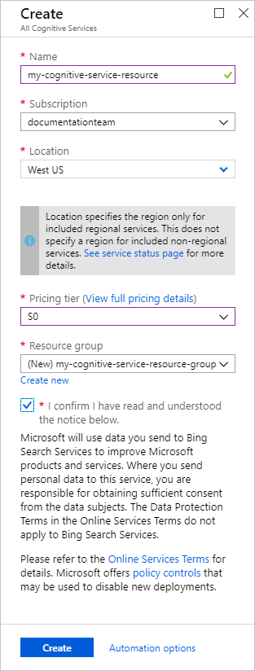
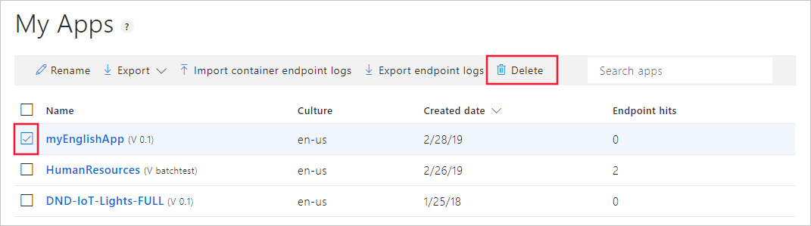

# Quickstart: Deploy an app in the LUIS portal

When your LUIS app is ready to return utterance predictions to a client application (for example, a chat bot), you need to deploy the app to the prediction endpoint.

In this quickstart, you learn to deploy an application. You create a prediction endpoint resource, assign the resource to the app, train the app, and publish the app.

## Prerequisites

* Get an [Azure subscription](https://azure.microsoft.com/free).
* Complete the [previous portal quickstart](get-started-portal-build-app.md) or [download and import the app](https://github.com/Azure-Samples/cognitive-services-language-understanding/blob/master/documentation-samples/quickstarts/in-portal/build-portal-app.json).

## Create the endpoint resource

You create the prediction endpoint resource in the Azure portal. This resource should only be used for endpoint prediction queries. Do not use this resource for authoring changes to the app.

1. Sign in to the [Azure portal](https://ms.portal.azure.com/).

1. Select the green **+** sign in the upper-left panel. Search for `Cognitive Services` in the marketplace and select it.

1. Configure the subscription with the following settings:

   |Setting|Value|Purpose|
   |--|--|--|
   |Name|`my-cognitive-service-resource`|The name of the Azure resource. You need this name when you assign the resource to the app in the LUIS portal.|
   |Subscription|Your subscription|Select one of the subscriptions associated with your account.|
   |Location|**West US**|The Azure region for this resource.|
   |Pricing tier|**S0**|The default pricing tier for this resource.|
   |Resource group|`my-cognitive-service-resource-group`|Create a new resource group for all your cognitive service resources. When you're done with the resources, you can delete the resource group to clean up your subscription. |
   | | | |

   

1. Select **Create** to create the Azure resource.

   In the next section, you learn how to connect this new resource to a LUIS app in the LUIS portal.

## Assign the resource key to the LUIS app in the LUIS portal

Every time you create a new resource for LUIS, you need to assign the resource to the LUIS app. After it's assigned, you won't need to do this step again unless you create a new resource. You might create a new resource to expand the regions of your app or to support a higher number of prediction queries.

1. Sign in to the [LUIS portal](https://www.luis.ai) and choose the **myEnglishApp** app from the apps list.

1. Select **Manage** in the upper-right menu, and then select **Keys and endpoints**.

1. To add the LUIS, select **Assign Resource +**.

   [](./media/get-started-portal-deploy-app/assign-resource-button.png#lightbox)

1. Select your tenant, subscription, and resource name. Select **Assign resource**.

   

1. Find the new row in the table and copy the endpoint URL. It's correctly constructed to make an `HTTP GET` request to the LUIS API endpoint for a prediction.

## Train and publish the app

Train the app when you're ready to test it. Publish the app when you want the currently trained version to be available to client applications from the query prediction endpoint runtime.

1. If the app is untrained, select **Train** from the menu in the upper right.

1. Select **Publish** from the top menu. Accept the default environment settings, and select **Publish**.

1. When the green success notification bar appears at the top of the browser window, select **Refer to the list of endpoints**.

   

1. On the **Keys and Endpoint settings** page, find the list of assigned resources and corresponding endpoint URLs at the bottom.

1. Select the endpoint URL associated with your new resource name. This action opens a web browser with a correctly constructed URL to make a `GET` request to the prediction endpoint runtime.

1. The `q=` at the end of the URL is short for **query** and is where the user's utterance is appended to the GET request. After the `q=`, enter the same user utterance used at the end of the previous quickstart:

    ```Is there a form named hrf-234098```

    The browser shows the response, which is the same JSON your client application will receive:

    ```JSON
    {
    "query": "Is there a form named hrf-234098",
    "topScoringIntent": {
        "intent": "FindForm",
        "score": 0.9768753
    },
    "intents": [
        {
        "intent": "FindForm",
        "score": 0.9768753
        },
        {
        "intent": "None",
        "score": 0.0216071066
        }
    ],
    "entities": [
        {
        "entity": "hrf-234098",
        "type": "Human Resources Form Number",
        "startIndex": 22,
        "endIndex": 31
        }
      ]
    }
    ```

    This response gives you more information than the default test pane in the previous tutorial. To see this same level of information in the test pane, you must publish the app. After the app is published, select **Compare with published** in the test pane. Use **Show JSON view** in the published test pane to see the same JSON as the previous step. In this way, you can compare the current app you're working on with an app that is published to the endpoint.

    [](./media/get-started-portal-deploy-app/compare-test-pane.png#lightbox)

## Clean up resources

When you're done with this quickstart, select **My apps** from the top navigation menu. Select the app's check box from the list, and then select **Delete** from the context toolbar above the list.

[](./media/get-started-portal-build-app/delete-app.png#lightbox)

## Next steps

> [!div class="nextstepaction"]
> [Identify common intents and entities](luis-tutorial-prebuilt-intents-entities.md)
